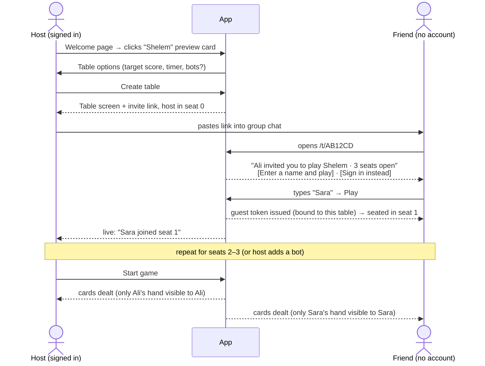
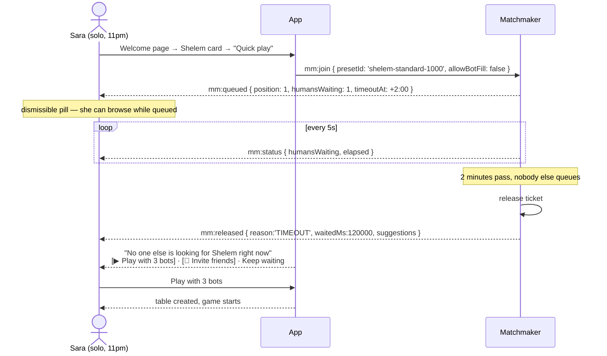
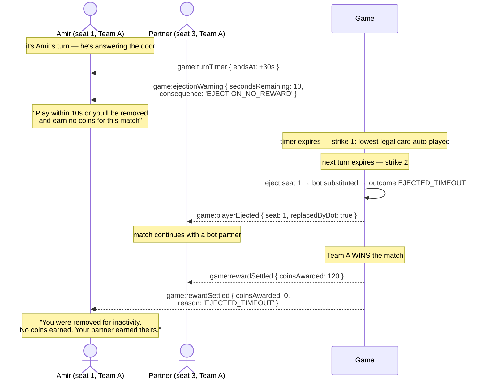

# Business PRD — Board Game Platform

> **Status:** Draft · **Audience:** you (owner, developer, and first user) · **Companion:** [02-technical-prd.md](./02-technical-prd.md)

---

## 1. Vision

> **A cheat-proof game table you can open with a link — where your friends are playing within
> five seconds of clicking, where the games you actually play (including Shelem) are first-class
> citizens, and where playing earns you something worth keeping.**

Two things make this more than a hobby project:

1. **Matchmaking** — you don't need three friends free at the same time to play Shelem. Queue,
   and the app finds people.
2. **An earned economy** — playing deposits coins into your wallet (guests included), which buy
   in-game assets. A **premium plan** is the real-money product on top.

The economy is the commercial goal, not a bolt-on. It also raises the stakes on fairness: once
play is worth something, cheating and idling stop being rude and start being profitable. That is
why [07-security-and-anticheat.md](./07-security-and-anticheat.md) and the turn-enforcement rules
in [04-realtime-protocol.md](./04-realtime-protocol.md) §6 are load-bearing rather than
defensive extras.

---

## 2. Problem Statement

Playing card games with friends remotely currently means choosing between bad options:

| Option | Problem |
|---|---|
| Video call + physical cards | One person deals; nobody else can see their own hand properly. Doesn't work at all for hidden-information games |
| Generic table simulators (Tabletop Simulator, Board Game Arena) | No Shelem. Heavy clients, accounts required for everyone, fiddly physics, or a paywall |
| Existing card apps | Almost never include Persian games. Full of ads, chips-for-money upsells, and hostile monetization |
| Signup-walled web games | The friend who just wants to play one round refuses to make an account. Game night dies at the registration form |

Two problems have no good existing answer:

1. **Shelem effectively doesn't exist online** in a form you'd want to use with friends.
2. **Every alternative demands registration before play**, which is where casual invitations die.

---

## 3. Goals & Non-Goals

### Goals

| G | Goal | Measured by |
|---|---|---|
| G1 | A friend with a link is seated and playing **without creating an account** | Time from link click to seated < 5 s |
| G2 | **Cheating is structurally impossible**, not merely discouraged | Anti-cheat leak tests pass for every game; no client-side rules code exists |
| G3 | **Shelem is properly implemented**, including bidding and partnership scoring | You and your regular group play a full match and agree the scoring is right |
| G4 | Games survive real-world networks — dropped phones, tunnels, laptop sleep | Reconnect to fully playable < 2 s; zero games lost to an API restart |
| G5 | Adding a new game is a weekend, not a rewrite | Game #6 requires no changes to games #1–5 |
| G6 | Persian speakers get a first-class RTL experience | Full `fa` locale with RTL layout shipped in v1 |
| G7 | The table feels *yours* — card backs, avatars, felt colors | Customization page shipped; assets earned and bought with coins |
| G8 | **You can play without assembling three friends first** | Matchmaking fills a table, or releases you within 2 min with a usable alternative |
| G9 | **A match is never ruined by someone who walked away** | Turn limits eject an inactive player and substitute a bot within ~60 s |
| G10 | **Playing earns something worth keeping** | Coins accrue to every player — guests included — and buy assets they actually want |
| G11 | **A premium plan people choose freely, with no pay-to-win** | Subscription converts, and no premium perk touches gameplay |

### Non-Goals (v1 and beyond)

> ⚠️ **Revised.** Earlier drafts listed *"no real money / purchases / cash-out"* and *"no public
> matchmaking with strangers"* as non-goals. Both are **withdrawn** — see
> [09-matchmaking.md](./09-matchmaking.md) and [10-economy-and-rewards.md](./10-economy-and-rewards.md).
> What remains below is what is still genuinely out of scope.

| Non-goal | Reasoning |
|---|---|
| **Coins convertible to money** | Earn-only, spend-in-app. No cash-out, no peer transfer. Keeps the product clear of money transmission ([10](./10-economy-and-rewards.md) E4) |
| **Wallet coins as poker stakes** | Table chips are ephemeral and never touch the wallet. Crossing this line makes the app **gambling** ([10](./10-economy-and-rewards.md) E5) — the most consequential boundary in the project |
| **Loot boxes / randomized paid rewards** | Regulated or banned in several jurisdictions, and unpleasant |
| **Any premium gameplay advantage** | Cosmetics, earn rate, and convenience only. The moment premium buys a better hand, the games are worthless ([10](./10-economy-and-rewards.md) E3) |
| Crypto / NFT assets | A possible future you raised, **not built**. [10](./10-economy-and-rewards.md) §8 documents the seam kept open and the real cost of walking through it |
| Native mobile apps | Responsive web covers phones. A native app is months of work for no new capability |
| Tournaments & brackets | Post-v1; adds scheduling complexity for a rare use case |
| Voice/video chat | Text chat + emotes is the right scope |
| Social graph (feeds, followers) | Invite links and matchmaking cover it. Blocking exists for safety, not socializing |
| Ads or third-party analytics SDKs | The premium plan is the revenue model. No tracking |
| Email delivery in v1 | Invites are copy-paste links. Password reset deferred ([08-roadmap.md](./08-roadmap.md)) |

---

## 4. Personas

### P1 — The Host (primarily you)
Organizes game night. Wants: pick a game, get a link, paste it in the group chat, start playing.
Frustrations: chasing friends through signup flows; games that can't be resumed after someone's
phone dies. **Needs:** table creation in under three clicks, seat management, bot fill for a
missing fourth, the ability to kick or reseat.

### P2 — The Invited Guest (the persona that decides whether this project succeeds)
Got a link. Might be on a phone, on the bus, mildly reluctant. Will **not** create an account to
play one round. May never sign up at all — and that must be completely fine.
**Needs:** click → type a display name → sit down. Zero other steps. Their guest identity must
survive a page refresh, and if they *do* choose to sign up later, they must not lose their seat,
their hand, or their place in the match.

> **This persona is the reason the guest-token architecture exists.** Every design decision that
> makes guest play harder is a decision against the product's core promise.

**What converts them:** not "save your stats" — **the coins they already earned.** A guest who
finishes an evening with 340 provisional coins has a concrete, personal reason to make an account:
those coins vest on signup and vanish if they don't
([10-economy-and-rewards.md](./10-economy-and-rewards.md) §3.4). The economy *is* the signup
funnel.

### P3 — The Returning Player
Plays regularly. Wants: stats, a rating that means something, a card back that's *theirs*, to
resume last night's table, and to spend what they've earned. **Needs:** persistent account, match
history, wallet + store, cosmetics, "my tables" on the welcome page.

### P4 — The Solo Player *(new, and the reason matchmaking exists)*
Wants to play Shelem at 11pm on a Tuesday. Has nobody available. Every previous design served
them badly: an invite link nobody clicks is a dead end. **Needs:** a queue, an honest wait, and —
when nobody shows up — an immediate, useful alternative rather than a spinner. They are also the
persona most exposed to strangers, so muting, blocking, and reporting matter to them first
([09-matchmaking.md](./09-matchmaking.md) §7.3).

### P5 — You, the Operator
Runs it on a VPS. Wants: cheap, boring, restartable, backed up, debuggable at 1am.
**Needs:** structured logs, an audit trail when someone claims a hand scored wrong, replayable
matches from `(seed, moves)`, and a restore procedure that has actually been tested.

**This persona is the one the product under-served the longest.** Once matchmaking put strangers at
the same table and coins acquired value, "debuggable at 1am" stopped meaning `psql` and started
meaning *find this user, see where their coins went, disable them, turn the broken game off*. That
is a second application, and it is specified in
[12-admin-console.md](./12-admin-console.md) — deliberately **not** a page inside the player app,
because an admin session that can adjust the coin supply must not share an origin, a cookie, or a
network position with the game.

---

## 5. The Headline Journeys

### J1 — Host creates a table and friends join as guests *(the happy path)*



**Requirements this journey imposes**
- `GET /invites/:code` must resolve **unauthenticated** and reveal enough to be inviting (game
  name, host's display name, seats free, in-progress or not) without leaking anything private.
- The pre-join screen leads with *play*, not with *sign up*. Sign-in is the secondary action.
- Guest display names are validated (length, no impersonation of "Dealer"/"System", profanity
  filter) but require nothing else.
- Join/leave/seat changes broadcast live to everyone at the table.

### J2 — Guest signs up mid-game and lands back at the table *(explicitly requested)*

```mermaid
sequenceDiagram
    actor G as Guest "Sara"
    participant A as App
    participant DB as Database

    Note over G,A: Sara is playing in seat 1
    A-->>G: after hand 1: gentle banner —<br/>"Save your stats & keep this card back? Create an account"
    G->>A: clicks Sign up (game continues; modal, not navigation)
    A-->>G: form pre-filled with display name "Sara"
    G->>A: submits email + password
    A->>DB: transaction —<br/>create User · move TableMember from guest→user ·<br/>re-attribute GameEvents · copy preferences · revoke guest token
    DB-->>A: ok
    A-->>G: auth cookies set → returned to the SAME table,<br/>SAME seat, SAME hand, mid-game
    A-->>G: toast: "Welcome, Sara. Your match history starts now."
```

**Requirements this journey imposes**
- Signup **must not interrupt play.** It is a modal over the table, never a navigation away. If
  it *is* a navigation (e.g. OAuth round trip in a later version), the return URL carries the
  table and seat.
- The claim is a **single database transaction**. A half-migrated guest (account created, seat
  lost) is the worst possible failure and must be impossible.
- Guest cosmetic/preference choices made before signup carry over — that's the pitch.
- If Sara signs up *after* the game ended, she still lands at the table (or its match summary),
  and the just-finished match is credited to her new account.
- The nudge appears at **natural breaks** (between hands, at match end) — never mid-trick.
  It is dismissible, and dismissal is remembered for that session.

### J3 — Returning player arrives at the welcome page

```
Welcome page
├── [If signed in] "Continue playing" — resumable tables, live seat counts
├── Game preview card grid  ←  driven by GET /api/v1/games
│     ┌──────────────────────┐
│     │   [art]              │
│     │   Shelem             │
│     │   4 players · 30–45m │
│     │   ●●● heavy          │
│     │   [ Play now ]       │
│     └──────────────────────┘
├── "How it works" — three steps: pick a game, share the link, play
└── [If guest/anon] Sign up / Sign in
```

**Requirements**
- The grid is **server-driven** from the game registry. Adding a game must not require a frontend
  change to appear here. Games not yet implemented render as `Coming soon` from the same source.
- Each card shows: art, localized name, player count, duration range, complexity badge, and
  whether it uses a standard deck.
- Cards are keyboard-navigable and screen-reader labeled; the grid reflows to a single column on
  phones and mirrors under RTL.

### J4 — Solo player queues, and the queue times out *(the honest path)*



**Requirements this journey imposes**
- The queue **must release**, not spin forever. 2 minutes by default, and the countdown is visible.
- **The release screen is the important screen**, not an error state. With a small player base it
  is the common outcome, so it leads with the action most likely to end in actually playing.
- Queueing is non-blocking — a dismissible pill, not a modal prison.
- The release screen is where a solo player is steered back to the **invite-link flow**, which is
  what actually works when your player base is six friends. Matchmaking is the addition; invites
  remain the backbone.

### J5 — A player walks away mid-match *(the rule with teeth)*



**Requirements this journey imposes**
- **A winning team's ejected player earns nothing; their partner earns in full.** Reward is
  computed per *seat*, never per team ([10](./10-economy-and-rewards.md) §5).
- The player is **warned before** it happens, and told **why** afterwards. A silent zero reads as
  a bug and generates support questions.
- The match keeps going. A bot takes the seat within ~60 s so the other three aren't stranded.
- Returning within the reclaim window recovers **half** the reward — enough that coming back beats
  staying away ([04](./04-realtime-protocol.md) §6.4).
- Repeat offenders collect an escalating **matchmaking cooldown** — and never a restriction on
  playing with their own friends ([09](./09-matchmaking.md) §7.1).

---

## 6. Game Catalog

### v1 — implemented, in build order

| # | Game | Players | Duration | Complexity | Hidden info | Engine reuse & notes |
|---|---|---|---|---|---|---|
| 1 | **Sudoku** | 1 (+ race mode 2–4) | 5–20 m | Light | Solution is server-only | Milestone-1 game: proves auth + table + socket skeleton with near-zero rules risk |
| 2 | **Blackjack** | 1–5 vs dealer | 5–15 m | Light | Dealer hole card, shoe | Introduces dealing, hidden state, betting rounds, a bot-driven dealer seat |
| 3 | **Shelem** ⭐ | 4 (2 teams) | 30–45 m | Heavy | Every hand + widow | **The flagship.** Builds the trick-taking core that Hokm later reuses |
| 4 | **Poker** (NL Hold'em) | 2–6 | 20–60 m | Heavy | Hole cards | Reuses betting-round core; side pots are the hardest logic in the project |
| 5 | **Chess** | 2 | 10–60 m | Heavy (rules: none hidden) | — | Adapter over `chess.js`; adds real clocks. Deliberately last: shares least with the rest |

### Backlog — documented, not scheduled

| Game | Players | Complexity | Engine reuse | Effort | Why it's on the list |
|---|---|---|---|---|---|
| **Hokm** | 4 (2 teams) | Medium | **~70% of Shelem** | S | The cheapest possible next game, and the natural Persian companion to Shelem |
| **Crazy Eights** | 2–6 | Light | Deck + shedding base | S | Smoke test for the shedding-game base class |
| **Uno** | 2–8 | Light–Medium | Shedding base + custom deck | M | Most-requested casual game; needs its own deck and action-card resolution |
| **Rummy / Gin Rummy** | 2–4 | Medium | Deck + melding (new) | M | Melding/discard-pile mechanics unlock a whole family of games |
| **Durak** | 2–5 | Medium | Shedding + attack/defend (new) | M | Distinct attack/defend structure; well-loved and genuinely different |
| **Checkers** | 2 | Light | **Chess board + move-validation layer** | S | Nearly free once chess ships |
| **Backgammon** | 2 | Medium | Board layer + **verifiable dice** | M | Would exercise the seed-commitment fairness system on visible randomness |

Full specs: [games/backlog-games.md](./games/backlog-games.md). Recommended pick-up order:
**Hokm → Checkers → Crazy Eights → Uno → Rummy → Durak → Backgammon** (cheapest-first, so
momentum never stalls).

---

## 7. Feature Scope

### MVP (must exist for the product to make sense)

- Email/password accounts; httpOnly cookie sessions with refresh rotation
- **Guest play from an invite link** — no account, ever required
- **Guest → account claim preserving seat and in-progress game**
- Table create / configure / seat / start / leave / close; invite link mint & revoke
- Server-authoritative game engines with per-viewer state projection
- WebSocket gameplay with reconnect grace and resync
- Welcome page with server-driven game preview cards
- English + Persian with full RTL
- **Turn limits with ejection and bot substitution** — a match is never stalled by an absent player
- **Wallet + reward ledger**, earning from the first game onward, guests included
- The five v1 games (delivered per milestone, not all at MVP — see [08-roadmap.md](./08-roadmap.md))

### Cross-cutting features

| Feature | Scope | Placed at |
|---|---|---|
| **Turn enforcement & ejection** ⭐ | Per-turn limits (30–60 s), a 10 s warning, strikes, ejection, bot substitution, reclaimable seat. Mechanism in M0; per-game default actions with each game | **M0**, then per game |
| **Matchmaking** ⭐ | Queue per game preset, 2-minute timeout with a useful release screen, bot fill, parties, farming guards, ejection cooldowns | **M3** (needs ≥2 games to matter) |
| **Wallet & rewards** ⭐ | Append-only ledger, per-seat reward with forfeiture on ejection, guest provisional balances vesting on signup, caps and decay | **M0** (earning) |
| **Store & premium** ⭐ | Coin-priced cosmetics, coin sinks, premium subscription with a strict no-gameplay-advantage rule | **M7** |
| **In-table chat + quick emotes** | Per-table text chat, rate-limited, profanity-filtered; one-tap emotes so guests who won't type can still react | M0 (chat) / M8 (emotes) |
| **Spectator mode** | Join by link without a seat. Reuses the spectator *projection* — cheap once projection exists | M8 (projection ready from M1) |
| **AI bots** | Fill a seat at table creation, on matchmaking bot-fill, and on ejection. **Per-game work** — each engine needs its own strategy | Per game, from M2 |
| **Stats, ELO & match history** | Per-game W/L, streaks, ELO, replayable history from the event log | M8 (event log exists from M0) |
| **Customization page** ⭐ | Card backs, avatars (preset + upload), felts, light/dark, card faces (classic / Persian), animation speed, sound. Server-persisted; `localStorage` for guests | M8, token architecture in M0, purchasing in M7 |
| **Admin console** ⭐ | A **second application** for P5: user search and moderation, ledger oversight and reconciliation, game on/off without a deploy, live table control, reports. Own process on an unpublished port, own credentials with mandatory TOTP, append-only audit log ([12](./12-admin-console.md)) | Spine in **M0**, ledger view M2, game flags M3, the console at **MA** (between M7 and M8) |

> **Bots are now load-bearing, not a nicety.** They were originally "fill an empty seat if you're
> short a player". Three separate systems now depend on them: matchmaking bot-fill, ejection
> substitution, and disconnect grace expiry. A game without a legal bot cannot ship its milestone.
> Still ship the legal-but-weak bot first (random from `legalMoves`); strength is a later problem,
> legality is not.

> **Earning ships in M0, spending in M7.** Players will accrue coins for several milestones with
> nothing to buy. That is deliberate — a balance waiting to be spent is a better store launch than
> an empty wallet — but the free `PLAY_COUNT` / `WIN_COUNT` cosmetic unlocks stay available
> throughout so the customization page isn't hollow in the meantime.

### Later

Tournaments · replay viewer UI (data already exists) · voice · daily puzzle streaks ·
email (password reset, invites by email) · OAuth sign-in · queue backfill of ejected seats ·
gifting premium · coins purchasable for money *(open question — [10](./10-economy-and-rewards.md) §6.5)* ·
crypto / NFT assets *(a separate product decision, not a feature — [10](./10-economy-and-rewards.md) §8)*

---

## 8. Success Metrics

### Product health

| Metric | Target | Why this one |
|---|---|---|
| **Games started that reach a legitimate finish** | > 85% | The best single proxy for "does this actually work". Catches desyncs, rage-quits, and rules bugs at once |
| **Time from link click to seated (guest, p95)** | < 5 s | The core promise (G1) |
| **Games lost to a disconnect or restart** | **0** | Event log + snapshots should make this structurally impossible |
| **Rules disputes per 10 matches** | < 0.5 (and trending to 0) | Especially Shelem. Each dispute becomes a regression test from `(seed, moves)` |
| **Time to add backlog game #6** | < 1 weekend | Validates G5. If Hokm takes two weeks, the abstraction failed |
| **Distinct players with ≥ 2 matches** | ≥ 6 in the first month | Nobody comes back to something that isn't fun |
| **RTL defects reported by Persian-reading users** | 0 open at each milestone exit | RTL treated as correctness, not polish |

### Matchmaking (G8)

| Metric | Target | Why this one |
|---|---|---|
| **Queue fill rate** | > 40% at peak hours | Below this, matchmaking is decoration and invites are still the only real path |
| **Median wait to match** | < 45 s | Longer and people stop queueing |
| **Release screen → played anyway** | > 60% | Measures whether the timeout path *works* rather than dead-ends. With a small player base this matters more than fill rate |
| Matches formed against the farming guard | Trending to 0 as a share | Rising share means someone is probing it |

### Turn enforcement (G9)

| Metric | Target | Why this one |
|---|---|---|
| **Matches with ≥ 1 ejection** | < 10% | Higher means the limits are too tight, not that players are worse |
| **Ejections that were warned first** | 100% | A silent ejection is a bug |
| **Reclaim rate within the window** | > 30% | Validates that half-reward-for-returning actually pulls people back |
| Repeat ejectors (≥ 3 in 24 h) | < 2% of active players | The cooldown ladder should make this self-correcting |

### Economy (G10, G11)

| Metric | Target | Why this one |
|---|---|---|
| **Guest → signup conversion** | **> 45%** of guests who finish a match | Raised from 30%: an unvested coin balance is a far stronger pitch than "save your stats" (§4, P2). If this doesn't beat 30%, the economy isn't doing its main job |
| **Median coins at signup** | 150–400 | Below, the incentive is too weak to notice; above, guest earning is too generous and invites farming |
| **Coin sink ratio** (spent ÷ earned) | 0.6–0.9 | Below 0.6 the store has nothing people want; above 0.9 they're starved and will stop playing |
| **Ledger discrepancies** | **0** | Nightly reconciliation. Any non-zero result is a correctness bug, never "rounding" |
| **Rewards zeroed by caps** | < 5% of matches | Higher means the caps are hitting honest players, not farmers |
| **Premium conversion** | > 3% of monthly actives | Modest, and enough to cover a VPS |
| **Premium churn** | < 8%/month | Perks that only matter once churn fast |
| **Pay-to-win complaints** | **0** | E3 is absolute. One credible complaint is a design failure, not a support ticket |

---

## 9. Risks

| Risk | L | I | Mitigation |
|---|---|---|---|
| **Scope creep across 12 games** | High | High | Strict milestone gating in [08-roadmap.md](./08-roadmap.md): a game ships fully (rules + bot-legal + RTL + tests) before the next starts. Backlog games documented so ideas have a *parking place* instead of derailing the current milestone |
| **Shelem rules disputes** | **Medium** (was High) | Medium | Rules now follow a source ([Wikipedia — Shelem](https://en.wikipedia.org/wiki/Shelem)) rather than reconstruction — see [games/shelem.md](./games/shelem.md) §0. The six parameters the source doesn't cover, and every scoring variant it names, are **table options** rather than hard-coded, so a disagreement is a settings change. The 165-per-hand invariant catches scoring bugs mechanically |
| Poker side-pot bugs | Medium | High | Side-pot algorithm specified and unit-tested against a table of known multi-all-in scenarios *before* the UI is built |
| Guest-claim data loss | Low | **Very high** | Single transaction (Unit of Work), integration-tested including deliberate mid-transaction failure. This is the one bug that would lose a friend's game |
| Real-time complexity (desync, ordering) | Medium | High | Server-authoritative state + monotonic `seq` + gap-detecting resync. The client never derives state it wasn't sent |
| RTL treated as an afterthought | Medium | Medium | Logical CSS properties enforced by stylelint from day one; RTL review is a milestone exit criterion, not a cleanup task |
| Bot quality disappoints | Medium | Low | Ship legal-but-weak; label bots clearly in the UI so expectations are set. Improve only on complaint |
| Solo-developer burnout | **High** | High | Milestones are deliberately small and independently enjoyable — M1 (Sudoku) is playable in weeks, and every milestone ends with something you can actually play with friends |
| Invite-link abuse (link leaks into a group chat) | Low | Low | Expiring, revocable, seat-count-capped invites; optional host approval for joins |
| **Coin farming via guest sessions** | **High** | **High** | The economy's defining threat. Layered: guests accrue but **cannot spend**; balances are provisional and capped at vesting; per-IP/device queue guards; duration factor and repeat decay; hourly/daily caps. The economic caps are the real defense — the detection heuristics are secondary and defeatable ([09](./09-matchmaking.md) §7.2) |
| **Empty queues make matchmaking look broken** | **High** | Medium | With six friends, timeout is the *normal* outcome. Mitigated by treating the release screen as a first-class surface that routes back to bots or invites (J4) — not by pretending the queue is busy |
| **Turn limits eject honest players** | Medium | High | Two strikes rather than one, a 10 s warning, strikes reset on any action, half reward for returning, and cooldowns that never touch private tables. Tracked by the "matches with ≥1 ejection < 10%" metric |
| **Premium drifts into pay-to-win** | Medium | **Very high** | E3 is written as an absolute with an explicit never-sell list ([10](./10-economy-and-rewards.md) §4.2). Every proposed perk is checked against it. One credible complaint is treated as a design failure |
| **Economy balance is wrong at launch** | **High** | Low | Certain, and cheap to fix: every rate, price, cap, and multiplier is a `RewardRule` / `StoreItem` row, so rebalancing is an update, not a deploy |
| **Ledger bugs lose player balances** | Low | **Very high** | Append-only ledger, derived idempotency keys, row-locked debits, nightly reconciliation with alerting. Losing someone's earned coins is the economy's equivalent of losing their seat |
| **Regulatory drift toward gambling** | Low | **Very high** | The chips ≠ coins boundary (E5) is enforced by a lint rule and a test, not by intention. Documented in [10](./10-economy-and-rewards.md) §7 so future changes are made knowingly |
| Stranger toxicity via matchmaking | Medium | Medium | Name/avatar validation, mute, block, report with chat context, bots always labelled ([09](./09-matchmaking.md) §7.3) |

---

## Related Documents

| Document | What it covers |
|---|---|
| [02-technical-prd.md](./02-technical-prd.md) | Architecture, stack, layers, deployment |
| [04-realtime-protocol.md](./04-realtime-protocol.md) §6 | Turn enforcement and ejection — G9 and journey J5 |
| [09-matchmaking.md](./09-matchmaking.md) | Queue, timeout, release — G8 and journey J4 |
| [10-economy-and-rewards.md](./10-economy-and-rewards.md) | Wallet, rewards, forfeiture, store, premium — G10 and G11 |
| [05-game-engine-spec.md](./05-game-engine-spec.md) | The abstraction behind G5 |
| [07-security-and-anticheat.md](./07-security-and-anticheat.md) | How G2 is achieved |
| [08-roadmap.md](./08-roadmap.md) | Milestones M0–M8 + MA |
| [games/](./games/) | Per-game rules and specifications |
