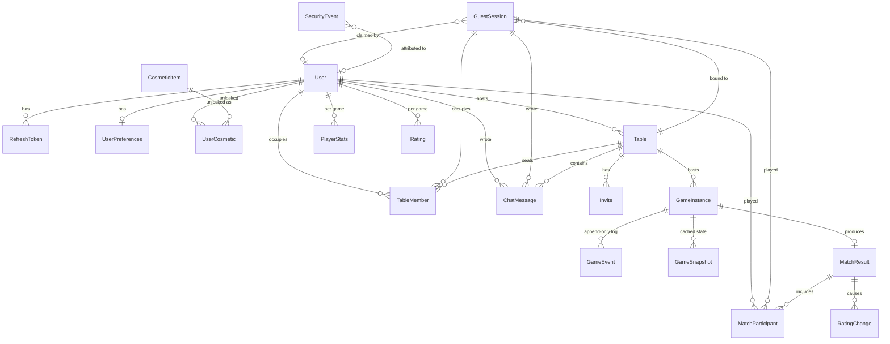
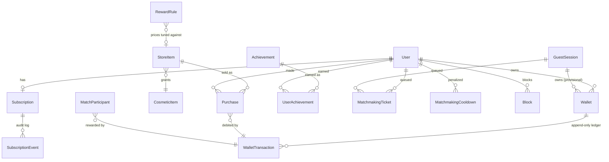
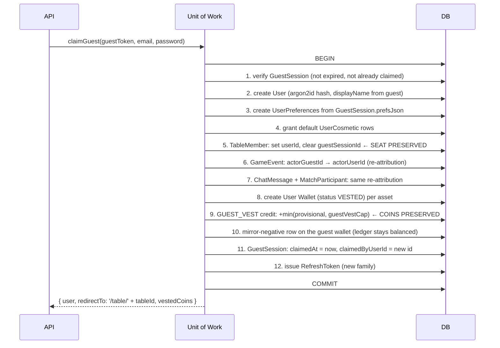

# Data Model

> **Status:** Draft · **Depends on:** [02-technical-prd.md](./02-technical-prd.md) §5–6

Prisma schema, ERD, and the two mechanisms that make the rest of the system work: **event-sourced
game state** and the **guest→user claim transaction**.

---

## 1. Design Rules

Restated from [02-technical-prd.md](./02-technical-prd.md) §6.2, because every model below obeys them:

1. **No Prisma `enum`** — SQLite has none. Use `String` + a TS union in `contracts/` + Zod.
2. **No scalar lists** — SQLite has no arrays. Use a join table or a JSON `String`.
3. **JSON is stored as `String` and never queried into.** Parse in app code. This keeps the schema
   identical on both engines.
4. **`Int` for chips, scores, and all wallet amounts**, never `Decimal`/`Float`. Currency in
   floating point is how ledgers stop balancing. The only `Float` in the schema is
   `MatchParticipant.playedFraction`, which is a ratio and never money.
5. **`String @default(cuid())` ids.** No `@db.Uuid`, no native types.
6. **Every timestamp is `DateTime`**; all arithmetic happens in app code.
7. **Soft-delete via nullable `*At` columns** (`revokedAt`, `leftAt`, `closedAt`) rather than a
   `deleted` boolean — the timestamp is strictly more informative for free.
8. **Balances are never mutated directly.** `Wallet.balance` is a cache written only inside the
   transaction that appends the corresponding `WalletTransaction`. Anything that changes a balance
   without a ledger row is a bug ([10](./10-economy-and-rewards.md) E1).
9. **Two append-only logs, and they are the schema's backbone:** `GameEvent` (what happened in a
   game) and `WalletTransaction` (what happened to a balance). Neither is ever updated or deleted.

---

## 2. ERD



### Economy & matchmaking



---

## 3. Schema

### 3.1 Identity

```prisma
model User {
  id            String   @id @default(cuid())
  email         String   @unique
  passwordHash  String                              // argon2id
  displayName   String
  avatarKind    String   @default("preset")         // 'preset' | 'upload' | 'initials'
  avatarRef     String?                             // preset id or uploaded file key
  locale        String   @default("en")             // 'en' | 'fa'
  role          String   @default("USER")           // 'USER' | 'SUPPORT' | 'ADMIN' — [12] §3.1
  status        String   @default("ACTIVE")         // 'ACTIVE' | 'DISABLED' | 'BANNED' — [12] §7.1
  statusReason  String?                             // why, set by an admin; mirrored to the audit log
  statusChangedAt DateTime?
  statusChangedBy String?                           // acting admin's User.id
  emailVerified Boolean  @default(false)            // reserved; no email in v1
  createdAt     DateTime @default(now())
  updatedAt     DateTime @updatedAt
  lastSeenAt    DateTime?

  preferences   UserPreferences?
  refreshTokens RefreshToken[]
  cosmetics     UserCosmetic[]
  hostedTables  Table[]              @relation("TableHost")
  memberships   TableMember[]
  stats         PlayerStats[]
  ratings       Rating[]
  messages      ChatMessage[]
  participations MatchParticipant[]
  claimedGuests GuestSession[]       @relation("ClaimedBy")
  wallets       Wallet[]
  purchases     Purchase[]
  subscription  Subscription?
  achievements  UserAchievement[]
  tickets       MatchmakingTicket[]
  cooldowns     MatchmakingCooldown[]
  blocksMade    Block[]              @relation("Blocker")
  blocksAgainst Block[]              @relation("Blocked")
  adminCredential AdminCredential?                  // [12] §4
  adminSessions AdminSession[]                      // [12] §4
  adminActions  AdminAuditLog[]      @relation("AdminActor")

  @@index([lastSeenAt])
  @@index([status])
}

model RefreshToken {
  id          String   @id @default(cuid())
  userId      String
  tokenHash   String   @unique                      // sha256 of the token; never the raw value
  familyId    String                                // rotation family — see §6.2
  issuedAt    DateTime @default(now())
  expiresAt   DateTime
  revokedAt   DateTime?
  replacedById String?
  userAgent   String?
  ip          String?

  user        User     @relation(fields: [userId], references: [id], onDelete: Cascade)

  @@index([userId, revokedAt])
  @@index([familyId])
}
```

> **Admin identity lives in separate models, deliberately.** `AdminCredential` (TOTP secret,
> lockout), `AdminSession` (IP-pinned, `mfaAt` for step-up), and `AdminAuditLog` (append-only,
> hash-chained) are specified in [12-admin-console.md](./12-admin-console.md) §4, together with
> `GameFlag`, `PlatformFlag`, `ControlCommand`, and `DailyMetric`. An admin session is **not** a
> player `RefreshToken` with a flag on it — logging into the game never logs you into the console
> ([12](./12-admin-console.md) §3.2). All seven obey the §1 portability rules above.

**`GuestSession`** — the model that carries persona P2:

```prisma
model GuestSession {
  id           String   @id @default(cuid())
  tokenHash    String   @unique
  displayName  String
  /** ★ A guest identity is bound to ONE table. It grants no access anywhere else. */
  tableId      String
  avatarRef    String?
  /** Preferences chosen before signup, carried over on claim. JSON string. */
  prefsJson    String?
  locale       String   @default("en")
  createdAt    DateTime @default(now())
  expiresAt    DateTime
  lastSeenAt   DateTime?
  /** Set when this guest becomes a real account. Kept for audit; never reused. */
  claimedAt    DateTime?
  claimedByUserId String?

  table        Table    @relation(fields: [tableId], references: [id], onDelete: Cascade)
  claimedBy    User?    @relation("ClaimedBy", fields: [claimedByUserId], references: [id])
  memberships  TableMember[]
  messages     ChatMessage[]
  participations MatchParticipant[]
  /** Provisional wallet — accrues while playing, vests on signup (10 §3.4). */
  wallets      Wallet[]
  tickets      MatchmakingTicket[]

  @@index([tableId])
  @@index([expiresAt])
}
```

> **Why `tableId` is non-nullable and required:** a guest token that worked on *any* table would
> be a privilege-escalation primitive — leak one link, get a wildcard identity. Binding the
> identity to the table it was created for means a stolen guest token is worth exactly one
> already-public table. See [07-security-and-anticheat.md](./07-security-and-anticheat.md) §3.

### 3.2 Tables, seats, invites

```prisma
model Table {
  id           String   @id @default(cuid())
  /** Null for matchmade tables — there is no host. */
  hostUserId   String?
  gameSlug     String                               // 'shelem' — matches GameEngine.meta.slug
  status       String   @default("WAITING")         // WAITING | IN_PROGRESS | FINISHED | CLOSED
  /** How the table came to exist. Drives auto-start, avatar rules, reward eligibility. */
  origin       String   @default("PRIVATE")         // PRIVATE | MATCHMADE
  /** Matchmaking preset id, when origin = MATCHMADE. */
  presetId     String?
  /** Set at formation by the farming guard. False → matches here earn nothing. */
  rewardEligible Boolean @default(true)
  /** Table options validated against GameEngine.meta.optionsSchema. JSON string. */
  optionsJson  String
  /**
   * Turn-enforcement policy — 04 §6.3 (ejectAfterStrikes, warningSeconds,
   * strikesResetOnAction, reclaimWindowSec). JSON string.
   *
   * Its own column rather than a corner of optionsJson, because it is platform
   * policy rather than game rules: "how long may you think" is the engine's to
   * declare, "how many lapses cost you the seat" is the table's to decide, and
   * it means the same thing in every game.
   *
   * Null ≠ "{}": a table that never expressed a preference follows the platform
   * defaults as they change, while one that did keeps what its host chose.
   */
  turnEnforcementJson String?
  seatCount    Int
  allowSpectators Boolean @default(true)
  /** Host must approve each join (defence for a leaked link). */
  requireApproval Boolean @default(false)
  createdAt    DateTime @default(now())
  updatedAt    DateTime @updatedAt
  startedAt    DateTime?
  closedAt     DateTime?

  host         User?    @relation("TableHost", fields: [hostUserId], references: [id])
  members      TableMember[]
  invites      Invite[]
  games        GameInstance[]
  messages     ChatMessage[]
  guestSessions GuestSession[]

  @@index([hostUserId, status])
  @@index([status, updatedAt])
  @@index([origin, gameSlug, status])
}

model TableMember {
  id             String   @id @default(cuid())
  tableId        String
  /** Exactly one of userId / guestSessionId is set for humans; both null for a bot. */
  userId         String?
  guestSessionId String?
  isBot          Boolean  @default(false)
  botDifficulty  String?                            // 'easy' | 'medium' | 'hard'
  /** 0-based seat index. Spectators have seat = null. */
  seat           Int?
  role           String   @default("PLAYER")        // PLAYER | SPECTATOR
  team           Int?                               // partnership games (Shelem: seat % 2)
  joinedAt       DateTime @default(now())
  leftAt         DateTime?
  /** Set on disconnect; the DISCONNECT grace timer is measured from here. */
  disconnectedAt DateTime?

  // ─── Turn enforcement & ejection (04 §6) ───
  /** Consecutive turn timeouts. Reset to 0 by any action when strikesResetOnAction. */
  timeoutStrikes Int      @default(0)
  /** Set when the seat was taken over. Null while the human still holds it. */
  ejectedAt      DateTime?
  ejectionReason String?                            // TURN_TIMEOUT | ABANDON | KICKED
  /** Until when the human may `game:reclaimSeat`. Null = not reclaimable. */
  reclaimableUntil DateTime?
  /** Whether a bot currently occupies this seat on the human's behalf. */
  botSubstituted Boolean  @default(false)

  table          Table    @relation(fields: [tableId], references: [id], onDelete: Cascade)
  user           User?    @relation(fields: [userId], references: [id])
  guestSession   GuestSession? @relation(fields: [guestSessionId], references: [id])

  /** ★ THE seat race fix. Two friends clicking seat 2 → one gets a unique violation. */
  @@unique([tableId, seat])
  @@unique([tableId, userId])
  @@unique([tableId, guestSessionId])
  @@index([tableId, role])
}
```

> **The three unique constraints are load-bearing**, not defensive decoration:
> - `(tableId, seat)` — makes simultaneous seat claims resolve correctly at the database level.
>   A read-then-write check in application code cannot do this.
> - `(tableId, userId)` / `(tableId, guestSessionId)` — one identity cannot occupy two seats,
>   which is the cheapest form of self-collusion in a partnership game.
>
> Caveat: SQLite and Postgres both treat `NULL`s as distinct in unique indexes, so multiple
> spectators (`seat = null`) coexist fine, and rows with `userId = null` (guests, bots) don't
> collide. This behaviour is identical on both engines — verified as a portability requirement.

```prisma
model Invite {
  id          String   @id @default(cuid())
  tableId     String
  code        String   @unique                      // short, URL-safe, ~8 chars
  createdByUserId String
  /** null = unlimited within seat capacity */
  maxUses     Int?
  useCount    Int      @default(0)
  expiresAt   DateTime
  revokedAt   DateTime?
  createdAt   DateTime @default(now())

  table       Table    @relation(fields: [tableId], references: [id], onDelete: Cascade)

  @@index([tableId, revokedAt])
}
```

### 3.3 Game state — event sourced

```prisma
model GameInstance {
  id           String   @id @default(cuid())
  tableId      String
  gameSlug     String
  status       String   @default("ACTIVE")          // ACTIVE | FINISHED | ABANDONED
  /** Deal seed. Committed as sha256(seed+id) before dealing, revealed after. §5 */
  rngSeed      String
  seedCommit   String
  seedRevealedAt DateTime?
  /** Monotonic; every appended event increments it. Clients detect gaps with this. */
  seq          Int      @default(0)
  /** Seat → occupant snapshot at start, so history survives later seat changes. JSON. */
  seatingJson  String
  optionsJson  String
  startedAt    DateTime @default(now())
  finishedAt   DateTime?

  table        Table    @relation(fields: [tableId], references: [id], onDelete: Cascade)
  events       GameEvent[]
  snapshots    GameSnapshot[]
  result       MatchResult?

  @@index([tableId, status])
}

model GameEvent {
  id           String   @id @default(cuid())
  gameId       String
  /** Position in the log. (gameId, seq) is unique — this IS the ordering. */
  seq          Int
  kind         String                               // MOVE | DEAL | PHASE | TIMEOUT | SYSTEM | AUDIT
  /** Seat that caused it; null for system/dealer events. */
  seat         Int?
  /** Who acted, for re-attribution on guest claim. */
  actorUserId  String?
  actorGuestId String?
  /** Event body. JSON string. Shape depends on kind + game. */
  payloadJson  String
  /** Client-supplied idempotency key; blocks double-play on socket retry. */
  clientMoveId String?
  createdAt    DateTime @default(now())

  game         GameInstance @relation(fields: [gameId], references: [id], onDelete: Cascade)

  @@unique([gameId, seq])
  @@unique([gameId, clientMoveId])                  // ★ idempotency, enforced by the DB
  @@index([gameId, kind])
}

model GameSnapshot {
  id        String   @id @default(cuid())
  gameId    String
  /** State AFTER event `seq` was applied. */
  seq       Int
  stateJson String
  createdAt DateTime @default(now())

  game      GameInstance @relation(fields: [gameId], references: [id], onDelete: Cascade)

  @@unique([gameId, seq])
}
```

### 3.4 Chat

```prisma
model ChatMessage {
  id             String   @id @default(cuid())
  tableId        String
  userId         String?
  guestSessionId String?
  kind           String   @default("TEXT")          // TEXT | EMOTE | SYSTEM
  /** Text body, or emote id, or an i18n key for SYSTEM messages. */
  body           String
  /** SYSTEM messages carry params for client-side interpolation. JSON. */
  paramsJson     String?
  createdAt      DateTime @default(now())
  redactedAt     DateTime?

  table          Table    @relation(fields: [tableId], references: [id], onDelete: Cascade)
  user           User?    @relation(fields: [userId], references: [id])
  guestSession   GuestSession? @relation(fields: [guestSessionId], references: [id])

  @@index([tableId, createdAt])
}
```

> System messages store an **i18n key**, not English prose — so "Sara played the Ace of Spades"
> renders in Persian for a Persian-reading viewer, from the same row.

### 3.5 Results, stats, ratings

```prisma
model MatchResult {
  id          String   @id @default(cuid())
  gameId      String   @unique
  gameSlug    String
  reason      String                                // NORMAL | RESIGNATION | TIMEOUT | ABANDONED | DRAW
  winningTeam Int?
  /** Per-game summary: contract made, final score line, tricks, etc. JSON. */
  summaryJson String
  durationMs  Int
  finishedAt  DateTime @default(now())

  game        GameInstance @relation(fields: [gameId], references: [id], onDelete: Cascade)
  participants MatchParticipant[]
  ratingChanges RatingChange[]

  @@index([gameSlug, finishedAt])
}

model MatchParticipant {
  id             String   @id @default(cuid())
  matchResultId  String
  userId         String?
  guestSessionId String?
  isBot          Boolean  @default(false)
  seat           Int
  team           Int?
  rank           Int
  score          Int

  // ─── Outcome & reward (10 §5) ───
  /** COMPLETED | EJECTED_TIMEOUT | EJECTED_ABANDON | RESIGNED
   *  | REPLACED_RETURNED | BOT | KICKED */
  outcome        String   @default("COMPLETED")
  /** Left before the end (for abandonment accounting). Derived from outcome. */
  forfeited      Boolean  @default(false)
  /** Coins actually credited. 0 when forfeited or capped. */
  coinsAwarded   Int      @default(0)
  /** True when a reward was earned by the team but zeroed for THIS seat. */
  rewardForfeited Boolean @default(false)
  /** The ledger row that paid this seat, if any. */
  rewardTxId     String?
  /** Fraction of the match this human actually played (bot-substituted remainder excluded). */
  playedFraction Float    @default(1)

  matchResult    MatchResult @relation(fields: [matchResultId], references: [id], onDelete: Cascade)
  user           User?    @relation(fields: [userId], references: [id])
  guestSession   GuestSession? @relation(fields: [guestSessionId], references: [id])
  rewardTx       WalletTransaction? @relation(fields: [rewardTxId], references: [id])

  @@index([userId, matchResultId])
  @@index([outcome])
}

model PlayerStats {
  id          String   @id @default(cuid())
  userId      String
  gameSlug    String
  played      Int      @default(0)
  won         Int      @default(0)
  lost        Int      @default(0)
  drawn       Int      @default(0)
  forfeited   Int      @default(0)
  currentStreak Int    @default(0)
  bestStreak  Int      @default(0)
  totalMs     Int      @default(0)
  /** Game-specific counters: tricks won, contracts made, best sudoku time. JSON. */
  extraJson   String?
  updatedAt   DateTime @updatedAt

  user        User     @relation(fields: [userId], references: [id], onDelete: Cascade)

  @@unique([userId, gameSlug])
}

model Rating {
  id        String   @id @default(cuid())
  userId    String
  gameSlug  String
  /** ELO-style. Start 1200, K decaying with games played. */
  rating    Int      @default(1200)
  peak      Int      @default(1200)
  games     Int      @default(0)
  updatedAt DateTime @updatedAt

  user      User     @relation(fields: [userId], references: [id], onDelete: Cascade)

  @@unique([userId, gameSlug])
  @@index([gameSlug, rating])
}

model RatingChange {
  id            String   @id @default(cuid())
  matchResultId String
  userId        String
  gameSlug      String
  before        Int
  after         Int
  delta         Int
  createdAt     DateTime @default(now())

  matchResult   MatchResult @relation(fields: [matchResultId], references: [id], onDelete: Cascade)

  @@index([userId, createdAt])
}
```

### 3.6 Cosmetics & preferences

```prisma
model CosmeticItem {
  id          String   @id                          // stable slug: 'back-persian-tile'
  category    String                                // CARD_BACK | AVATAR | AVATAR_FRAME | FELT
                                                     // | CARD_FACE | THEME | EMOTE_PACK | BADGE
  nameKey     String                                // i18n key, not literal text
  assetRef    String
  /** How it's obtained. PURCHASE items are priced via StoreItem. */
  unlockKind  String   @default("DEFAULT")          // DEFAULT | PLAY_COUNT | WIN_COUNT
                                                     // | ACHIEVEMENT | PURCHASE | PREMIUM_GRANT
  unlockParamsJson String?
  gameSlug    String?                               // null = usable everywhere
  sortOrder   Int      @default(0)
  active      Boolean  @default(true)
  /** ★ Crypto seam (10 §8): a slot for a future token id. Unused in v1. */
  externalRef String?
  /** ★ Crypto seam: transferability is the regulatory tripwire. Default false, per item. */
  transferable Boolean @default(false)

  unlocks     UserCosmetic[]
  storeItems  StoreItem[]

  @@index([category, active])
  @@index([unlockKind, active])
}

model UserCosmetic {
  id         String   @id @default(cuid())
  userId     String
  cosmeticId String
  unlockedAt DateTime @default(now())

  user       User         @relation(fields: [userId], references: [id], onDelete: Cascade)
  cosmetic   CosmeticItem @relation(fields: [cosmeticId], references: [id], onDelete: Cascade)

  @@unique([userId, cosmeticId])
}

model UserPreferences {
  userId          String   @id
  theme           String   @default("system")       // light | dark | system
  locale          String   @default("en")
  numeralSystem   String   @default("auto")         // auto | latin | persian
  cardBackId      String?
  cardFaceId      String?
  feltId          String?
  animationSpeed  String   @default("normal")       // off | fast | normal
  soundEnabled    Boolean  @default(true)
  soundVolume     Int      @default(70)
  showLegalMoveHints Boolean @default(true)
  reducedMotion   Boolean  @default(false)
  /** Room for new preferences without a migration. JSON. */
  extraJson       String?
  updatedAt       DateTime @updatedAt

  user            User     @relation(fields: [userId], references: [id], onDelete: Cascade)
}
```

> `showLegalMoveHints` is a **display** preference only. The server always sends `legalMoves`;
> turning hints off just stops the client highlighting them. It never changes what is enforced.

### 3.7 Security audit

```prisma
model SecurityEvent {
  id           String   @id @default(cuid())
  kind         String                                // ILLEGAL_MOVE | NOT_YOUR_TURN | BAD_TOKEN |
                                                     // SEAT_IMPERSONATION | RATE_LIMIT | INVITE_ABUSE
  severity     String   @default("INFO")             // INFO | WARN | ALERT
  userId       String?
  guestSessionId String?
  tableId      String?
  gameId       String?
  ip           String?
  userAgent    String?
  detailsJson  String?
  createdAt    DateTime @default(now())

  user         User?    @relation(fields: [userId], references: [id])

  @@index([kind, createdAt])
  @@index([userId, createdAt])
}
```

### 3.8 Matchmaking

The **live queue lives in Redis** ([09-matchmaking.md](./09-matchmaking.md) §3). These models exist
for metrics, abuse analysis, and penalties that must outlive a restart.

```prisma
model MatchmakingTicket {
  id             String   @id @default(cuid())
  gameSlug       String
  presetId       String
  userId         String?
  guestSessionId String?
  partyId        String?
  allowBotFill   Boolean  @default(false)
  ratingAtQueue  Int?
  ip             String?
  enqueuedAt     DateTime @default(now())
  resolvedAt     DateTime?
  /** MATCHED | TIMEOUT | CANCELLED | DISCONNECTED | SERVER_RESTART | BLOCKED */
  outcome        String?
  waitedMs       Int?
  /** Set when outcome = MATCHED. */
  tableId        String?

  user           User?    @relation(fields: [userId], references: [id])
  guestSession   GuestSession? @relation(fields: [guestSessionId], references: [id])

  @@index([gameSlug, presetId, enqueuedAt])
  @@index([outcome, resolvedAt])
  @@index([ip, enqueuedAt])
}

model MatchmakingCooldown {
  id           String   @id @default(cuid())
  userId       String?
  guestSessionId String?
  /** Ejections counted in the rolling window that produced this cooldown. */
  ejectionCount Int
  reason       String                               // TURN_TIMEOUT | ABANDON
  startedAt    DateTime @default(now())
  endsAt       DateTime

  user         User?    @relation(fields: [userId], references: [id], onDelete: Cascade)

  @@index([userId, endsAt])
  @@index([guestSessionId, endsAt])
}

model Block {
  id            String   @id @default(cuid())
  blockerUserId String
  blockedUserId String
  createdAt     DateTime @default(now())

  blocker       User     @relation("Blocker", fields: [blockerUserId], references: [id], onDelete: Cascade)
  blocked       User     @relation("Blocked", fields: [blockedUserId], references: [id], onDelete: Cascade)

  @@unique([blockerUserId, blockedUserId])
}
```

> Cooldowns are keyed by identity and **persisted**, not held in Redis: a player who ejects
> themselves from three matches must not be able to clear the penalty by waiting for a deploy.

### 3.9 Wallet & ledger

The economy's core. See [10-economy-and-rewards.md](./10-economy-and-rewards.md) §2.

```prisma
model Wallet {
  id             String   @id @default(cuid())
  /** Exactly one of userId / guestSessionId is set. */
  userId         String?
  guestSessionId String?
  assetCode      String                             // COIN | GEM | TICKET
  /** ★ CACHED. Truth is Σ transactions. Written only inside the appending transaction. */
  balance        Int      @default(0)
  /** VESTED (user, spendable) | PROVISIONAL (guest, accrues only) */
  status         String   @default("VESTED")
  /** Lifetime totals, for caps and analytics. Never used as the balance. */
  lifetimeEarned Int      @default(0)
  lifetimeSpent  Int      @default(0)
  createdAt      DateTime @default(now())
  updatedAt      DateTime @updatedAt

  user           User?    @relation(fields: [userId], references: [id], onDelete: Cascade)
  guestSession   GuestSession? @relation(fields: [guestSessionId], references: [id], onDelete: Cascade)
  transactions   WalletTransaction[]

  @@unique([userId, assetCode])
  @@unique([guestSessionId, assetCode])
  @@index([status])
}

model WalletTransaction {
  id            String   @id @default(cuid())
  walletId      String
  assetCode     String
  /** Signed. Positive = credit, negative = debit, 0 = CAP_REJECTED audit row. */
  amount        Int
  /** MATCH_REWARD | DAILY_BONUS | ACHIEVEMENT | PREMIUM_GRANT | PURCHASE | REFUND
   *  | GUEST_VEST | GUEST_FORFEIT | ADMIN_ADJUST | CAP_REJECTED */
  kind          String
  /** ★ Derived, never random. UNIQUE per wallet — this IS idempotency (E2). */
  idempotencyKey String
  /** Human/machine reason, especially for CAP_REJECTED and ADMIN_ADJUST. */
  reason        String?
  /** Related entity: matchResultId, storeItemId, subscriptionId, guestSessionId. */
  refKind       String?
  refId         String?
  /** Balance immediately after this row, for statement rendering and audit. */
  balanceAfter  Int
  createdAt     DateTime @default(now())

  wallet        Wallet   @relation(fields: [walletId], references: [id], onDelete: Cascade)
  purchase      Purchase?
  participants  MatchParticipant[]

  /** ★ The constraint the whole economy rests on. */
  @@unique([walletId, idempotencyKey])
  @@index([walletId, createdAt])
  @@index([kind, createdAt])
  @@index([refKind, refId])
}

model RewardRule {
  id            String   @id                        // 'shelem' | 'poker' | '_global'
  gameSlug      String?                             // null for global caps
  assetCode     String   @default("COIN")
  baseAmount    Int      @default(0)
  /** rank → multiplier, keyed by seat count. JSON string. */
  placementJson String
  /** Minimum plausible duration for a full reward (durationFactor). Milliseconds. */
  expectedMinMs Int      @default(0)
  /** Repeat-matchup decay curve. JSON array of multipliers. */
  repeatDecayJson String
  capPerHour    Int      @default(400)
  capPerDay     Int      @default(2000)
  capPerDayGuest Int     @default(500)
  capMatchesPerDay Int   @default(30)
  guestVestCap  Int      @default(500)
  active        Boolean  @default(true)
  updatedAt     DateTime @updatedAt
}
```

> **`RewardRule` is data, not code**, so rebalancing the economy is a row update rather than a
> deploy. That matters more than it sounds: the numbers in
> [10](./10-economy-and-rewards.md) §3 are a starting guess, and the first month of real play
> will prove some of them wrong.

### 3.10 Store, subscriptions, achievements

```prisma
model StoreItem {
  id            String   @id                        // 'store-back-persian-tile'
  cosmeticId    String
  assetCode     String   @default("COIN")
  priceAmount   Int
  category      String
  /** Purchasable only by premium subscribers. */
  premiumOnly   Boolean  @default(false)
  /** Consumable items expire; null = permanent. */
  durationDays  Int?
  /** Featured/rotating window. */
  availableFrom DateTime?
  availableTo   DateTime?
  sortOrder     Int      @default(0)
  active        Boolean  @default(true)

  cosmetic      CosmeticItem @relation(fields: [cosmeticId], references: [id])
  purchases     Purchase[]

  @@index([category, active, sortOrder])
  @@index([availableFrom, availableTo])
}

model Purchase {
  id            String   @id @default(cuid())
  userId        String
  storeItemId   String
  /** The debit row. One purchase, one transaction. */
  transactionId String   @unique
  pricePaid     Int
  assetCode     String
  /** For consumables. */
  expiresAt     DateTime?
  refundedAt    DateTime?
  createdAt     DateTime @default(now())

  user          User     @relation(fields: [userId], references: [id], onDelete: Cascade)
  storeItem     StoreItem @relation(fields: [storeItemId], references: [id])
  transaction   WalletTransaction @relation(fields: [transactionId], references: [id])

  @@index([userId, createdAt])
}

model Subscription {
  id                 String   @id @default(cuid())
  userId             String   @unique
  tier               String   @default("PREMIUM")   // PREMIUM (only tier in v1)
  /** ACTIVE | PAST_DUE | CANCELED | EXPIRED | TRIALING */
  status             String
  /** Provider identifiers. NO card data is ever stored here. */
  provider           String   @default("stripe")
  providerCustomerId String?
  providerSubId      String?  @unique
  interval           String   @default("month")     // month | year
  currentPeriodStart DateTime?
  currentPeriodEnd   DateTime?
  cancelAtPeriodEnd  Boolean  @default(false)
  canceledAt         DateTime?
  /** Grace window after a failed payment before perks lapse. */
  graceEndsAt        DateTime?
  createdAt          DateTime @default(now())
  updatedAt          DateTime @updatedAt

  user               User     @relation(fields: [userId], references: [id], onDelete: Cascade)
  events             SubscriptionEvent[]

  @@index([status, currentPeriodEnd])
}

model SubscriptionEvent {
  id             String   @id @default(cuid())
  subscriptionId String
  /** Provider event id — UNIQUE, so a redelivered webhook is a no-op. */
  providerEventId String  @unique
  kind           String                             // created | renewed | payment_failed | canceled
  payloadJson    String
  createdAt      DateTime @default(now())

  subscription   Subscription @relation(fields: [subscriptionId], references: [id], onDelete: Cascade)

  @@index([subscriptionId, createdAt])
}

model Achievement {
  id          String   @id                          // 'first-shelem-win'
  nameKey     String
  descKey     String
  gameSlug    String?
  /** Progress definition: { metric, target }. JSON string. */
  criteriaJson String
  rewardAsset String   @default("COIN")
  rewardAmount Int     @default(0)
  /** Optional cosmetic granted alongside the coins. */
  cosmeticId  String?
  sortOrder   Int      @default(0)
  active      Boolean  @default(true)

  grants      UserAchievement[]
}

model UserAchievement {
  id            String   @id @default(cuid())
  userId        String
  achievementId String
  progress      Int      @default(0)
  completedAt   DateTime?
  createdAt     DateTime @default(now())

  user          User        @relation(fields: [userId], references: [id], onDelete: Cascade)
  achievement   Achievement @relation(fields: [achievementId], references: [id], onDelete: Cascade)

  @@unique([userId, achievementId])
}
```

> **`SubscriptionEvent.providerEventId` is unique on purpose.** Payment providers guarantee
> *at-least-once* webhook delivery, so the same renewal event will arrive twice sooner or later. A
> unique constraint turns "grant 500 coins" into a no-op on the second delivery — the same E2
> pattern as reward idempotency, applied to money.

---

## 4. Event Sourcing

### 4.1 The decision

`GameEvent` is the **source of truth**. `GameSnapshot` is a cache. Current state is:

```
state = replay(snapshot.state, events where seq > snapshot.seq)
```

### 4.2 Why this and not a mutable `state` column

One mechanism delivers five things that would otherwise each need their own:

| Capability | How it falls out |
|---|---|
| **Reconnect resync** | Client sends its last `seq`; server sends the events it missed |
| **Zero games lost on restart** | Nothing lives only in process memory |
| **Match replay** | Replay from `seq 0` — the data is already there |
| **Rules-dispute resolution** | `(rngSeed, events[])` reproduces the exact hand. A "that scored wrong" complaint becomes a regression test |
| **Cheat auditing** | Rejected moves are logged as `AUDIT` events in the same ordered stream |

The cost is that reads require a replay. Mitigated by snapshots and by the fact that games are
short (a Shelem hand is ~60 events).

### 4.3 Snapshot policy

- Every **25 events**, and always at a phase boundary (end of a hand, end of a street).
- Always on `FINISHED`.
- Replay cost is therefore bounded at ~25 events plus one JSON parse.
- Snapshots older than the two most recent are pruned by a weekly job; events are **never**
  pruned while the match is retained.

### 4.4 Write path (always inside one transaction)

```ts
await uow.run(async (repos) => {
  const instance = await repos.games.findByIdForUpdate(gameId)
  const { state, seq } = await repos.games.rebuildState(gameId)   // snapshot + delta

  const { state: next, events } = engine.applyMove(state, seat, move, rng)

  let s = seq
  for (const e of events) {
    await repos.events.append({ gameId, seq: ++s, clientMoveId, ...e })
  }
  await repos.games.setSeq(gameId, s)
  if (shouldSnapshot(s, events)) await repos.snapshots.create({ gameId, seq: s, state: next })
  if (engine.isTerminal(next)) await repos.results.create(buildResult(engine.result(next)))
  return { next, fromSeq: seq + 1, toSeq: s }
})
```

The `(gameId, clientMoveId)` unique constraint means a retried move fails to insert rather than
double-applying — **the database enforces idempotency**, not a cache that could be lost on restart.

---

## 5. Provable Shuffle Data

| Field | When written | Purpose |
|---|---|---|
| `GameInstance.rngSeed` | At creation, before dealing | The actual seed. Never sent to clients while the game is live |
| `GameInstance.seedCommit` | At creation | `sha256(rngSeed + gameId)`, broadcast immediately |
| `GameInstance.seedRevealedAt` | On finish | Timestamp of reveal; `rngSeed` is broadcast then |

Anyone can recompute `sha256(seed + gameId)` against the commit they received before the deal and
confirm the deal wasn't rigged after the fact. Full protocol:
[07-security-and-anticheat.md](./07-security-and-anticheat.md) §4.

---

## 6. Key Transactions

### 6.1 Guest → user claim *(the critical one)*

Journey J2 in [01-business-prd.md](./01-business-prd.md). A partial failure here loses a friend's
seat mid-game, so it is **one transaction, all-or-nothing**.



Notes:
- **Steps 5 and 9 are the whole point.** The `TableMember` row is *updated*, not recreated — so
  the seat, team, and join time are untouched and no seat-vacated event is ever emitted. From the
  other players' perspective, nothing happened except a name badge losing its "guest" marker. And
  step 9 is what makes the signup pitch concrete: *"your 340 coins are now yours."*
- Step 6 keeps match history attributed correctly, so the hand in progress counts toward the new
  account's stats.
- Step 10 keeps the ledger self-consistent (E1): coins are *moved* between wallets by a matched
  pair of rows, never conjured. Σ of all transactions across all wallets stays meaningful.
- Vesting is idempotent by `vest:{guestSessionId}` — one guest session can never vest into two
  accounts, even if the request is retried.
- The guest row is retained (not deleted) with `claimedAt` set: it is the audit trail linking the
  two identities, and it guarantees the token can never be reused.
- Failure modes tested explicitly: duplicate email at step 2, expired guest at step 1, a
  deliberate throw at step 6 (must roll back the created user), and a throw at step 9 (must roll
  back **both** the user and the seat transfer — a claimed seat with no wallet is as broken as a
  wallet with no seat).

### 6.2 Refresh-token rotation with reuse detection

Every refresh issues a new token in the same `familyId` and sets `replacedById` on the old one.
If a **revoked** token is presented, the entire family is revoked — the signature of a stolen
token being replayed. Cost: one extra column and one index; benefit: token theft is contained
rather than indefinite.

### 6.3 Seat claim

Insert `TableMember`; catch unique violation on `(tableId, seat)` → `SeatTakenError` (409). No
`SELECT` first. This is correct under concurrency; a check-then-insert is not.

### 6.4 Reward settlement

Runs once, when a `GameInstance` reaches `FINISHED`. One transaction covering every seat, so a
partially-paid match is impossible.

```ts
await uow.run(async (repos) => {
  const result = engine.result(state)                  // per-seat SeatOutcome
  const match  = await repos.results.create({ ...buildResult(result) })

  for (const seat of result.standings) {
    const participant = await repos.results.addParticipant(match.id, seat)
    const holder = holderKeyFor(participant)            // user, guest, or null for a bot
    if (!holder) continue                               // bots never earn

    const amount = rewards.compute({                    // pure policy function
      gameSlug: match.gameSlug,
      rank: seat.rank,
      seatCount: result.standings.length,
      outcome: participant.outcome,                     // ← EJECTED_* ⇒ integrityFactor 0
      premium: await repos.subs.isActive(holder),
      rewardEligible: table.rewardEligible,
      durationMs: match.durationMs,
      repeatCount: await repos.results.recentMatchupCount(holder, result.identities),
    })

    // Idempotent by `match:{matchResultId}:{seat}` — replaying this settlement is a no-op.
    const tx = await wallet.credit({
      holderKey: holder, asset: 'COIN', amount, kind: 'MATCH_REWARD',
      idempotencyKey: `match:${match.id}:${seat.seat}`,
      refKind: 'MatchResult', refId: match.id,
      reason: amount === 0 ? participant.outcome : undefined,
    })
    await repos.results.setReward(participant.id, tx.id, amount)
  }

  await repos.stats.applyMatch(match)                   // W/L, streaks, ELO
})
```

Three properties worth stating:

- **Idempotent per seat.** The key is derived from `(matchResultId, seat)`, so a retried
  settlement — a worker restart, a duplicated event — credits nothing twice (E2).
- **Ejection is applied per seat, not per team.** A winning Shelem partnership where one player
  was ejected produces a full reward for one seat and a zero-amount `CAP_REJECTED` row for the
  other. That is exactly the rule you asked for, and the loop structure is what makes it fall out
  naturally rather than needing a special case.
- **Policy lives outside the engine.** `rewards.compute` is a pure function over
  `RewardRule` rows; the engine only reports `SeatOutcome`. Engines stay unaware that coins exist,
  preserving invariant I1.

---

## 7. Seeds

`prisma/seed.ts` populates:
- `CosmeticItem` — default card backs (classic, Persian tile, minimal), avatar presets, felt
  colors (green, blue, burgundy, charcoal), card faces (classic + **Persian for Shelem**).
- `StoreItem` — prices for every `PURCHASE` cosmetic, per the bands in
  [10-economy-and-rewards.md](./10-economy-and-rewards.md) §4.1.
- `RewardRule` — one row per game plus a `_global` row carrying the caps. **This is the economy's
  tuning surface**; seeding it is what makes rebalancing a row update.
- `Achievement` — the initial milestone set.
- An admin `User` from `SEED_ADMIN_EMAIL` / `SEED_ADMIN_PASSWORD`, with `role = 'ADMIN'` and a
  funded wallet for testing the store. Its `AdminCredential` row has `totpEnrolledAt = null` —
  **the seed never writes a TOTP secret**, so the first console login is forced through
  enrollment ([12](./12-admin-console.md) §3.3).
- `GameFlag` — one `ENABLED` row per registry slug; `PlatformFlag` — `maintenance = {"on":false}`
  and `registrationOpen = true` ([12](./12-admin-console.md) §4.1).
- In dev only: a demo table per game, a handful of finished matches with mixed `SeatOutcome`
  values (**including an ejected winner**, so the forfeiture path is visible without waiting for
  someone to go AFK), and a seeded wallet ledger so the statement screen has content.

Seeds are **idempotent** (`upsert` on stable ids) so re-running is always safe.

---

## 8. Migration Strategy

Per [02-technical-prd.md](./02-technical-prd.md) §6.1:

| Env | Command |
|---|---|
| dev | `prisma db push` — fast iteration, no migration history |
| prod | `prisma migrate deploy` against Postgres, run in a **one-shot container before the API starts** |

Generating prod migrations requires a Postgres instance — `docker compose up postgres` locally,
point `DATABASE_URL` at it, `prisma migrate dev --name <change>`. The committed `migrations/`
folder is therefore **Postgres-only**, which is exactly what production needs.

> **Open question:** confirm you're happy with `db push` for dev. The alternative (dual
> migration folders) is more faithful but roughly doubles migration bookkeeping for a solo
> project. Recommendation: `db push` for dev, real migrations for Postgres only.

---

## Related Documents

- [02-technical-prd.md](./02-technical-prd.md) — repository pattern over these models
- [04-realtime-protocol.md](./04-realtime-protocol.md) — how `seq` drives resync; §6 ejection state
- [05-game-engine-spec.md](./05-game-engine-spec.md) — what goes in `payloadJson` and `stateJson`
- [07-security-and-anticheat.md](./07-security-and-anticheat.md) — guest binding, seed commitment, audit log
- [09-matchmaking.md](./09-matchmaking.md) — why the queue is Redis and these rows are not
- [10-economy-and-rewards.md](./10-economy-and-rewards.md) — the ledger invariants these models enforce
- [12-admin-console.md](./12-admin-console.md) §4 — the seven admin models that extend this schema
