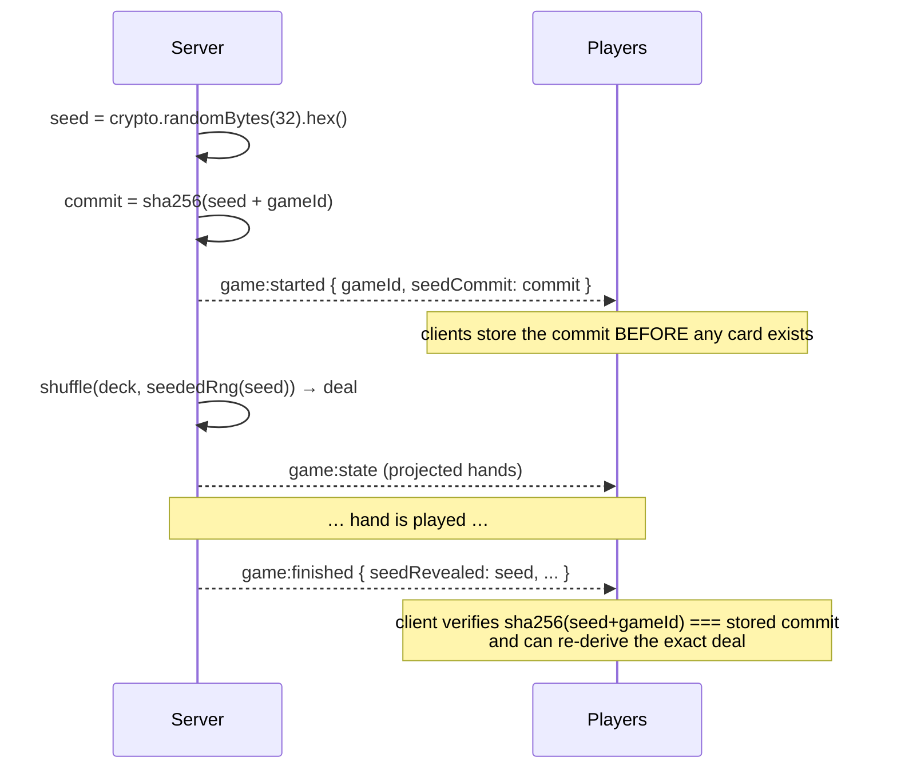

# Real-Time Protocol

> **Status:** Draft · **Depends on:** [02-technical-prd.md](./02-technical-prd.md) §3, [05-game-engine-spec.md](./05-game-engine-spec.md)

Socket.IO transport contract: handshake, rooms, the event catalog, per-viewer projection,
ordering, and reconnection.

**The one rule that governs this whole document:** the server never broadcasts game state. It
sends *N personalized projections*. There is no code path that emits the same game payload to two
different seats.

---

## 1. Connection & Handshake

Single namespace `/` (no per-table namespaces — rooms are the right tool and namespaces would
complicate the Redis adapter for nothing).

```mermaid
sequenceDiagram
    participant C as Client
    participant G as Socket.IO Gateway
    participant A as AuthService
    participant DB

    C->>G: connect (cookies sent automatically; withCredentials)
    G->>A: authenticate(handshake)
    alt access cookie valid
        A-->>G: { kind:'user', userId }
    else guest token present
        A->>DB: verify GuestSession (hash, not expired, not claimed)
        A-->>G: { kind:'guest', guestSessionId, tableId }
    else neither
        G-->>C: connect_error { code:'UNAUTHORIZED' }
        Note over C: client calls POST /auth/refresh, then retries once
    end
    G->>G: socket.data.identity = <resolved identity>   ★ immutable for the socket's life
    G-->>C: connected { serverTime, protocolVersion }
```

### 1.1 Identity rules

| Rule | Why |
|---|---|
| Identity is resolved **once, at handshake**, from the cookie or guest token, and stored in `socket.data`. | Re-reading it per event would let a token swap mid-connection. |
| **Nothing in any inbound payload can change identity.** No `userId`, `seat`, or `playerId` field is ever read from a client payload. | This single rule eliminates the entire seat-impersonation class of attack. |
| A **guest** socket may only ever join `table:{its bound tableId}`. Any other table is `FORBIDDEN`. | Enforces the binding from [03-data-model.md](./03-data-model.md) §3.1. |
| `seat` for every action is looked up server-side from `TableMember` by identity + table. | The client is told its seat; it never asserts it. |
| `protocolVersion` mismatch → client shows "please refresh". | Avoids silent breakage after a deploy mid-game. |

### 1.2 Transport configuration

- `transports: ['websocket', 'polling']` — WebSocket preferred, polling as the fallback for
  hostile networks.
- Client reconnection: exponential backoff, `reconnectionDelay: 500`, `max: 5000`,
  `reconnectionAttempts: Infinity` (a phone in a tunnel should keep trying).
- `pingInterval: 20000`, `pingTimeout: 20000`.
- Server: `maxHttpBufferSize: 1e5` (100 KB — game payloads are tiny; a large frame is either a
  bug or an attack).
- Redis adapter when `REDIS_URL` is set; in-memory otherwise.

---

## 2. Room Model

| Room | Members | Receives |
|---|---|---|
| `table:{tableId}` | everyone at the table — players, spectators, host | Lobby events, chat, presence, seat changes, non-secret game events |
| `seat:{tableId}:{seat}` | **only the socket(s) of that seat's occupant** | That seat's private projection: their hand, their legal moves |
| `spectators:{tableId}` | spectators only | The spectator projection |
| `user:{userId}` | all sockets of one signed-in user (multi-device) | Cross-table notifications ("your turn at another table") |

A player is in `table:{id}` **and** `seat:{id}:{n}`. Public state goes to the table room; private
state goes to the seat room. Two rooms rather than one is what makes the hand-privacy guarantee
structural instead of conditional.

> **Multi-tab note:** a user opening a second tab gets a second socket joined to the same seat
> room. Both receive the private projection — correct, since it is the same person. Moves are
> idempotent by `clientMoveId`, so a double-submit from two tabs is harmless.

---

## 3. Event Catalog

Naming: `domain:action`. Client→server events use **ack callbacks**; server→client events are
fire-and-forget with a `seq`.

### 3.1 Client → Server

| Event | Payload | Ack | Notes |
|---|---|---|---|
| `table:join` | `{ tableId, asSpectator? }` | `{ ok, table, seat, you }` | Joins rooms. Guest sockets: `tableId` must match binding |
| `table:leave` | `{ tableId }` | `{ ok }` | Frees the seat if `WAITING`; marks `disconnectedAt` if in progress |
| `table:takeSeat` | `{ tableId, seat }` | `{ ok }` / `SEAT_TAKEN` | DB unique constraint decides the race |
| `table:releaseSeat` | `{ tableId }` | `{ ok }` | |
| `table:addBot` | `{ tableId, seat, difficulty }` | `{ ok }` | **Host only** |
| `table:removeBot` | `{ tableId, seat }` | `{ ok }` | Host only |
| `table:kick` | `{ tableId, seat }` | `{ ok }` | Host only |
| `table:updateOptions` | `{ tableId, options }` | `{ ok }` | Host only, `WAITING` only, Zod-validated |
| `game:start` | `{ tableId }` | `{ ok, gameId }` | Host only; validates seat count against `meta.playableCounts` |
| **`game:move`** | `{ gameId, move, clientMoveId }` | `{ ok }` / `{ ok:false, code, i18nKey }` | **The core event.** Seat resolved server-side |
| `game:resign` | `{ gameId }` | `{ ok }` | |
| `game:offerDraw` / `game:respondDraw` | `{ gameId, accept? }` | `{ ok }` | Chess |
| `game:requestSync` | `{ gameId, lastSeq }` | `{ ok, mode:'delta'\|'full' }` | Explicit resync; see §5 |
| `chat:send` | `{ tableId, body }` | `{ ok }` / `RATE_LIMITED` | Rate-limited, filtered |
| `chat:emote` | `{ tableId, emoteId }` | `{ ok }` | Cheaper limit than text |
| `presence:heartbeat` | `{ tableId }` | — | Every 15 s; updates `lastSeenAt` |
| `game:reclaimSeat` | `{ gameId }` | `{ ok }` / `SEAT_NOT_RECLAIMABLE` | Return to a seat a bot is holding — see §6.4 |
| `mm:join` | `{ presetId, allowBotFill, partyId? }` | `{ ok, ticketId, position, timeoutAt }` / `BLOCKED` | Matchmaking — [09](./09-matchmaking.md) §8 |
| `mm:leave` | `{ ticketId }` | `{ ok }` | |
| `mm:status` | `{ ticketId }` | `{ ok, position, elapsedMs, humansWaiting, timeoutAt }` | |
| `mm:createParty` / `mm:joinParty` | `{ presetId }` / `{ inviteCode }` | `{ ok, partyId, ... }` | Queue as a group |

### 3.2 Server → Client

Every game event carries `seq`. Every payload is **already projected** for its recipient.

| Event | Room | Payload | Purpose |
|---|---|---|---|
| `connected` | socket | `{ serverTime, protocolVersion }` | Handshake complete |
| `table:snapshot` | socket | `{ table, members[], you:{ seat, role }, chat[] }` | Full lobby state on join |
| `table:memberJoined` / `MemberLeft` | `table:{id}` | `{ member }` / `{ seat, memberId }` | Live seat map |
| `table:seatChanged` | `table:{id}` | `{ seat, occupant \| null }` | |
| `table:optionsChanged` | `table:{id}` | `{ options }` | |
| `table:statusChanged` | `table:{id}` | `{ status }` | `WAITING → IN_PROGRESS → FINISHED` |
| `table:presence` | `table:{id}` | `{ seat, state:'online'\|'away'\|'disconnected', graceEndsAt? }` | Drives the "reconnecting…" badge |
| `game:started` | `table:{id}` | `{ gameId, gameSlug, seedCommit, seating }` | `seedCommit` published **before** the deal (§7) |
| **`game:state`** | `seat:*` / `spectators:*` | `{ gameId, seq, phase, view, legalMoves?, toAct, timers }` | **Personalized projection.** `legalMoves` present only for the seat that is to act |
| `game:event` | `table:{id}` | `{ gameId, seq, kind, seat?, descriptor }` | Public narration ("Sara played ♠A") as an i18n key + params |
| `game:moveRejected` | socket | `{ gameId, clientMoveId, code, i18nKey }` | Only to the offender; also audit-logged |
| `game:turnTimer` | `table:{id}` | `{ gameId, seat, endsAt, strikes }` | Server-authoritative deadline; client renders a countdown |
| **`game:ejectionWarning`** | socket | `{ gameId, secondsRemaining, consequence }` | **Only to the acting seat.** Final warning before ejection — §6.2 |
| **`game:playerEjected`** | `table:{id}` | `{ gameId, seat, reason, replacedByBot, reclaimableUntil? }` | A seat was taken over — §6 |
| **`game:playerReturned`** | `table:{id}` | `{ gameId, seat }` | Human reclaimed a bot-held seat — §6.4 |
| `game:finished` | `table:{id}` | `{ gameId, result, seedRevealed, ratingChanges? }` | Seed revealed here |
| **`game:rewardPreview`** | `seat:*` | `{ estimatedCoins, integrityFactor, warnings[] }` | Shown at match end before settlement — [10](./10-economy-and-rewards.md) §10 |
| **`game:rewardSettled`** | `seat:*` | `{ coinsAwarded, forfeited, reason?, capped? }` | Per-seat; forfeiture explained here |
| **`wallet:updated`** | `user:{id}` / socket | `{ asset, vested, provisional, delta?, reason? }` | Any balance change |
| `game:syncRequired` | socket | `{ gameId, reason }` | Server detected the client is behind; client must `requestSync` |
| `chat:message` | `table:{id}` | `{ id, author, kind, body \| emoteId, createdAt }` | |
| **`mm:queued`** | socket | `{ ticketId, position, humansWaiting, timeoutAt }` | [09](./09-matchmaking.md) §8 |
| **`mm:status`** | socket | `{ position, elapsedMs, humansWaiting, timeoutAt }` | Pushed every 5 s |
| **`mm:matched`** | socket | `{ tableId, seat, seatCount, botCount, startsInMs }` | Client auto-navigates |
| **`mm:released`** | socket | `{ reason, waitedMs, presetId, suggestions }` | Queue timeout — the *common* path |
| `error` | socket | `{ code, i18nKey, details? }` | Out-of-band errors |

### 3.3 Typed wrappers

Event maps live in `backend/src/contracts/events.ts` (canonical) and are mirrored to the frontend
(see [02-technical-prd.md](./02-technical-prd.md) §4.1):

```ts
export interface ServerToClientEvents {
  'game:state': (p: GameStatePayload) => void
  'game:event': (p: GameEventPayload) => void
  // ...
}
export interface ClientToServerEvents {
  'game:move': (p: MovePayload, ack: (r: Ack) => void) => void
  // ...
}
// server
const io = new Server<ClientToServerEvents, ServerToClientEvents, InterServerEvents, SocketData>(...)
// client
const socket: Socket<ServerToClientEvents, ClientToServerEvents> = io(URL, { withCredentials: true })
```

Both sides also **Zod-parse** inbound payloads. Types catch mistakes at compile time; Zod catches
a hostile client at runtime. Both are required — the client is untrusted by definition.

---

## 4. Projection — The Anti-Cheat Boundary

### 4.1 The mechanism

```ts
// application/services/GameSessionService.ts  (simplified)
private async broadcastState(gameId: string, state: unknown, seq: number) {
  const { engine, table } = await this.load(gameId)

  for (const m of table.members.filter(isSeated)) {
    const view = engine.projectState(state, { kind: 'seat', seat: m.seat })
    const legal = state.toAct === m.seat ? engine.legalMoves(state, m.seat) : undefined
    this.io.to(`seat:${table.id}:${m.seat}`)
        .emit('game:state', { gameId, seq, phase: state.phase, view, legalMoves: legal, ... })
  }

  if (engine.meta.supportsSpectators) {
    const view = engine.projectState(state, { kind: 'spectator' })
    this.io.to(`spectators:${table.id}`).emit('game:state', { gameId, seq, view, ... })
  }
}
```

There is deliberately **no** `io.to('table:x').emit('game:state', …)` anywhere in the codebase.
An ESLint `no-restricted-syntax` rule forbids emitting `game:state` to a `table:*` room, so the
mistake fails the build rather than leaking a hand.

### 4.2 What each viewer gets — Shelem, mid-trick

| Field | Seat 0 (self) | Seat 1 (opponent) | Spectator |
|---|---|---|---|
| own hand | `['AS','KH',…]` | — | — |
| others' hands | `{1:{count:8}, 2:{count:8}, 3:{count:8}}` | same shape | all as counts |
| `deck` / undealt | **absent** | **absent** | **absent** |
| widow (before exchange) | absent (or own, if declarer) | absent | absent |
| current trick | full — cards are face-up | full | full |
| completed tricks | winner + points only | same | same |
| bids, trump, scores | full — public | full | full |

### 4.3 The traps, named

| Trap | Wrong | Right |
|---|---|---|
| **Deck order** | `deck: Card[]` in the projection | `deckCount: number`. Sending the deck leaks the entire future of the hand |
| Blackjack shoe | `shoe: Card[]` | `shoeRemaining: number`, `penetration: number` |
| Hole card | Sent with a `faceDown: true` flag the client "respects" | **Absent from the payload** until the reveal phase |
| Hand sizes | Omitting counts entirely | Send counts — they are public at a real table and the UI needs them |
| Sudoku solution | Included so the client can validate | Server-only. Client posts a cell; server answers correct/incorrect |
| Bot hands | Projected as omniscient because "it's just a bot" | Bots get their own seat projection like anyone else. Otherwise a bug leaks bot hands to spectators |

Each of these has a named test in the anti-cheat suite
([02-technical-prd.md](./02-technical-prd.md) §10): serialize the projection, assert no hidden
card string appears anywhere in it.

---

## 5. Ordering & Reconnection

### 5.1 `seq`

- `GameInstance.seq` is a monotonic counter, incremented per appended `GameEvent`.
- Every `game:state` and `game:event` carries its `seq`.
- The client stores `lastSeq` per game.
- **Gap detection:** on receiving `seq > lastSeq + 1`, the client immediately emits
  `game:requestSync { lastSeq }` and shows a brief "syncing…" state rather than rendering a
  state it can't reconcile.
- Out-of-order or stale (`seq <= lastSeq`) messages are **dropped silently** — this makes the
  client idempotent against duplicate delivery.

### 5.2 Disconnect → grace → bot → reconnect

```mermaid
sequenceDiagram
    participant C as Client (seat 1)
    participant G as Gateway
    participant S as GameSessionService
    participant O as Other players

    C--xG: transport closed (tunnel / sleep / refresh)
    G->>S: onDisconnect(seat 1)
    S->>S: TableMember.disconnectedAt = now; start grace timer
    S-->>O: table:presence { seat:1, state:'disconnected', graceEndsAt }
    Note over O: badge: "Sara reconnecting… 0:58"

    alt reconnects within grace
        C->>G: connect + table:join
        G->>S: rejoin(seat 1)
        S->>S: clear disconnectedAt, cancel timer
        S-->>C: table:snapshot + game:state (full, current seq)
        S-->>O: table:presence { seat:1, state:'online' }
    else grace expires
        S->>S: if game supports bots → attach bot to seat 1
        S-->>O: game:event { kind:'BOT_TOOK_OVER', seat:1 }
        Note over S: bot plays until the human returns
        C->>G: connect (later)
        S->>S: detach bot, restore human control
        S-->>O: game:event { kind:'PLAYER_RETURNED', seat:1 }
    else grace expires and no bot support
        S->>S: pause game (untimed) or forfeit seat (timed)
        S-->>O: game:event { kind:'SEAT_ABANDONED', seat:1 }
    end
```

**Disconnect grace periods** (`meta`-declared, host-overridable):

| Game | Grace | On expiry |
|---|---|---|
| Sudoku | ∞ | Solo — nothing to hold up |
| Blackjack | 45 s | Ejected, bot substituted, seat reclaimable |
| Shelem | 90 s | Ejected, bot substituted, seat reclaimable. Generous, because a 4-player partnership match is ruined by a forfeit |
| Poker | 45 s | Ejected, bot substituted, seat reclaimable |
| Chess | clock only | The player's own clock is already the timer — no extra grace |

> **Two different timers, do not conflate them.** *Disconnect grace* (this section) starts when the
> transport drops and applies whether or not it's the player's turn. The *turn timer* (§6) starts
> when it becomes a seat's turn and applies even to a perfectly connected player who is simply not
> acting. Both end in ejection, but they carry different reward consequences
> ([10](./10-economy-and-rewards.md) §5.1: `EJECTED_ABANDON` vs `EJECTED_TIMEOUT`).

### 5.3 Resync modes

| Client `lastSeq` vs server | Mode | Sent |
|---|---|---|
| within snapshot window (gap ≤ 50) | `delta` | The missed `game:event`s, then one current `game:state` |
| far behind, or no `lastSeq` | `full` | `table:snapshot` + one current `game:state`. Cheap — a game state is a few KB |

Delta replay is a bandwidth nicety; **`full` is always correct** and is the fallback whenever
anything is ambiguous. Never guess at reconciliation.

### 5.4 Timers survive restarts

Turn deadlines are stored as absolute `endsAt` timestamps in Redis (`game:{id}:timer`) **and** as
a `PHASE` game event. On API restart, a startup task re-arms timers for all `ACTIVE` games from
the persisted deadlines. Clients render a countdown from `endsAt` against server-time offset
measured at handshake — so a client with a wrong system clock still shows the right countdown.

---

## 6. Turn Enforcement & Ejection

> **You asked for:** *players have a maximum time to play — say 30 seconds or a minute — and if
> they don't play, the app removes them from the game and replaces them with a bot.*

This is the canonical specification. [05-game-engine-spec.md](./05-game-engine-spec.md) declares
the limits; the games' documents list their default actions; this section owns the mechanism.

### 6.1 Turn timers

Every game declares `turnTimeoutMs` in `GameMeta`. The **session service** owns the actual timer —
never the engine (invariant I1 forbids an engine touching the clock).

| Game | Default turn limit | Notes |
|---|---|---|
| Blackjack | **30 s** | Betting phase: 30 s |
| Poker | **30 s** + 30 s one-shot time bank | Time bank is consumed automatically before ejection fires |
| Shelem | **30 s** play · **45 s** bidding | Bidding genuinely needs longer thought |
| Sudoku | **none** | Solo puzzle; a match-long idle timer applies instead (10 min) |
| Chess | **the chess clock** | The clock *is* the turn limit. Flag-fall ends the game — no ejection needed |

Deadlines are absolute (`endsAt`), stored in Redis **and** as a `PHASE` game event, so a restart
re-arms them without gifting anyone time (§5.4).

### 6.2 The escalation

```mermaid
sequenceDiagram
    participant S as GameSessionService
    participant P as Acting player (seat 1)
    participant T as Table (everyone)

    S->>T: game:turnTimer { seat:1, endsAt, strikes:0 }
    Note over P: client renders a countdown ring

    S->>P: game:ejectionWarning { secondsRemaining:10,<br/>consequence:'EJECTION_NO_REWARD' }
    Note over P: "Play within 10s or you'll be removed<br/>and earn no coins for this match"

    alt plays in time
        P->>S: game:move
        S->>S: cancel timer, clear strike
    else timer expires
        S->>S: strike++ ; apply the game's default action
        alt strikes < ejectAfterStrikes
            S->>T: game:event { kind:'TURN_TIMEOUT', seat:1, strikes }
            S->>T: game:turnTimer { seat:1, endsAt, strikes }
            Note over T: play continues; player keeps the seat
        else strikes reached the limit
            S->>S: eject seat 1 → attach bot → mark SeatOutcome EJECTED_TIMEOUT
            S->>T: game:playerEjected { seat:1, reason:'TURN_TIMEOUT',<br/>replacedByBot:true, reclaimableUntil }
            S->>P: game:rewardPreview { estimatedCoins:0,<br/>integrityFactor:0 }
            Note over P: removed from play; reward forfeited
        end
    end
```

> **`TURN_TIMEOUT` is a narration kind, not a stored one** (settled at S31). The log keeps the six
> `GameEvent.kind` values [03](./03-data-model.md) §4 fixes: a timeout is written as `TIMEOUT` so
> that replay re-applies the default action it caused, and is *narrated* as `TURN_TIMEOUT` so the
> client can render "Sara timed out — strike 1 of 2". The same holds for `BOT_TOOK_OVER`,
> `PLAYER_RETURNED` and `SEAT_ABANDONED` in §5.2, which are stored as `SYSTEM` rows carrying a
> `system` discriminator. One function — `narrationKindOf` — maps between the two vocabularies, so
> neither the enum nor the client has to widen.

### 6.3 Strikes — one deliberate softening of your rule

You specified that failing to play means removal. Implemented as **`ejectAfterStrikes`, default
`2`** rather than `1`.

The reason: a single 30-second lapse — a doorbell, a phone call, a tunnel — would eject someone
from a 45-minute Shelem match and forfeit their coins. That is harsh enough to make people avoid
the long games, which are the ones you most want played. Two strikes still ejects a genuinely
absent player within ~60 seconds, which is fast enough to protect the other three.

**It is a table option**, so `ejectAfterStrikes: 1` gives you your literal rule:

```ts
turnEnforcement: z.object({
  ejectAfterStrikes: z.number().int().min(1).max(5).default(2),
  warningSeconds:    z.number().int().min(0).max(30).default(10),
  strikesResetOnAction: z.boolean().default(true),   // a move clears the count
  reclaimWindowSec:  z.number().int().min(0).max(600).default(120),
})
```

`strikesResetOnAction: true` matters: a player who times out once, then plays normally for ten
tricks, should not be ejected by a second lapse twenty minutes later. Strikes measure *current*
absence, not lifetime record.

> **Where it lives** (settled at S31): its own nullable `Table.turnEnforcementJson` column and its
> own schema in `contracts/dto/turnEnforcement.ts` — **not** inside `optionsJson`, which each game's
> own strict `optionsSchema` validates. These four fields are platform policy rather than game
> rules, so copying them into six engines' schemas would let them drift.
>
> `null` is not the same as `{}`: a table that never expressed a preference follows the defaults as
> they change; one that did keeps what its host chose. Every table response publishes the
> **resolved** policy, defaults filled in, because a rule you are about to be held to and cannot
> read is a trap.

### 6.4 Seat reclamation

An ejected seat is held by a bot but stays **reclaimable** for `reclaimWindowSec` (default 120 s).
The returning player emits `game:reclaimSeat`.

| Situation | Reclaimable? | Reward on finishing |
|---|---|---|
| Ejected by turn timeout, returns within the window | **Yes** | 0.5× (`REPLACED_RETURNED`) |
| Ejected by disconnect, returns within the window | **Yes** | 0.5× |
| Returns after the window | No — the bot keeps the seat to the end | 0 |
| Ejected twice in one match | No — the seat is final | 0 |
| Chess | N/A — no ejection; the clock decides | — |

Reclamation happens **mid-hand** in Shelem (a hand is long; waiting for a boundary could mean five
minutes benched) and **at the next hand boundary** in Poker and Blackjack (joining mid-hand with a
bot's committed chips is unfair in both directions).

> Half reward for returning is the incentive design: enough that coming back beats staying away,
> less than never leaving. Combined with forfeiture and the matchmaking cooldown
> ([09](./09-matchmaking.md) §7.1), the three mechanisms make idling strictly worse than playing
> and worse than leaving cleanly.

### 6.5 Default actions on a strike (not an ejection)

On a non-final strike the game must still advance. Each game declares the **safest** action —
never one that spends resources the player didn't authorize:

| Game | Default action | Never |
|---|---|---|
| Blackjack | **Stand** | Never hit (could bust a 20); never auto-bet |
| Poker | **Fold**, or check if free | **Never call** — it spends chips without consent |
| Shelem | Lowest-value **legal** card; `PASS` when bidding | Never bid on someone's behalf |
| Sudoku | Nothing — solo | — |
| Chess | N/A — the clock runs out and the game ends | — |

### 6.6 Consequences beyond the table

| Consequence | Where |
|---|---|
| **Reward forfeited** — nothing earned even if the team wins | [10](./10-economy-and-rewards.md) §5 |
| Counted as a loss for stats and ELO | [03](./03-data-model.md) §3.5 |
| Escalating matchmaking cooldown | [09](./09-matchmaking.md) §7.1 — matchmaking only, never private tables |
| `MatchParticipant.outcome = EJECTED_TIMEOUT` | [03](./03-data-model.md) §3.5 |
| Explained to the player, not silent | `game:rewardSettled` carries the reason; the post-match screen states it plainly |

---

## 7. Seed Commitment Over the Wire



The client shows a small "✓ deal verified" indicator on the match summary. It is a *nice* feature
for friends who joke about rigged deals, and a genuinely strong guarantee: the server cannot have
chosen the deal after seeing anyone's cards.

---

## 8. Rate Limits & Abuse Control

| Event | Limit | On exceed |
|---|---|---|
| `game:move` | 10 / 5 s per socket | `RATE_LIMITED` ack + `SecurityEvent` |
| `chat:send` | 5 / 10 s per identity | ack with `retryAfterMs` |
| `chat:emote` | 10 / 10 s | silent drop after warning |
| `table:takeSeat` | 5 / 10 s | `RATE_LIMITED` |
| `game:requestSync` | 3 / 10 s | forced `full` sync, then throttle |
| `game:reclaimSeat` | 3 / 10 s | `RATE_LIMITED` |
| `mm:join` | 10 / 5 min per identity · 2 concurrent tickets per IP | `RATE_LIMITED` / `BLOCKED`. Queue-flapping to hunt for a favourable group is itself a farming signal ([09](./09-matchmaking.md) §7.2) |
| `mm:status` | 12 / min | ignored beyond the limit — the server pushes status anyway |
| connections | 5 concurrent sockets per identity | oldest evicted |
| handshake failures | 10 / min per IP | temporary IP block |

Limits are Redis-backed (sliding window) so they hold across API restarts; in dev they fall back
to in-process counters.

Additional guards:
- **Payload size**: `maxHttpBufferSize` 100 KB, plus Zod schemas with `.max()` on every string.
- **Illegal-move throttle**: 5 rejected moves in 30 s → `ALERT` `SecurityEvent`. Repeated
  rejections are the clearest signal of someone probing the API, which is exactly what you'd want
  to know about.

---

## 9. Client Socket Discipline

Rules the frontend must follow ([06-frontend-architecture.md](./06-frontend-architecture.md) §4):

1. **One socket per tab**, owned by `socketStore`. Never a socket inside a component.
2. **Never optimistic-update game state.** Emit the move, show a pending affordance on the card,
   wait for `game:state`. Optimistic UI here means guessing the rules client-side — which is
   exactly what P1 forbids. (Chat *may* be optimistic; it's not game state.)
3. **Store only what the server sent.** `gameStore` holds the projection verbatim. No deriving,
   no reconstructing, no caching an opponent's hand.
4. **Always send `clientMoveId`** (`crypto.randomUUID()`), retained until acked so a reconnect
   retry is idempotent.
5. **Track `lastSeq`** and request sync on any gap.
6. On `connect_error: UNAUTHORIZED` → attempt one `POST /auth/refresh`, then reconnect once; if
   that fails, route to sign-in preserving the return URL.
7. **Never render a turn countdown from a local timer alone.** Compute remaining time from the
   server's `endsAt` minus the clock offset measured at handshake. A client with a skewed system
   clock must still see the true deadline, because that deadline can eject them.
8. **Never treat a matchmaking ticket as client state.** `mm:status` and
   `GET /matchmaking/status` are the truth; a ticket that exists only in the browser survives a
   refresh in appearance only.

---

## Related Documents

- [02-technical-prd.md](./02-technical-prd.md) — architecture, transports, testing
- [03-data-model.md](./03-data-model.md) — `GameEvent`, `seq`, seed columns
- [05-game-engine-spec.md](./05-game-engine-spec.md) — `projectState`, invariant I4
- [06-frontend-architecture.md](./06-frontend-architecture.md) — client-side socket handling
- [07-security-and-anticheat.md](./07-security-and-anticheat.md) — threat model
- [09-matchmaking.md](./09-matchmaking.md) — queue protocol and abuse control
- [10-economy-and-rewards.md](./10-economy-and-rewards.md) §5 — reward consequences of ejection
