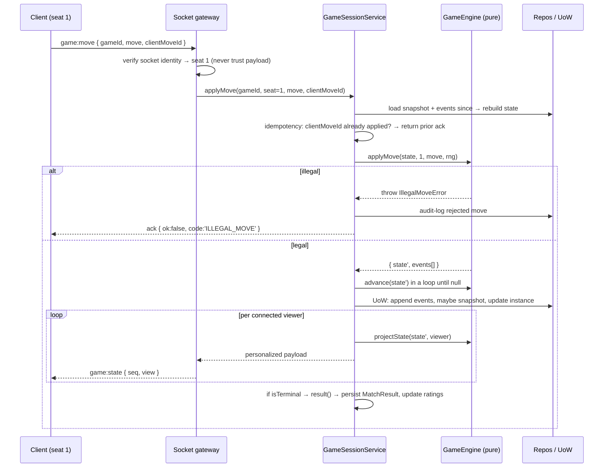

# Game Engine Specification

> **Status:** Draft · **Depends on:** [02-technical-prd.md](./02-technical-prd.md) §5

This document defines the single abstraction every game implements. It exists to satisfy
principle **P5**: *adding game #6 must not require touching games #1–5.*

Everything here lives in `backend/src/domain/games/` and imports **nothing** from
`infrastructure/`, `application/`, or `@prisma/client`.

---

## 1. The Contract

```ts
// domain/games/GameEngine.ts

/** Seat index within a table, 0-based. Partnership games derive teams from seat parity. */
export type SeatId = number

/** Who is being shown state: a seated player, a spectator, or the server itself. */
export type Viewer =
  | { kind: 'seat';      seat: SeatId }
  | { kind: 'spectator' }
  | { kind: 'omniscient' }              // server-internal / replay tooling only

export interface GameMeta {
  slug: string                          // 'shelem' — stable, used in URLs and the registry
  minPlayers: number
  maxPlayers: number
  /** Seat counts that are actually playable, e.g. Shelem: [4]; Poker: [2,3,4,5,6] */
  playableCounts: number[]
  teams?: { size: number; count: number }
  /** Zod schema for per-table options (target score, blinds, difficulty, ...) */
  optionsSchema: ZodType<unknown>
  defaultOptions: unknown
  /** Preview-card data for the welcome page. i18n keys, never literal text. */
  preview: {
    nameKey: string
    taglineKey: string
    complexity: 'light' | 'medium' | 'heavy'
    avgMinutes: [number, number]
    art: string                         // asset path
    hasHiddenInfo: boolean
    usesStandardDeck: boolean
  }
  /** Per-move turn limit; null = untimed. Chess overrides with a real clock.
   *  ENFORCEMENT lives in the session service (04 §6), never in the engine — an engine
   *  that read a clock would violate I1. This is a declaration, not a timer. */
  turnTimeoutMs: number | null
  /** Optional per-phase overrides, e.g. Shelem bidding gets longer than card play. */
  turnTimeoutByPhaseMs?: Record<string, number>
  /** Safest move to apply on a non-final timeout strike (04 §6.5).
   *  Must never spend a resource the player didn't authorize. */
  defaultActionOnTimeout: (state: unknown, seat: SeatId) => unknown | null
  /** Disconnect grace before the seat is ejected and bot-substituted. */
  disconnectGraceMs: number
  /** Whether a bot-held seat may be reclaimed mid-hand, or only at a hand boundary. */
  reclaimAt: 'IMMEDIATE' | 'HAND_BOUNDARY' | 'NEVER'

  supportsSpectators: boolean
  supportsBots: boolean

  /** Queueable presets. Custom options remain available on private tables. See 09 §2. */
  matchmaking: {
    enabled: boolean
    presets: {
      id: string
      nameKey: string
      seatCount: number
      options: unknown          // ★ a fixed literal — this is what makes the pool key meaningful
      preferHumansMs: number
    }[]
  }
}

export interface MoveResult<S> {
  state: S
  /** Domain events describing what changed. Persisted; drive broadcast + replay. */
  events: GameEventPayload[]
}

export interface GameEngine<S, M> {
  readonly meta: GameMeta

  /** Deterministic given (config, seats, rng). No I/O. */
  createInitialState(config: GameConfig, rng: Rng): S

  /** Exhaustive list of currently legal moves for a seat. Empty if not their turn. */
  legalMoves(state: S, seat: SeatId): M[]

  /**
   * Applies a move. MUST throw IllegalMoveError / NotYourTurnError rather than
   * returning an invalid state. Must not mutate `state`.
   */
  applyMove(state: S, seat: SeatId, move: M, rng: Rng): MoveResult<S>

  /**
   * Moves the game forward without a player acting: deal the next street, resolve a
   * completed trick, run the dealer's hand, expire a turn. Called in a loop by the
   * session service until it returns null.
   */
  advance?(state: S, rng: Rng): MoveResult<S> | null

  /** ★ The anti-cheat boundary. Returns ONLY what this viewer may know. */
  projectState(state: S, viewer: Viewer): unknown

  isTerminal(state: S): boolean

  /** Only valid when isTerminal(state). */
  result(state: S): GameResult

  /** Optional AI. Required for a game to appear in "fill with bot" UI. */
  bot?: BotStrategy<S, M>

  /** Human-readable move description for chat/log/replay. i18n key + params. */
  describeMove(state: S, seat: SeatId, move: M): { key: string; params: Record<string, unknown> }
}
```

### 1.1 Supporting types

```ts
export interface GameConfig {
  seats: SeatId[]                       // occupied seats at start
  options: unknown                      // validated against meta.optionsSchema
  locale?: string                       // for describeMove convenience only
}

/**
 * How a seat's occupant left the match. Drives reward eligibility (10 §5).
 * The engine reports the FACT; the RewardService applies the POLICY.
 */
export type SeatOutcome =
  | 'COMPLETED'          // played to the end
  | 'EJECTED_TIMEOUT'    // turn timer struck out → removed, bot substituted
  | 'EJECTED_ABANDON'    // disconnected past grace, never returned
  | 'RESIGNED'           // deliberately conceded
  | 'REPLACED_RETURNED'  // ejected, then reclaimed the seat and finished
  | 'BOT'                // bot-occupied
  | 'KICKED'             // removed by the host

export interface GameResult {
  /** Ranking of seats, best first. Ties share a rank. */
  standings: {
    seat: SeatId
    rank: number
    score: number
    /** ★ Per SEAT, not per team. A winning partnership can contain an ejected player. */
    outcome: SeatOutcome
    /** Fraction of the match this human actually played (bot remainder excluded). */
    playedFraction: number
  }[]
  winningTeam?: number
  /** Free-form per-game summary, persisted to MatchResult.summaryJson */
  summary: Record<string, unknown>
  reason: 'NORMAL' | 'RESIGNATION' | 'TIMEOUT' | 'ABANDONED' | 'DRAW'
}

export interface BotStrategy<S, M> {
  /** Must be fast (<50 ms) and pure. Difficulty tiers are separate strategies. */
  chooseMove(state: S, seat: SeatId, legal: M[], rng: Rng): M
  readonly difficulty: 'easy' | 'medium' | 'hard'
}
```

---

## 2. The Five Invariants

Every engine is reviewed against these. A violation is a bug, not a style preference.

| # | Invariant | Why | How it's tested |
|---|---|---|---|
| **I1** | **Pure & deterministic.** No `Date.now()`, no `Math.random()`, no I/O, no globals. Time and randomness are injected. | Replayability: any reported bug reduces to `(seed, moves[])`. Without this, "Shelem scored wrong last night" is unfixable. | `replayFixture(seed, moves)` must produce byte-identical state twice |
| **I2** | **Immutable.** `applyMove` returns new state; never mutates the input. | Lets the session service keep the pre-move state for rollback and diffing. | Freeze input state in tests (`Object.freeze` deep) and assert no throw |
| **I3** | **Total legality.** `applyMove` rejects anything not in `legalMoves`. | The client is untrusted (P1). `legalMoves` is a *convenience for the UI*, never the enforcement point. | Property test: for every state in a fixture corpus, every move ∉ `legalMoves` throws |
| **I4** | **Projection completeness.** `projectState` must strip *all* information the viewer may not have — including derivable information (deck order, remaining-card counts that reveal a hand, an opponent's exact hand size when that is secret). | This is the whole anti-cheat story. | Dedicated suite: serialize the projection, assert no hidden card's `(rank,suit)` appears anywhere in it |
| **I5** | **Serializable.** State must round-trip through `JSON.stringify/parse` unchanged. No `Map`, `Set`, `Date`, `class` instances, `undefined` in arrays. | State is persisted as a JSON `String` column (SQLite/Postgres portable — see [03-data-model.md](./03-data-model.md)) and sent over the socket. | `expect(parse(stringify(s))).toEqual(s)` in every engine's suite |

> **I4 has a subtle trap worth naming:** it is not enough to blank out other players' cards. If
> your state keeps `deck: Card[]` in draw order, a projection that includes the deck leaks the
> *entire future of the game*. The correct projection sends `deckCount: number`, never `deck`.
> Every card game here must be checked for this specific mistake.

### 2.1 What an engine must never know about

Three concerns sit *outside* the engine and importing them would break I1:

| Concern | Owner | Why not the engine |
|---|---|---|
| **Wall-clock time / turn timers** | `GameSessionService` ([04](./04-realtime-protocol.md) §6) | `Date.now()` destroys determinism. `meta.turnTimeoutMs` is a *declaration*; the service arms the timer and calls `defaultActionOnTimeout` or ejects |
| **Coins, wallets, rewards** | `RewardService` ([10](./10-economy-and-rewards.md) §3) | The engine reports `SeatOutcome`; policy converts it to money. An engine that knew about coins could not be unit-tested without a ledger |
| **Matchmaking** | `MatchmakingService` ([09](./09-matchmaking.md)) | `meta.matchmaking.presets` is data the matcher reads; the engine never queries a queue |

Enforced by ESLint: `src/domain/games/**` may not import from `application/`, `infrastructure/`,
or anything named `wallet`/`reward`/`matchmaking`. The wallet restriction doubles as the E5 guard
that keeps poker chips from ever touching a real balance
([10](./10-economy-and-rewards.md) §4.4).

---

## 3. Randomness

```ts
// domain/games/shared/rng.ts
export interface Rng {
  int(maxExclusive: number): number     // uniform, unbiased
  pick<T>(items: readonly T[]): T
  shuffle<T>(items: readonly T[]): T[]  // returns a new array
}

/** Production: CSPRNG. Cannot be predicted from observed output. */
export function createSecureRng(): Rng

/** Tests & replay: deterministic from a seed (xoshiro128** or similar). */
export function createSeededRng(seed: string): Rng
```

**Shuffle — the only acceptable implementation:**

```ts
// Fisher–Yates with an unbiased integer source.
export function shuffle<T>(items: readonly T[], rng: Rng): T[] {
  const a = [...items]
  for (let i = a.length - 1; i > 0; i--) {
    const j = rng.int(i + 1)            // NOT Math.floor(rng.float() * (i+1))
    ;[a[i], a[j]] = [a[j]!, a[i]!]
  }
  return a
}
```

Two rules:
- `createSecureRng().int()` wraps `crypto.randomInt` — which does rejection sampling, so it is
  unbiased. `Math.floor(Math.random() * n)` is both predictable and (slightly) biased; it must
  not appear anywhere in `domain/`.
- **Seed commitment** for provable fairness: before dealing, the server persists `seed` and
  broadcasts `sha256(seed + gameId)`. After the hand ends, it broadcasts `seed`. Anyone can
  verify the deal wasn't chosen after seeing the cards. Details in
  [07-security-and-anticheat.md](./07-security-and-anticheat.md) §4.

---

## 4. Shared Building Blocks

`domain/games/shared/` — the reason each new card game costs days, not weeks.

### 4.1 Cards

```ts
export const SUITS = ['C', 'D', 'H', 'S'] as const          // clubs diamonds hearts spades
export const RANKS = ['2','3','4','5','6','7','8','9','T','J','Q','K','A'] as const
export type Suit = typeof SUITS[number]
export type Rank = typeof RANKS[number]

/** Compact 2-char string: 'AS', 'TD', '7H'. Chosen deliberately: */
export type Card = `${Rank}${Suit}`
```

Why a string and not `{rank, suit}`: it satisfies **I5** trivially, makes state payloads ~4×
smaller on the wire, is directly usable as an object key and in `Set`-free dedupe via arrays,
and makes **I4** testable by simple substring assertions on a serialized projection. Helpers
(`rankOf`, `suitOf`, `cardValue`) keep call sites readable.

### 4.2 Deck utilities

```ts
buildStandardDeck(): Card[]                      // 52
buildDeck(opts: { jokers?: number; strip?: Rank[] }): Card[]
deal(deck: Card[], counts: number[]): { hands: Card[][]; rest: Card[] }
sortHand(hand: Card[], order: RankOrder, trump?: Suit): Card[]
```

### 4.3 Trick-taking core — used by Shelem, then Hokm, then Rummy-adjacent games

```ts
export interface TrickState {
  leader: SeatId
  plays: { seat: SeatId; card: Card }[]
  trump: Suit | null
}
legalTrickPlays(hand: Card[], trick: TrickState, mustFollowSuit: boolean): Card[]
resolveTrick(trick: TrickState, rankOrder: RankOrder): { winner: SeatId; cards: Card[] }
```

This module is the single biggest reason **Shelem is scheduled before Poker**: it is directly
reused by Hokm (~70%) and partially by Crazy Eights and Durak in the backlog.

Keep this module free of *how trump is chosen* and *how points are counted* — those differ between
the two Persian games (Shelem: trump from the opening lead, card points + trick points; Hokm:
announced trump, trick counts only). The shared core is **follow-suit legality, trick resolution,
and the partnership model**; everything else belongs to the game.

### 4.4 Betting-round core — used by Poker and Blackjack

```ts
export interface BettingState {
  pot: number
  bets: Record<SeatId, number>
  stacks: Record<SeatId, number>
  toAct: SeatId | null
  lastRaiser: SeatId | null
  minRaise: number
  /** ⚠️ A `Set<SeatId>` would be the natural choice here and is FORBIDDEN by I5 —
   *  it does not survive JSON.stringify. Always a plain array. */
  folded: SeatId[]
}
legalBets(s: BettingState, seat: SeatId): BetAction[]
applyBet(s: BettingState, seat: SeatId, action: BetAction): BettingState
isRoundComplete(s: BettingState): boolean
buildSidePots(s: BettingState): SidePot[]         // ← the classic bug source; see poker doc
```

### 4.5 Phase machine

```ts
export interface PhaseMachine<P extends string> {
  readonly initial: P
  readonly transitions: Record<P, readonly P[]>
  can(from: P, to: P): boolean
  assert(from: P, to: P): void                    // throws IllegalPhaseTransitionError
}
```

Each game declares its phases explicitly, e.g. Shelem:
`DEALING → BIDDING → WIDOW_EXCHANGE → TRICK_PLAY → HAND_SCORING → (DEALING | MATCH_OVER)`.
Note there is deliberately **no** `TRUMP_SELECTION` state — in Shelem the trump suit is a side
effect of the declarer's opening lead ([games/shelem.md](./games/shelem.md) §3). Hokm, which
reuses most of the same core, *does* have an explicit trump-naming phase; the phase machines are
where the two games diverge.
Declaring transitions as data (rather than scattered `if` checks) makes the phase diagram in each
game document verifiable against the code.

### 4.6 Timers

Turn timers are **not** in the engine (they'd violate I1). `meta.turnTimeoutMs` is a *declaration*;
the `GameSessionService` owns the actual `setTimeout`, and on expiry calls `advance()` or applies
a game-declared default move (fold, auto-play forced card, flag-fall in chess).

---

## 5. Registry

```ts
// domain/games/registry.ts
export function buildGameRegistry() {
  const engines = [sudokuEngine, blackjackEngine, shelemEngine, pokerEngine, chessEngine]
  const bySlug = new Map(engines.map((e) => [e.meta.slug, e]))
  return {
    get(slug: string): AnyGameEngine {
      const e = bySlug.get(slug)
      if (!e) throw new NotFoundError(`Unknown game: ${slug}`)
      return e
    },
    /** Powers GET /api/v1/games → the welcome page preview cards. */
    list(): GameMeta[] { return engines.map((e) => e.meta) },
  }
}
```

The welcome page renders whatever `list()` returns. **Adding a game requires no frontend
deploy for the catalog** — only the per-game renderer component (and the registry entry) are new
code. This is P5 made concrete.

---

## 6. How a Move Flows



Points worth internalizing:

- **Seat comes from the socket, never the payload.** The client cannot claim to be seat 2.
- **State is rebuilt from the log** (snapshot + delta), not held in a mutable process map. This
  is what makes an API restart lose zero games.
- **`projectState` is called once per viewer**, not once per broadcast. Same state, N different
  payloads. There is no "broadcast the state" path in the codebase — that path is exactly the
  bug we are designing against.
- **Idempotency via `clientMoveId`**: a socket retry after a flaky reconnect must not double-play
  a card.

---

## 7. Per-Game Implementation Checklist

Copy this into each game's PR description:

- [ ] `meta` complete, `optionsSchema` validates and rejects garbage
- [ ] `createInitialState` deterministic under a seeded RNG (test asserts twice-equal)
- [ ] `legalMoves` exhaustive and correct at every phase
- [ ] `applyMove` throws for every move ∉ `legalMoves` (property test over fixture corpus)
- [ ] `applyMove` does not mutate input (frozen-input test)
- [ ] `advance` terminates — no infinite loop possible
- [ ] **`projectState` leak test passes for every seat and for spectators** (I4)
- [ ] **No `deck` array in any non-omniscient projection** (the §2 trap)
- [ ] State survives JSON round-trip (I5) — no `Set`/`Map`/`Date`
- [ ] `isTerminal` + `result` correct, including draws/abandonment
- [ ] **`result().standings[].outcome` correct per seat**, including a winning team containing an
      ejected player ([10](./10-economy-and-rewards.md) §5)
- [ ] `defaultActionOnTimeout` returns the **safest** move and never spends an unauthorized
      resource (no auto-call, no auto-bet, no auto-hit) ([04](./04-realtime-protocol.md) §6.5)
- [ ] `meta.turnTimeoutMs` / `disconnectGraceMs` / `reclaimAt` set deliberately, not copied
- [ ] `meta.matchmaking.presets` are **fixed literals**; the game is playable at each preset's
      exact `seatCount`
- [ ] Bot can take over a seat mid-match and the state stays valid
- [ ] `describeMove` returns i18n keys for every move type, with `en` + `fa` translations added
- [ ] Full-game fixture replays byte-identically
- [ ] Bot (if `supportsBots`) never chooses an illegal move; property-tested over 1000 seeds
- [ ] Rules document in `games/<slug>.md` matches the implemented phase machine
- [ ] RTL visual review of the game screen in `fa`

---

## 8. Game-Specific Notes

| Game | Engine shape | Reuses | Distinct risk |
|---|---|---|---|
| **Sudoku** | No hidden *opponent* info, but the **solution is server-only**. `projectState` never includes the solved grid — the client only learns "that cell is wrong". | — | Puzzle generation + difficulty grading is the real work |
| **Blackjack** | Dealer is a virtual seat driven by `advance()`. Hole card hidden until reveal phase. | betting-round | Shoe state must not be projected (the §2 trap, in its most tempting form) |
| **Shelem** | The flagship. Bidding (min 100, ×5) → widow exchange → 12 tricks → scoring, 4 seats / 2 teams. **Trump is set by the declarer's opening lead**, not announced. Scoring mixes card points with 5-per-trick to total 165. | trick-taking, deck | Two-component scoring, and the discard pile counting as a scoring trick — see [games/shelem.md](./games/shelem.md) §0.3 |
| **Poker** | Multi-street betting, side pots, showdown. | betting-round | `buildSidePots` with multiple all-ins at different stack depths |
| **Chess** | Thin adapter over `chess.js`; `state` is `{ fen, pgn, clocks }`. Perfect information ⇒ `projectState` is near-identity (but clocks still need server-truth). | — | Clock accuracy; must not mirror under RTL |

---

## Related Documents

- [02-technical-prd.md](./02-technical-prd.md) — layers, repository pattern, wiring
- [04-realtime-protocol.md](./04-realtime-protocol.md) — how projections reach clients; §6 turn enforcement
- [07-security-and-anticheat.md](./07-security-and-anticheat.md) — threat model behind I3/I4
- [09-matchmaking.md](./09-matchmaking.md) — how `meta.matchmaking.presets` is consumed
- [10-economy-and-rewards.md](./10-economy-and-rewards.md) — how `SeatOutcome` becomes a reward
- [games/](./games/) — per-game rule specifications
