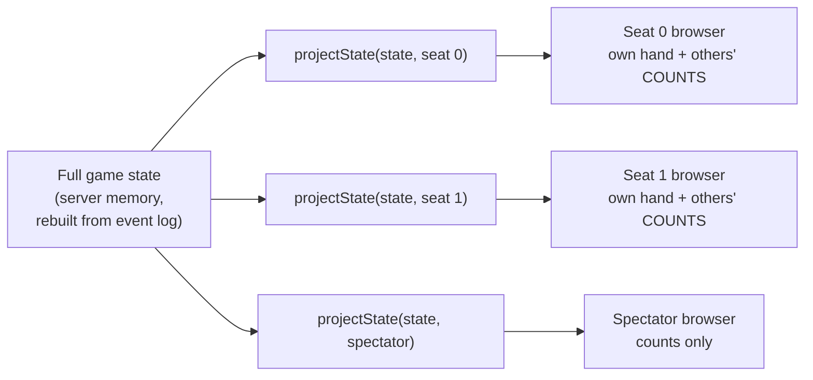

# Security & Anti-Cheat

> **Status:** Draft · **Depends on:** [05-game-engine-spec.md](./05-game-engine-spec.md), [04-realtime-protocol.md](./04-realtime-protocol.md)

Goal **G2** from [01-business-prd.md](./01-business-prd.md): *cheating is structurally impossible,
not merely discouraged.*

The distinction matters. A system that hides cards in the UI is discouraging cheating — anyone
who opens devtools wins. A system where the card was never sent to that browser makes cheating
impossible regardless of what the attacker does client-side. Everything below aims for the second
kind.

---

## 1. Threat Model

Attacker model: **a technically capable friend** with devtools, the ability to craft socket
frames, and knowledge of the API — but no server access. This is the realistic threat for a
private app, and it's a demanding one.

| # | Threat | Vector | Severity | Structurally prevented by |
|---|---|---|---|---|
| T1 | **Read an opponent's hand** | Inspect socket frames / React state / network log | **Critical** | Per-viewer projection — the cards never reach that client (§2) |
| T2 | **Predict the deck** | Deck array leaked in a payload; or a weak/seeded PRNG | **Critical** | `deckCount` only; CSPRNG shuffle (§4) |
| T3 | **Play an illegal move** | Craft a `game:move` frame bypassing UI validation | High | Server re-validates every move against `legalMoves`; UI validation is cosmetic (§3.1) |
| T4 | **Act as another seat** | Send `{ seat: 2 }` in a payload | High | Seat resolved from socket identity; payload seat fields are never read (§3.2) |
| T5 | **Act out of turn** | Send a move when it isn't your turn | High | Engine's `applyMove` throws `NotYourTurnError` (§3.1) |
| T6 | **Replay / duplicate a move** | Resend a frame after reconnect | Medium | `(gameId, clientMoveId)` DB unique constraint (§3.3) |
| T7 | **Guest token abuse** | Reuse a leaked guest token elsewhere | Medium | Token bound to one `tableId`; short TTL (§5.1) |
| T8 | **Invite-link abuse** | Link leaks into a wider group chat | Medium | Expiry, revocation, use caps, optional host approval (§5.2) |
| T9 | **Session/token theft** | XSS, or a stolen refresh token | High | httpOnly cookies, refresh rotation with family revocation (§5.3) |
| T10 | **Collusion** (two friends sharing hands over another channel) | Out of band | Low | **Not preventable.** Mitigated socially + one-seat-per-identity (§7) |
| T11 | **Socket flooding / DoS** | Event spam | Medium | Redis sliding-window rate limits, payload caps (§8) |
| T12 | **Malicious avatar upload** | Polyglot image, SVG with script, decompression bomb | Medium | Re-encode server-side, never serve original bytes (§6) |
| T13 | **Bot-assisted play** (engine help in chess/poker) | External analysis tool | Low | **Not preventable** in any web game. Accepted (§7) |
| T14 | **Enumerate invite codes** | Brute-force `/invites/:code` | Low | 128-bit-entropy codes, IP rate limit, no distinguishing 404 vs 410 timing (§5.2) |
| T15 | **Coin farming via guest sessions** | Many guest identities, self-matched, fast fake matches | **Critical** | Guests cannot spend; provisional balances capped at vesting; duration factor; repeat decay; queue guards (§11.1) |
| T16 | **Reward replay / double-credit** | Retried settlement, redelivered webhook, restarted worker | **Critical** | Derived idempotency keys + a unique DB constraint (§11.2) |
| T17 | **Balance tampering** | Race two purchases; forge a client-side balance | High | Row-locked debits; balance is ledger-derived; nightly reconciliation (§11.3) |
| T18 | **AFK reward farming** | Join, idle, collect | Medium | Ejection ⇒ zero reward; escalating queue cooldown (§11.4) |
| T19 | **Premium entitlement bypass** | Forged webhook; client-claimed premium | High | Signature-verified webhooks; entitlement always read server-side (§11.5) |
| T20 | **Wallet ↔ chip bridging** | A future change wires poker stacks to the wallet | **Critical** | Lint rule + test. A *regression* threat, not an attacker threat (§11.6) |

> **The economy changed the threat landscape more than any other feature.** Before it, cheating
> cost a friend a game. Now it has a payout, which means the adversary model shifts from "a
> curious friend with devtools" to "someone with a financial reason to automate." §11 addresses
> that class specifically.

---

## 2. T1 — Hidden Information (the core defense)

### 2.1 The architecture



The full state exists **only** on the server. Each browser receives a different, reduced payload.
There is no complete state anywhere in any client, at any point, in any form.

### 2.2 The four enforcement points

| Layer | Mechanism |
|---|---|
| **Engine** | `projectState` is a required method of `GameEngine`. Invariant **I4** ([05](./05-game-engine-spec.md) §2) makes completeness a correctness requirement, tested per game |
| **Transport** | Private state goes to `seat:{tableId}:{seat}` rooms — never `table:{tableId}`. Enforced by an ESLint `no-restricted-syntax` rule that fails the build on `io.to('table:…').emit('game:state', …)` |
| **Component** | `<Card />` takes `card?: Card`; `undefined` renders a back. A face-down card is one for which **no face data was passed** — the component cannot leak what it never received |
| **Test** | Per-game leak suite: serialize every projection, assert no hidden card string appears. Plus a Playwright two-context test asserting neither page's DOM **or network log** contains the other's cards |

### 2.3 The four leaks to actively hunt

These are the mistakes that actually happen. Each has a named test.

| Leak | Why it's tempting | Correct |
|---|---|---|
| **Deck array in the projection** | It's in the state object; spreading the state is one line | `deckCount: number`. Sending the deck leaks *the entire rest of the game* — worse than leaking one hand |
| **Face-down card sent with a flag** | "The client just won't render it" | Omit the card entirely. A flag is a request, not a boundary |
| **Bot hands projected omniscient** | "It's only a bot" | Bots get seat projections like anyone else, or a spectator sees bot hands |
| **Blackjack shoe in state** | Needed for dealing | `shoeRemaining` + `penetration` only. The shoe is the deck leak in its most tempting costume |

```ts
// tests/anticheat/leak.test.ts — runs for EVERY game
for (const engine of allEngines) {
  it(`${engine.meta.slug}: no seat sees another seat's hidden cards`, () => {
    const state = playRandomGame(engine, createSeededRng('leak-test'))
    for (const seat of seats) {
      const json = JSON.stringify(engine.projectState(state, { kind: 'seat', seat }))
      for (const other of seats.filter(s => s !== seat)) {
        for (const card of hiddenCardsOf(state, other)) {
          expect(json).not.toContain(card)          // Card is a 2-char string → substring works
        }
      }
      expect(json).not.toContain('"deck"')
    }
  })
}
```

> This is where the `type Card = 'AS' | ...` string representation from
> [05-game-engine-spec.md](./05-game-engine-spec.md) §4.1 pays for itself: the leak test is a
> substring assertion over serialized JSON, which catches a card hidden **anywhere** in the
> payload — including in a field nobody thought to check.

---

## 3. T3–T6 — Move Integrity

### 3.1 The client's UI validation is cosmetic

```ts
// Server — the ONLY enforcement point
applyMove(state, seat, move, rng) {
  if (state.toAct !== seat) throw new NotYourTurnError({ seat, expected: state.toAct })
  const legal = this.legalMoves(state, seat)
  if (!legal.some(m => deepEqual(m, move))) throw new IllegalMoveError({ seat, move })
  // ... apply
}
```

The client greying out an unplayable card is a **usability feature**. A crafted socket frame
bypasses it entirely and hits the check above. Invariant **I3** requires this check to exist
independently of `legalMoves` being sent to the client at all.

### 3.2 Seat identity is never client-supplied

```ts
// interface/socket/handlers/game.ts
socket.on('game:move', async ({ gameId, move, clientMoveId }, ack) => {
  const identity = socket.data.identity                    // ★ set at handshake, immutable
  const seat = await tables.resolveSeat(gameId, identity)  // ★ DB lookup, not payload
  if (seat === null) return ack(fail('NOT_SEATED'))
  // ...
})
```

The `MovePayload` Zod schema has **no** `seat`, `userId`, or `playerId` field, and `.strict()` so
an extra key is a validation error rather than silently ignored. This makes T4 impossible at the
schema level, not by discipline.

### 3.3 Idempotency

`clientMoveId` (a client UUID) is stored on the `GameEvent` row under a unique
`(gameId, clientMoveId)` constraint ([03](./03-data-model.md) §3.3). A duplicate insert fails at
the database; the handler returns the original ack. So a flaky reconnect that resends a move
cannot play the same card twice — and the guarantee survives an API restart, which an in-memory
dedupe cache would not.

### 3.4 Rejections are evidence

Every rejected move writes a `SecurityEvent` (`ILLEGAL_MOVE` / `NOT_YOUR_TURN`) with identity,
table, game, IP, and the attempted move. Five rejections in 30 s escalates to `ALERT`.

Normal play produces **zero** rejected moves — the UI only offers legal ones. So any rejection is
either a bug worth fixing or someone probing the API. Both are things you want to know about, and
the audit trail is what turns "I think Amir was messing with it" into a log line.

---

## 4. T2 — Randomness & Provable Fairness

### 4.1 Shuffle

| Requirement | Implementation |
|---|---|
| Cryptographic source | `crypto.randomInt(max)` — rejection-sampled, therefore **unbiased** |
| Correct algorithm | Fisher–Yates, descending index ([05](./05-game-engine-spec.md) §3) |
| Banned outright | `Math.random()`, `Math.floor(rng() * n)`, `array.sort(() => Math.random() - 0.5)` |
| Enforcement | ESLint `no-restricted-globals` on `Math.random` within `src/domain/**` |

> `array.sort(() => Math.random() - 0.5)` deserves a specific mention: it appears in countless
> tutorials, is **not** a uniform shuffle, and produces a visibly skewed distribution. It must
> never appear in this codebase.

### 4.2 Seed commitment — verifiable deals

```
1. Before dealing:   seed   = crypto.randomBytes(32).toString('hex')
                     commit = sha256(seed + gameId)
2. Broadcast:        game:started { seedCommit: commit }        ← BEFORE any card exists
3. Deal:             shuffle(deck, createSeededRng(seed))
4. On finish:        game:finished { seedRevealed: seed }
5. Client verifies:  sha256(seed + gameId) === stored commit
                     and can re-derive the exact deal
```

What this proves: the server **committed to the deal before seeing anyone's cards**. It could not
have re-shuffled after observing a hand, and it could not have chosen a favourable seed after the
fact. Cost: two columns and a hash. Benefit: the "is this thing rigged?" question has a
mathematical answer.

The client shows a small **"✓ deal verified"** badge on the match summary, with a details panel
showing the commit, the revealed seed, and the recomputed hash.

### 4.3 Seed handling

- `rngSeed` is **never** sent to any client while `GameInstance.status = 'ACTIVE'`. A leaked
  live seed reveals every hand — it's the crown jewel.
- Excluded from all logs (Pino redaction path list) and from every DTO mapper.
- A dedicated test asserts `rngSeed` appears in no projection and no active-game DTO.

---

## 5. T7–T9 — Identity & Access

### 5.1 Guest tokens

| Property | Value | Reasoning |
|---|---|---|
| Binding | **One `tableId`**, non-nullable | A leaked token is worth exactly one already-public table — not a wildcard identity |
| TTL | 12 h, sliding on activity | Long enough for a game night, short enough to expire |
| Storage | httpOnly cookie, `SameSite=Lax` | Not readable by JS ⇒ XSS can't exfiltrate it |
| Server record | Hash only (`sha256`) in `GuestSession.tokenHash` | A DB leak doesn't yield usable tokens |
| Capabilities | Join its table, take a free seat, play, chat, set local preferences | Nothing else |
| Explicitly cannot | Access any other table, create tables, mint invites, read another user's data, upload files | Least privilege |
| On claim | `claimedAt` set; token immediately invalid | Cannot outlive its upgrade |

```ts
// The check that makes T7 structural
if (identity.kind === 'guest' && identity.tableId !== requestedTableId) {
  throw new ForbiddenError('Guest token is bound to a different table')
}
```

### 5.2 Invite links

| Control | Detail |
|---|---|
| Code entropy | 16 URL-safe chars (~96 bits). Not guessable |
| Expiry | Default 24 h, host-configurable |
| Use cap | `maxUses` defaults to remaining seat count |
| Revocation | `revokedAt` — host can kill a link instantly |
| Host approval | Optional `Table.requireApproval` — joins queue for host consent. The answer to "the link ended up in the wrong group chat" |
| Enumeration defense | 10 resolves/min per IP; **identical response shape and timing** for invalid, expired, and revoked codes, so probing yields no signal |
| Leaked info | Game name, host display name, seats free, in-progress flag. Never the player list, never chat, never any game state |

### 5.3 Sessions

| Control | Detail |
|---|---|
| Access token | JWT, **10 min**, httpOnly + `Secure` + `SameSite=Lax` cookie |
| Refresh token | Opaque random, **30 days**, httpOnly, `Path=/api/v1/auth/refresh` (so it isn't sent with every request) |
| Rotation | Every refresh issues a new token in the same `familyId`, marks the old `replacedById` |
| **Reuse detection** | Presenting an already-revoked token **revokes the whole family**. Contains a stolen token instead of letting it live for 30 days |
| Storage | `sha256` hashes only |
| Passwords | **argon2id**, `m=19456, t=2, p=1` (OWASP baseline). Not bcrypt, not PBKDF2 |
| Password policy | ≥ 10 chars, checked against a common-password list. No composition rules (they reduce entropy in practice) |
| Login throttle | 5 attempts / 15 min per email **and** per IP, exponential backoff |
| No JWT in `localStorage` | The single most common auth mistake in React apps; httpOnly cookies make XSS token theft impossible |

### 5.4 CSRF

Cookie auth ⇒ CSRF is in scope.

- `SameSite=Lax` on all auth cookies blocks cross-site POSTs from a third-party page.
- Plus a **double-submit token** on all state-changing REST routes: a non-httpOnly `csrf` cookie
  echoed in an `X-CSRF-Token` header; server compares.
- Socket.IO: the handshake `Origin` is checked against the CORS allowlist.
- `SameSite=Strict` was rejected because it breaks the invite-link flow when a friend arrives from
  an external chat app — the exact journey the product depends on. `Lax` + double-submit is the
  correct trade here.

---

## 6. T12 — Uploads

Avatar upload is the only file input in the app, and it is treated as hostile.

| Control | Detail |
|---|---|
| Limits | ≤ 2 MB, ≤ 4096×4096 px |
| Type detection | **Magic bytes** (`file-type`), never the `Content-Type` header or the extension |
| Allowed | jpeg, png, webp. **SVG rejected outright** — it's a script container |
| Re-encode | Always `sharp` → 256×256 webp. The original bytes are **never stored or served**, which kills polyglot files |
| Decompression bombs | `sharp` `limitInputPixels` + a metadata check before decode |
| Metadata | EXIF stripped (it contains GPS) |
| Storage | Random filename outside the web root; served via a controlled route with `Content-Type: image/webp` and `Content-Disposition: inline` |
| Headers | `X-Content-Type-Options: nosniff` on all responses |
| Guests | Cannot upload at all — presets only. Removes the abuse surface for unauthenticated users |

---

## 7. Accepted Risks

Honesty matters more here than a comforting list of controls.

### T10 — Collusion
Two players on a private voice call sharing their hands is **not preventable by any technical
means** in any online card game. Partial mitigations: one identity per seat
(`@@unique([tableId, userId])`), bot-vs-human labelling, and the fact that this is a private app
played with people you chose. Mostly it's a social problem, and the right answer is that these are
your friends.

### T13 — External engine assistance
A chess player running Stockfish in another tab, or a poker player using an equity calculator,
cannot be detected server-side. Commercial platforms attempt statistical detection; that machinery
is wildly out of scope here. Accepted.

### Server-side trust
The server sees all hands. You run the server. There is no cryptographic scheme (mental poker
protocols exist but are impractical for a 4-player game with a widow) that removes this. The
mitigations are: seed commitment proves the *deal* wasn't rigged, and the event log makes any
match auditable after the fact.

### Determined farming
The IP and device-fingerprint signals in §11.1 are **heuristics**. Someone with a phone hotspot
and two browsers defeats them, and there is no detection scheme that reliably wouldn't be
defeated by someone patient. The real defense is economic and holds regardless: guests can't
spend, provisional balances are capped at vesting, duration and repeat factors shrink the payout
of fast repeated matches, and hourly/daily caps bound the total. **A farm that yields a capped
wallet full of cosmetics is not worth anyone's afternoon.** Accepted on those terms, and the
"rewards zeroed by caps" metric ([01](./01-business-prd.md) §8) watches whether the caps are
catching honest players instead.

### v1 gaps, deliberately
- No email ⇒ no password reset. Documented in [08-roadmap.md](./08-roadmap.md); mitigated by
  admin-assisted reset (you have DB access).
- **2FA is now a real gap, not a shrug.** Once an account holds a coin balance, a premium
  subscription, and purchased cosmetics, it is worth stealing. Mitigated for now by httpOnly
  cookies, argon2id, refresh-family revocation, and no cash-out (a stolen account yields
  cosmetics, not money). **Revisit if coins ever become purchasable or transferable** — at that
  point 2FA stops being optional.
- **CAPTCHA on signup is deferred but reconsidered.** With guest vesting, automated account
  creation has a payout for the first time. Rate limits plus the vesting cap hold at current
  scale; a CAPTCHA on `POST /auth/register` is the first lever to pull if signup automation
  appears in the `SecurityEvent` log.

---

## 8. T11 — Rate Limiting & Hardening

### 8.1 Limits

Redis-backed sliding windows (so they survive restarts); in-process fallback in dev.

| Surface | Limit |
|---|---|
| `POST /auth/login` | 5 / 15 min per email + per IP |
| `POST /auth/register` | 3 / hour per IP |
| `POST /auth/guest` | 10 / hour per IP |
| `GET /invites/:code` | 10 / min per IP |
| `POST /me/avatar` | 5 / hour per user |
| REST (global) | 300 / min per identity |
| `game:move` | 10 / 5 s per socket |
| `chat:send` | 5 / 10 s per identity |
| Concurrent sockets | 5 per identity |
| Handshake failures | 10 / min per IP → temporary block |

### 8.2 Standard hardening

| Control | Detail |
|---|---|
| Helmet | Full default set, plus a strict CSP: `default-src 'self'`; no `unsafe-inline` (Vite build emits no inline scripts); `connect-src 'self' wss://<host>`; `img-src 'self' data:` |
| CORS | Explicit origin allowlist, `credentials: true`. Never `origin: '*'` with credentials — the browser rejects it anyway, and reaching for it signals a misconfiguration |
| HSTS | `max-age=31536000; includeSubDomains` (Caddy) |
| TLS | Caddy auto-TLS, TLS 1.2+ |
| Input validation | Zod on **every** REST body, query, param, and socket payload. `.strict()` everywhere so unexpected keys are rejected rather than ignored |
| SQL injection | Prisma parameterizes everything. `$queryRaw` is forbidden by lint rule |
| Error responses | Machine `code` + `i18nKey`. **Never** a stack trace, SQL text, or internal path |
| Log redaction | Pino redacts `password`, `token`, `cookie`, `authorization`, `rngSeed`, `tokenHash` at the logger, not by call-site discipline |
| Dependencies | `npm audit` in CI; Dependabot; lockfiles committed |
| Container | Non-root user, read-only root filesystem where possible, no dev dependencies in the runtime image |
| Secrets | Env file on the VPS, never in the image or git. `.env.example` documents required vars; `config/env.ts` Zod-validates at boot and **exits** on missing values |

---

## 9. Security Test Suite

A dedicated `tests/security/` directory. These are correctness tests, not optional extras.

| Test | Asserts |
|---|---|
| `leak.projection.test.ts` | For every game, every seat: no other seat's hidden cards, no `deck`, no `rngSeed` in any projection |
| `leak.spectator.test.ts` | Spectator projections contain **no** player's hand |
| `seat.impersonation.test.ts` | A `game:move` with an injected `seat` field is rejected by `.strict()` and the move resolves to the socket's real seat |
| `illegal.move.test.ts` | Property test: for a fixture corpus, every move ∉ `legalMoves` throws and writes a `SecurityEvent` |
| `idempotency.test.ts` | Same `clientMoveId` twice → applied once |
| `guest.binding.test.ts` | Guest token for table A is rejected on table B |
| `guest.claim.test.ts` | Claim preserves the seat; a deliberate mid-transaction failure rolls back completely |
| `token.rotation.test.ts` | Reusing a revoked refresh token revokes the whole family |
| `invite.enumeration.test.ts` | Invalid / expired / revoked codes return indistinguishable responses |
| `upload.hostile.test.ts` | SVG rejected; polyglot jpeg re-encoded; decompression bomb rejected |
| `ratelimit.test.ts` | Each documented limit actually triggers |
| `e2e.two-context.spec.ts` | Playwright: two browsers at one table; neither DOM nor network log contains the other's cards |
| `economy.idempotency.test.ts` | Same reward key twice ⇒ credited once; balance unchanged (T16) |
| `economy.reconcile.test.ts` | Balance == Σ ledger after 100 k random ops; a corrupted cache is detected (T17) |
| `economy.doublespend.test.ts` | Two concurrent purchases, one item's worth of coins ⇒ exactly one succeeds (T17) |
| `economy.forfeiture.test.ts` | **Ejected player on a winning team earns 0; their partner earns full** (T18) |
| `economy.guest.test.ts` | Guests cannot spend; vesting is capped and idempotent; unvested balance expires (T15) |
| `economy.chipsplit.test.ts` | Static: `domain/games/**` imports no wallet code. Runtime: poker winner gets the placement reward, not their chip count (T20) |
| `premium.webhook.test.ts` | Bad signature rejected + logged; duplicate event id is a no-op; lapse keeps coins and cosmetics (T19) |
| `matchmaking.farmguard.test.ts` | 3 tickets from one IP refused; all-guest group ⇒ `rewardEligible: false` (T15) |
| `matchmaking.cooldown.test.ts` | Ejection ladder applies; **private invite tables are never blocked** |

---

## 10. Incident Playbook

For when a friend says "something weird happened":

1. **Find the match** — `MatchResult` by table and time.
2. **Pull the log** — `GameEvent` for that `gameId`, ordered by `seq`.
3. **Replay it** — `replayFixture(rngSeed, events)` reproduces the exact hand deterministically
   (invariant I1). This is why determinism is a hard requirement rather than a nicety.
4. **Verify the deal** — recompute `sha256(rngSeed + gameId)` against the broadcast commit.
5. **Check for probing** — `SecurityEvent` for that table/window.
6. **Fix and freeze** — the reproduced hand becomes a regression test in the game's suite, so the
   same dispute can never recur silently.

---

## 11. T15–T20 — Economy Integrity

Once play has a payout, the adversary stops being a curious friend and starts being someone with
a reason to automate. These defenses are correctness requirements, not hardening extras.

### 11.1 T15 — Guest-session farming

**The attack:** open several browser sessions (guests need no account), queue them all, get matched
against yourself, throw the match fast, repeat. Farm coins, vest them into one real account.

Defense is **layered, and deliberately economic first**:

| Layer | Control | Defeats |
|---|---|---|
| 1. Payout | **Guests cannot spend.** Provisional balances only ([10](./10-economy-and-rewards.md) §2.2) | Removes any benefit before signup |
| 2. Payout | **Vesting cap: 500 coins per claimed guest session** | Bounds an entire farming run's value |
| 3. Payout | **Duration factor** — reward scales by `actual / expectedMin` ([10](./10-economy-and-rewards.md) §3.6) | The 30-second thrown match, directly |
| 4. Payout | **Repeat decay** — same matchup 5× in 30 min ⇒ 0.1× | Grinding the same fake table |
| 5. Payout | **Hourly / daily caps**, tighter for guests | Bounds throughput regardless of method |
| 6. Matching | Farming guard: >2 tickets per IP, >1 per fingerprint, all-guest groups ⇒ `rewardEligible: false` ([09](./09-matchmaking.md) §7.2) | The naive multi-tab attempt |
| 7. Detection | Repeat-pairing analysis over `MatchmakingTicket` + `MatchParticipant` | Patterns the guards missed |

> **Ordering matters.** Layers 1–5 hold even when 6–7 are defeated. A design that relied on
> detection alone would be an arms race; this one makes the prize small enough that winning the
> race isn't worth it. See §7 for the honest limits.
>
> Guard refusals are **silent** — tickets simply stay pooled — so thresholds aren't probeable.

### 11.2 T16 — Reward replay

Every credit carries a **derived** idempotency key, unique per wallet in the database:

```
match:{matchResultId}:{seat}      premium:{subscriptionId}:{periodIndex}
daily:{holderKey}:{YYYY-MM-DD}    vest:{guestSessionId}
achv:{achievementId}:{holderKey}
```

Three properties:
- **Derived, never random.** A replayed event produces the same key and therefore no second
  credit. A random key would defeat the whole mechanism.
- **Enforced by `@@unique([walletId, idempotencyKey])`**, not by an in-process cache — so it
  survives restarts, concurrent workers, and redelivered webhooks.
- **Payment webhooks use the provider's event id** (`SubscriptionEvent.providerEventId`, unique).
  Providers guarantee at-least-once delivery, so a duplicate renewal *will* arrive; it must be a
  no-op.

### 11.3 T17 — Balance tampering

| Control | Detail |
|---|---|
| Balance is **derived** | `Wallet.balance` is a cache; truth is `Σ WalletTransaction.amount` (P8) |
| Debits are **row-locked** | `SELECT … FOR UPDATE` before the balance check. Two concurrent purchases with one item's worth of coins: exactly one succeeds. A read-then-write is a genuine double-spend |
| Nightly **reconciliation** | Recompute every balance from its ledger; any mismatch raises an `ALERT` `SecurityEvent` |
| Client balances are **display only** | Every purchase re-reads the balance server-side. A forged client balance buys nothing |
| Zero-amount audit rows | `CAP_REJECTED` records rewards that were earned but capped — a silent non-credit is indistinguishable from a bug |
| `ADMIN_ADJUST` is reason-tagged | Manual corrections are auditable, including yours |

### 11.4 T18 — AFK farming

Directly addressed by the rules you specified:

- **Ejection ⇒ zero reward**, even on a winning team ([10](./10-economy-and-rewards.md) §5). Removes
  the *incentive*.
- **Escalating matchmaking cooldown** ([09](./09-matchmaking.md) §7.1). Removes the *opportunity*
  to repeat it — while never restricting private play with friends.
- **Resigning pays 0.25×, ejection pays 0.** Conceding promptly is courteous; vanishing mid-hand
  costs three other people their evening, and the reward gap reflects that.
- **Returning pays 0.5×.** Coming back beats staying away.

Together these make idling strictly worse than playing *and* worse than leaving cleanly — which is
the property you want, since a penalty with no better alternative just makes people quit entirely.

### 11.5 T19 — Premium entitlement

| Control | Detail |
|---|---|
| Webhook signature | Verified against the provider secret before parsing. Failures ⇒ `SecurityEvent`, never a state change |
| Entitlement is server-side | `subs.isActive(holder)` is read from the database at reward time. A client claiming premium changes nothing |
| Idempotent by provider event id | §11.2 |
| No card data | Provider holds it; we store a customer id and a subscription id ([03](./03-data-model.md) §3.10) |
| Grace, then lapse | 3 days after failed payment; **earned coins and purchased cosmetics are kept forever**. Never claw back what someone earned |
| Webhook route exemptions | Exempt from CSRF and the global rate limit (it isn't a browser request), but **not** from signature verification |

### 11.6 T20 — Wallet ↔ chip bridging

The one threat here whose adversary is **a future well-meaning commit**, not an attacker.

If wallet coins could buy poker chips and chips could be cashed back, the product becomes
real-stakes gambling ([10](./10-economy-and-rewards.md) E5, §7). Guards:

- **Lint:** `domain/games/**` may not import anything matching `wallet|reward|ledger`
  ([05](./05-game-engine-spec.md) §2.1).
- **Test:** no `WalletTransaction` is ever created with a `refId` pointing at a chip amount; a
  poker winner with 4 000 chips receives the *placement* reward, not 4 000 coins.
- **Documentation:** stated as a principle in three places on purpose, so nobody removes it
  believing it was incidental.

---

## Related Documents

- [05-game-engine-spec.md](./05-game-engine-spec.md) — invariants I3 (legality) and I4 (projection)
- [04-realtime-protocol.md](./04-realtime-protocol.md) — room model, rate limits, seed protocol, §6 ejection
- [03-data-model.md](./03-data-model.md) — `GuestSession` binding, `SecurityEvent`, seed columns, ledger constraints
- [02-technical-prd.md](./02-technical-prd.md) — error taxonomy, testing strategy, P8–P10
- [09-matchmaking.md](./09-matchmaking.md) — farming guards and queue cooldowns
- [10-economy-and-rewards.md](./10-economy-and-rewards.md) — ledger invariants and regulatory boundaries
