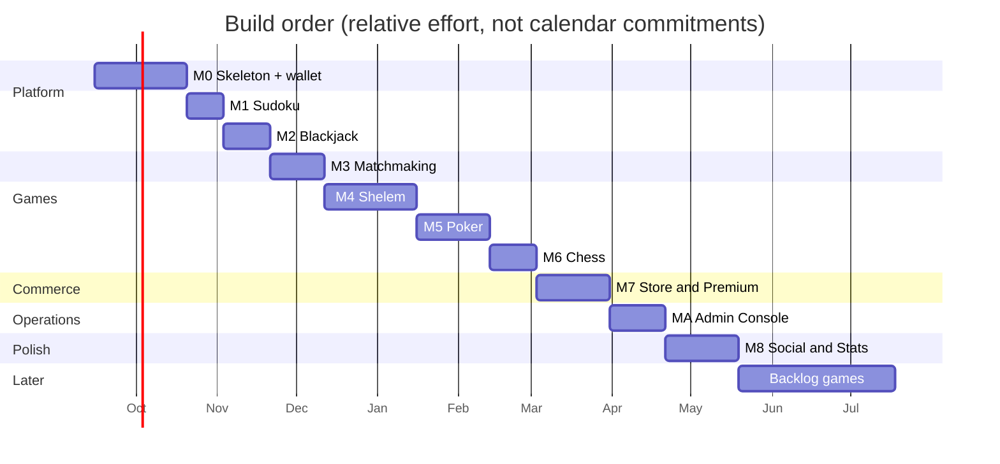

# Roadmap

> **Status:** Draft · **Companion:** [01-business-prd.md](./01-business-prd.md) §7

Build order: **skeleton → Sudoku → Blackjack → matchmaking → Shelem → Poker → Chess → store → polish**.

Two rules govern this roadmap, and they exist to counter the project's biggest risk (scope creep
across 12 games, plus solo-developer burnout):

1. **Every milestone ends with something you can actually play with a friend.** No milestone is
   pure infrastructure. M0 ships a playable *table* even before the first real game.
2. **A game is done when it's done.** Rules + bot-legal + RTL + tests + no known leaks. Starting
   the next game with the previous one at 80% is how a 12-game backlog becomes 12 broken games.

Effort estimates assume evenings and weekends, one person.

---

## Milestone Map

| Milestone | Deliverable | Effort | New platform capability it adds |
|---|---|---|---|
| **M0** | Playable table skeleton **+ turn enforcement + wallet** | ~5 wk | Auth, guests, tables, invites, sockets, event log, welcome page, **ejection & bot substitution**, **ledger & earning** |
| **M1** | Sudoku | ~2 wk | First engine; server-withheld solution; the leak-test harness |
| **M2** | Blackjack | ~2.5 wk | Dealing, hidden state, betting core, first real bot |
| **M3** | **Matchmaking** ⭐ | ~3 wk | Queue, presets, timeout release, bot fill, farming guards, cooldowns |
| **M4** | **Shelem** ⭐ | ~5 wk | Trick-taking core, partnerships, bidding, multi-hand matches |
| **M5** | Poker | ~4 wk | Multi-street betting, **side pots**, hand evaluator |
| **M6** | Chess | ~2.5 wk | Non-card board layer, real clocks, `chess.js` adapter |
| **M7** | **Store & Premium** ⭐ | ~4 wk | Coin spending, sinks, subscription, entitlements |
| **MA** | **Admin Console** | ~3 wk | `admin-frontend/`, moderation, ledger oversight, game on/off, reports, audit browser ([12](./12-admin-console.md) §11.2) |
| **M8** | Social & stats | ~4 wk | Spectators, emotes, ELO, stats, **customization page**, Persian completion |
| **Later** | Backlog games | — | Hokm → Checkers → Crazy Eights → Uno → Rummy → Durak → Backgammon |

### Why this ordering

| Decision | Reason |
|---|---|
| **Turn enforcement in M0** | Every game from M1 needs it, and ejection touches the seat model, the event log, and `SeatOutcome`. Retrofitting it after five games exist would mean five migrations |
| **Wallet in M0, store in M7** | Rewards must accrue from the *first* playable game or early players earn nothing retroactively. Spending can wait — a balance built up over months is a better store launch than an empty wallet |
| **Matchmaking at M3, not M0** | A queue needs games to queue for and bots to fill with. With only Sudoku it would be pointless; after Blackjack there are two real presets and a working bot |
| **Matchmaking before Shelem** | Shelem is the game most likely to need matchmaking (four players is hard to assemble) and the one whose 45-minute matches most need the ejection ladder proven first |
| **Premium after all five games** | Nobody subscribes to an incomplete catalog, and the perk list isn't credible until the cosmetics exist |
| **Admin spine in M0, admin UI at MA** | The audit-in-transaction rule and the public-port isolation must exist *before* the first admin write — retrofitting them across twenty endpoints is a rewrite. The *UI* can wait until there is a store, a subscription, and months of ledger to look at ([12](./12-admin-console.md) §11) |
| **MA is a letter, not M9** | Inserting it between M7 and M8 without renumbering keeps every existing cross-reference in [11](./11-build-plan.md) and the game specs valid |

---

## M0 — Platform Skeleton

**Goal:** a friend clicks a link, types a name, and is sitting at a table with you — chatting,
seeing seats fill live — before any game exists.

### Scope

| Area | Work |
|---|---|
| Repos | `backend/` + `frontend/` scaffolds, TS strict, ESLint (incl. the layer-boundary, `Math.random`, and **admin-import** rules), Prettier, Vitest, `contracts:sync` / `contracts:check` |
| Database | Full Prisma schema from [03-data-model.md](./03-data-model.md); dev `db push`; seed script |
| Backend layers | `domain/` → `application/` → `infrastructure/` → `interface/`; `IRepository` + all interfaces; Prisma implementations; `UnitOfWork`; `container.ts` |
| Auth | Register, login, refresh rotation with family revocation, logout, `/auth/me`; argon2id; **guest token issue** + **guest claim transaction** |
| Tables | Create, configure, seat/unseat, close; invite mint/revoke; `GET /invites/:code` unauthenticated |
| Sockets | Gateway, handshake identity, room model, presence, reconnect grace, chat |
| Event log | `GameEvent` append + `seq`, snapshot policy, `rebuildState`, idempotency constraint |
| **Turn enforcement** | `TurnTimerService`, absolute deadlines in Redis + `PHASE` events, warning emission, strike ladder, ejection, bot substitution, reclaim window, restart re-arming ([04](./04-realtime-protocol.md) §6) |
| **Wallet & rewards** | `Wallet` + `WalletTransaction` ledger, derived idempotency keys, row-locked debits, `RewardService` + `RewardRule` seeding, caps and decay, **guest provisional balances and vesting inside the claim transaction**, nightly reconciliation job ([10](./10-economy-and-rewards.md)) |
| Frontend | Vite setup, routes, `authStore`/`socketStore`/`tableStore`/`themeStore`, Axios single-flight refresh, socket manager |
| Screens | Welcome (registry-driven preview cards, all "Coming soon"), invite landing, table shell with seats + chat, login/register |
| i18n | `react-i18next` wired, `en` + `fa` for `common`/`auth`/`table`/`errors`, `dir` switching, logical-CSS stylelint rule, `tokens.css` |
| **Admin spine** | `admin-main.ts` on an unpublished `:3100` + the three isolation guards; admin sessions with **TOTP and forced enrollment**; the `withAudit` transaction wrapper and append-only `AdminAuditLog`; read-only `GET /users`, `/audit`, `/security-events`. **No UI** — verified via `backend/requests/admin.http` ([12](./12-admin-console.md) §11.1) |
| Ops | Dockerfiles, `docker-compose.yml` (dev), `docker-compose.prod.yml`, Caddy config, `/health` + `/ready`, Pino with redaction, CI for both projects |

### Exit criteria

- [ ] Host signs up, creates a table, copies an invite link
- [ ] Friend opens the link in a private window, types a name, is seated — **no account created**
- [ ] Both see each other join live; chat works both ways
- [ ] Guest refreshes the page and keeps their seat
- [ ] **Guest signs up mid-session and lands back at the same table in the same seat** (journey J2)
- [ ] **Guest's provisional coins vest into the new account in the same transaction**
- [ ] **An idle player is warned, struck twice, ejected, and replaced by a bot** — the table plays on
- [ ] **An ejected player on a winning team earns 0; their partner earns full** (journey J5)
- [ ] Ledger reconciliation runs clean; a deliberately corrupted balance is detected and alerted
- [ ] Killing and restarting the API loses neither the table nor anyone's seat, **and turn
      deadlines re-arm without gifting time**
- [ ] Welcome page renders cards from `GET /api/v1/games`
- [ ] Every screen reviewed in `fa`/RTL — no clipped or mirrored-wrongly layout
- [ ] `contracts:check` green in both CI pipelines
- [ ] **`GET :3000/admin/api/v1/users` returns 404; the same path on `:3100` returns 401**
- [ ] **The seeded admin can do nothing until TOTP is enrolled**, and every admin read is audited
- [ ] Deployed to the VPS over HTTPS, with the **restore-from-backup procedure actually tested once**

> **Why the guest-claim journey is an M0 exit criterion rather than a later feature:** it is the
> hardest transaction in the app and the one whose failure is least recoverable. Building it while
> the schema is fresh — and before five games depend on the event log's actor columns — is far
> cheaper than retrofitting it.

---

## M1 — Sudoku

**Goal:** first real engine, end to end. Deliberately the game with the least rules risk, so the
first pass through the engine → socket → renderer pipeline is about the *pipeline*.

### Scope
- `GameEngine` interface + registry ([05](./05-game-engine-spec.md))
- Sudoku engine: generation, difficulty grading, **solution held server-side**, validate/hint moves
- `GameSessionService`: start, apply move, advance loop, projection broadcast, terminal handling
- **The leak-test harness** — generic across engines, reused by every later game
- `replayFixture(seed, moves)` test kit
- Sudoku renderer, keyboard grid navigation, `dir="ltr"` island for the grid
- Race mode (same puzzle, 2–4 players, first to solve) — exercises multi-seat broadcast on an
  otherwise solo game

### Exit criteria
- [ ] Four difficulties generate valid, uniquely-solvable puzzles
- [ ] **Solution appears in no projection and no network payload** (leak test)
- [ ] A hostile client cannot obtain the solution by any documented endpoint or event
- [ ] Race mode: two players, live progress, correct winner
- [ ] Engine invariants I1–I5 tested and passing
- [ ] Persian numerals render correctly in the grid when enabled
- [ ] Best-time persisted to `PlayerStats.extraJson`

---

## M2 — Blackjack

**Goal:** first hidden-information game and the first bot. Everything Shelem needs, at a fraction
of the rules complexity.

### Scope
- Deck/card value objects, `buildDeck`, CSPRNG Fisher–Yates shuffle
- **Seed commitment protocol** end to end, with the "✓ deal verified" UI
- Betting-round core (`domain/games/shared/betting.ts`) — later reused by Poker
- Blackjack engine: shoe + penetration, hit/stand/double/split/insurance/surrender, dealer soft-17,
  payout table, **hidden hole card**
- Dealer as a virtual seat driven by `advance()`
- First bot (`BotStrategy`) — basic-strategy table, which is genuinely good at blackjack
- Card components: `Card`, `CardBack`, `Hand`, `CardStack`; deal/flip animations
- Turn timers + auto-stand on expiry
- **Admin (+1 session):** ledger browser API (cursor-paginated), wallet detail with cached-vs-derived
  comparison, reconciliation endpoint + nightly job ([12](./12-admin-console.md) §7.2)

### Exit criteria
- [ ] **Hole card absent from all projections until reveal** (leak test)
- [ ] **Shoe never projected** — only `shoeRemaining` (the tempting-deck-leak test)
- [ ] Split, double, insurance, and surrender all pay correctly (payout table test)
- [ ] Seed commitment verifies client-side; badge shows on the summary
- [ ] Bot plays basic strategy and never makes an illegal move (1000-seed property test)
- [ ] Disconnect → 45 s grace → auto-stand; reconnect mid-hand resyncs correctly
- [ ] Full RTL review

---

## M3 — Matchmaking

**Goal:** a solo player at 11pm can queue for Blackjack and either get matched or be handed a
working alternative within two minutes.

### Scope
- `MatchmakingService`: Redis pools per `(gameSlug, presetId)`, 1 s matcher tick, oldest-first
  fairness, atomic table formation
- **Presets** declared in `GameMeta` for Sudoku (race) and Blackjack; presets are fixed literals
  ([09](./09-matchmaking.md) §2)
- **Timeout release at 120 s** with the suggestion payload and the release screen — treated as the
  primary path, not the error path
- Bot fill after `preferHumansMs`, opt-in per ticket
- Auto-start countdown for matchmade tables (no host to press Start); absent players bot-filled
- Parties (queue as a group), one-ticket-per-identity, disconnect grace on the ticket
- **Farming guards**: per-IP and per-fingerprint limits, all-guest groups flagged
  `rewardEligible: false`, repeat-pairing decay
- **Ejection cooldown ladder**, persisted, matchmaking-only
- Stranger safety: display-name and avatar restrictions on matchmade tables, mute, block, report
- Frontend: `matchmakingStore`, queue picker on the welcome page with live counts, dismissible
  queue pill, release screen, match-found countdown
- **Admin (+1 session):** `GameFlag` (`ENABLED`/`HIDDEN`/`DISABLED`) and `PlatformFlag`, the
  `ControlCommand` outbox and its consumer, maintenance mode, queue/cooldown visibility
  ([12](./12-admin-console.md) §6, §7.3)

### Exit criteria
- [ ] Two players queue the same preset → matched, seated, game auto-starts
- [ ] `seatCount − 1` players queue → **all released at 120 s**, none left spinning
- [ ] **Release screen leads to actually playing** (bots or an invite table) in a manual walkthrough
- [ ] Bot fill only after `preferHumansMs` and only when opted in — never a surprise
- [ ] A ticket that expires in the same tick it could match is **released, not matched**
- [ ] Party of 2 always lands at the same table
- [ ] API restart while queued → tickets released with a clear message, no ghosts
- [ ] Table-creation failure rolls back fully; tickets return to the pool
- [ ] 3 tickets from one IP are refused silently; all-guest group ⇒ `rewardEligible: false`
- [ ] 3 ejections in 24 h ⇒ 30 min cooldown; **the same player can still join a private invite table**
- [ ] Block prevents re-matching
- [ ] Matcher tick stays under 50 ms with 200 tickets
- [ ] Full RTL review of queue, release, and match-found screens

> **The honest expectation:** with six friends, most queues will time out. That is why the release
> screen is an exit criterion and the fill rate is not.

---

## M4 — Shelem ⭐

**Goal:** the game this project exists for. Also the milestone that produces the trick-taking core
Hokm will reuse almost wholesale.

### Scope
- Trick-taking core (`shared/trick.ts`): follow-suit legality, trick resolution, rank orders
- Phase machine: `DEALING → BIDDING → WIDOW_EXCHANGE → TRICK_PLAY → HAND_SCORING → (DEALING | MATCH_OVER)`
  — **no trump-selection phase**
- Bidding: minimum **100**, multiples of **5**, pass is final for the round, Shelem declaration
- Widow exchange: declarer alone sees the widow, discards 4; **those 4 count as the declaring
  team's first scoring trick**, so point cards can be banked
- **Trump is established by the declarer's opening lead** — the one rule most likely to be
  implemented wrong if Hokm is built first
- 12 tricks; **two-component scoring** (card points A/Q = 10, 10 = 5, everything else 0 — *plus*
  5 per trick, totalling **165** per hand)
- Contract **made ⇒ score the points collected**, not the bid; **set ⇒ lose the bid**, doubled when
  the declaring team collected less than their opponents; **Shelem (all 12 tricks) = 330**
- **Scoring variants exposed as table options**, not hard-coded — so house-rule disagreements are
  settings changes
- Partnership model (`team = seat % 2`), partner-aware UI
- Multi-hand match flow with a between-hands scoreboard
- Shelem renderer: bid panel, trick area, scoreboard, partner indicator
- Persian card face set; complete `fa` translations for all Shelem terminology
- Legal-but-weak bot (random from `legalMoves`, then simple heuristics)

### Exit criteria
- [ ] **You play a full match with your regular group and everyone agrees the scoring is right**
- [ ] Rules match [games/shelem.md](./games/shelem.md); the doc's phase diagram matches the code
- [ ] **Every completed hand totals exactly 165** across both teams (the single strongest invariant)
- [ ] **Declarer's opening lead sets trump**; there is no trump-selection move anywhere in the code
- [ ] **The discard pile scores as the declaring team's trick**, banked point cards included
- [ ] Contract made scores collected points (bid 100 / collected 140 → **+140**); set loses the
      bid, doubled when behind the opponents; Shelem pays 330
- [ ] All variants in that doc are settable table options
- [ ] Own hand + widow (pre-exchange) never leak; hand counts are public (leak test)
- [ ] 90 s grace; bot takes over; human reclaims the seat mid-hand
- [ ] Three full-match fixtures replay byte-identically
- [ ] Full RTL review with the Persian card face set
- [ ] Bot never plays an illegal card (property test)

> **Still the highest-risk milestone**, though less so than before: the rules now have a source
> ([Wikipedia — Shelem](https://en.wikipedia.org/wiki/Shelem)), so this is verification rather
> than discovery. What the source *doesn't* settle — the match target, the all-pass rule, whether
> your table forbids discarding point cards — is exactly what a real match will surface, which is
> why the human-agreement criterion stays.

---

## M5 — Poker (No-Limit Texas Hold'em)

**Goal:** the hardest money logic in the project, on top of infrastructure that is by now proven.

### Scope
- Hand evaluator (7-card best-5), correct kicker handling
- Blinds, dealer button rotation, heads-up blind exception
- Streets: preflop/flop/turn/river; check/bet/call/raise/fold/all-in; min-raise rules
- **Side-pot construction** for multiple all-ins at different stack depths — specified and
  unit-tested *before* any UI exists
- Showdown ordering, split pots, odd-chip assignment
- Virtual chip accounting (`Int`, never float); table stakes
- Auto-fold on timeout (**never** auto-call)
- Poker renderer: pot display, bet slider, action buttons, all-in visualization

### Exit criteria
- [ ] Hand evaluator matches a reference implementation across ≥ 100k random 7-card hands
- [ ] **Side pots correct across the full table of multi-all-in scenarios** in [games/poker-holdem.md](./games/poker-holdem.md)
- [ ] Split pots and odd chips distributed correctly
- [ ] Chip conservation invariant: total chips constant across every hand (property test)
- [ ] Hole cards never leak; folded players' cards never revealed (leak test)
- [ ] 45 s grace → auto-fold; reconnect mid-hand resyncs
- [ ] Bot plays legally (tight-passive is fine)
- [ ] Full RTL review

---

## M6 — Chess

**Goal:** prove the platform isn't card-shaped. Scheduled last precisely because it shares the
least with everything else.

### Scope
- `chess.js` adapter behind `GameEngine`; state = `{ fen, pgn, clocks }`
- Castling, en passant, promotion, fifty-move, threefold repetition, insufficient material
- Real clocks: base + increment, server-authoritative, flag-fall
- Resign, draw offer/accept, takeback request (host-toggleable)
- Board renderer: drag + click-to-move, legal-move highlights **from the server**, last-move
  highlight, coordinate labels
- **`dir="ltr"` island** — the board does not mirror under RTL
- PGN export
- Bot: `chess.js` random-legal, or a small material-count minimax if it's more fun

### Exit criteria
- [ ] All special moves correct; all draw conditions detected
- [ ] Clocks accurate within 100 ms over a full game; flag-fall ends the game correctly
- [ ] Clocks survive an API restart (re-armed from persisted deadlines)
- [ ] **Board is not mirrored in `fa`; a1 is bottom-left for White** — with surrounding chrome mirrored
- [ ] PGN export opens correctly in a third-party viewer
- [ ] Full RTL review

---

## M7 — Store & Premium ⭐

**Goal:** the coins players have been accumulating since M0 become worth something, and the
premium plan goes live.

### Scope

| Area | Work |
|---|---|
| **Store** | `StoreService`, catalog with owned/affordable/locked states, row-locked purchase transaction, refunds |
| **Catalog** | Priced cosmetics across all eight categories; the full asset set for five games; rotating featured selection |
| **Coin sinks** | Consumables, timed theme rentals, name-change costs, high-tier items priced at multiple days of capped earning ([10](./10-economy-and-rewards.md) §4.3) |
| **Premium** | `SubscriptionService`, provider integration (Stripe assumed), checkout, cancel-at-period-end, 3-day grace, lapse handling |
| **Entitlements** | Server-side `isActive` checks; 1.5× earn multiplier and raised caps; premium-only cosmetics; expanded history and table limits |
| **Webhooks** | Signature verification, idempotency by provider event id, `SubscriptionEvent` audit log |
| **Transparency** | `GET /rewards/rules` public; post-match reward breakdown UI; wallet statement screen |
| **Frontend** | `walletStore`, store browsing and purchase flow, premium landing and management, wallet/statement screens |
| **Legal** | Terms, refund policy, age gate, VAT/tax handling per the provider |

### Exit criteria
- [ ] Purchase debits and grants in one transaction; insufficient funds leaves **no partial debit**
- [ ] **Two concurrent purchases with one item's worth of coins → exactly one succeeds**
- [ ] Guests cannot purchase; the store shows them the signup path instead
- [ ] Premium multiplier applies to rewards and caps — and **to nothing else** (E3 audit of every perk)
- [ ] Duplicate webhook is a no-op; bad signature is rejected and logged
- [ ] Lapse stops perks and **keeps every earned coin and purchased cosmetic**
- [ ] Reward breakdown UI matches the ledger exactly, including forfeiture messaging
- [ ] Coin sink ratio measurable; catalog has items reachable in a day and items worth saving for
- [ ] Ledger reconciliation clean across a week of real purchasing
- [ ] Full RTL review of store, wallet, and premium screens

> **The E3 audit is the gate that matters.** Before shipping, every premium perk is checked
> against the never-sell list ([10](./10-economy-and-rewards.md) §4.2). A perk that can't justify
> itself as cosmetic, earn-rate, or convenience does not ship.

---

## MA — Admin Console

**Goal:** the operator stops using `psql` and `curl`. Sits between M7 and M8 so nothing is
renumbered. Full specification: [12-admin-console.md](./12-admin-console.md) §11.2.

By this point the admin *backend* has been growing since M0 — the audit spine and port isolation
(M0), the ledger browser (M2), the game flags and control channel (M3). MA is where it gets a face
and the remaining capabilities.

### Scope

| Area | Work |
|---|---|
| **Project** | `admin-frontend/` scaffold — Vite/React/Zustand/Axios, **English + LTR only, no theming, no game code**; third CI pipeline; contract mirror; Caddy `admin.` host; Playwright |
| **Auth UI** | Login, MFA step, first-run TOTP enrollment with QR + recovery codes, step-up modal, session-expiry handling |
| **Users** | Search, the detail page (identity, wallet, activity, integrity, guest lineage, sessions), disable/enable/ban, force-logout, name reset, admin-assisted password reset, role changes, report queue |
| **Economy** | Cursor-paginated ledger browser, reconciliation, coin-supply charts with admin-minted share, `ADMIN_ADJUST` flow with mint ceiling, reward-rule and store-item editing |
| **Platform** | Game `ENABLED`/`HIDDEN`/`DISABLED` control, platform flags, maintenance mode, live table list, close-table and kick-seat, matchmaking queue and cooldown panel, broadcast |
| **Reports** | `DailyMetric` rollup job, dashboard tiles, trend charts across the six metric groups, SSE live feed |
| **Audit** | Audit browser with filters, hash-chain verification, security-event feed |
| **Hardening** | The full 15-test admin suite ([12](./12-admin-console.md) §10); a written incident runbook |

### Exit criteria

- [ ] `:3000/admin/*` returns 404 in a **deployed** environment; `:3100` is absent from `docker ps` ports
- [ ] A fresh admin can do nothing until TOTP is enrolled
- [ ] **Every mutating action produces an audit row** with actor, IP, reason, and before/after
- [ ] `GET /audit/verify` detects a row deleted directly in SQL
- [ ] Disabling a live player releases their seat, substitutes a bot, and **forfeits nothing**
- [ ] `HIDDEN` removes a game from the welcome page within 2 s and lets a live match finish
- [ ] `DISABLED` **with Redis stopped** still takes effect within one outbox sweep
- [ ] `ADMIN_ADJUST` requires step-up and a reason; a retried request writes exactly one ledger row
- [ ] The daily admin-mint ceiling refuses and raises a `SecurityEvent`
- [ ] Reconciliation reports a hand-injected drift and **does not** correct it
- [ ] **A live table viewed as admin passes the leak test for every seat**
- [ ] Rollup re-run for the same day produces no duplicate rows
- [ ] `SUPPORT` is 403 on every `ADMIN`-only route (matrix test)

> **The leak test on the admin viewer is the criterion that matters.** Every other item here is
> operational convenience; that one is the difference between an admin console and a live view of
> everyone's cards behind a single stolen cookie ([12](./12-admin-console.md) A5).

> MA has **no Cross-Milestone Definition of Done obligations** below that concern games — it ships
> no engine, no bot, no matchmaking preset, and deliberately no `fa`/RTL.

---

## M8 — Social, Stats & Cosmetics

**Goal:** the app stops being five games and becomes *yours*.

### Scope

| Feature | Work |
|---|---|
| **Spectator mode** | `spectators:{tableId}` room, spectator projections per game, spectator UI, host toggle. Cheap because projection already exists |
| **Emotes** | Emote bar, rate limits, animated reactions at the seat |
| **Stats** | `PlayerStats` aggregation, profile screen, per-game breakdowns, streaks |
| **ELO ratings** | Rating service (K decaying with games played), `RatingChange` per match, post-match delta display, per-game leaderboards |
| **Match history** | Paginated list, match summary screen, deal verification panel |
| **Customization page** ⭐ | Full `/customize`: card backs, card faces, felts, avatars (+ upload), theme, animation speed, sound, language. Live preview using a real `TableShell`. Owned / unlockable / **purchasable** states wired to the M7 store |
| **Achievements** | `Achievement` definitions live, progress tracking, coin grants — the second coin faucet after match rewards |
| **Persian completion** | Every game's `fa` namespace complete; Persian numerals everywhere; Jalali dates; full RTL visual pass |
| **Bot improvements** | Heuristics for Shelem and Poker if the weak bots have become annoying — and for matchmaking bot-fill quality |
| **Polish** | Sound design, deal animations, empty states, error states, mobile layout pass |

### Exit criteria
- [ ] Spectators see zero hidden cards in every game (leak test, all five)
- [ ] Ratings update correctly and are visible after each match
- [ ] Customization page: every option applies instantly and persists across devices
- [ ] Guest cosmetic choices **and coin balance** survive a signup
- [ ] Avatar upload rejects every hostile fixture in [07](./07-security-and-anticheat.md) §6
- [ ] Achievement grants are idempotent and appear in the ledger
- [ ] Zero open RTL defects across all five games
- [ ] Lighthouse ≥ 90 on performance and accessibility for the welcome and table pages
- [ ] Mobile: all five games playable on a phone in both directions

---

## Later — Backlog Games

Pick-up order is **cheapest-first**, so momentum never stalls on a hard game.

| Order | Game | Effort | Why here |
|---|---|---|---|
| 1 | **Hokm** | S | Reuses ~70% of Shelem's trick-taking core. The single cheapest new game in the catalog, and the natural Persian companion |
| 2 | **Checkers** | S | Reuses the chess board + move-validation layer from M6 |
| 3 | **Crazy Eights** | S | Builds the *shedding-game base class* — pay once, unlock Uno and Durak |
| 4 | **Uno** | M | Custom deck + action-card resolution on the shedding base |
| 5 | **Rummy / Gin** | M | Melding + discard pile; a new mechanic family |
| 6 | **Durak** | M | Attack/defend structure on the shedding base |
| 7 | **Backgammon** | M | New board layer + **verifiable dice** — extends seed commitment to visible randomness |

Specs: [games/backlog-games.md](./games/backlog-games.md).

**The G5 test:** Hokm should take **one weekend**. If it takes two weeks, the `GameEngine`
abstraction failed and the right response is to fix the abstraction before adding game #7 —
not to power through six more games on a bad foundation.

---

## Deferred Beyond the Roadmap

| Item | Why deferred | Revisit when |
|---|---|---|
| Email (password reset, email invites) | Needs a provider + deliverability work; admin-assisted reset covers v1 | A friend actually locks themselves out |
| OAuth sign-in | One-click signup from an invite link would genuinely help conversion | Guest→signup conversion underperforms |
| Replay viewer UI | The **data already exists** from M0's event log — this is purely a UI project | Someone asks to watch a hand back |
| Tournaments | Scheduling complexity for a rare use case | You want a game night with brackets |
| Achievements | Fun, but cosmetic unlocks already cover the progression itch | M8 unlocks feel too thin |
| Public lobby | Brings abuse and collusion problems that dwarf the game code | Probably never — see [01](./01-business-prd.md) §3. **Note:** the "no moderation tooling" half of this argument no longer holds — [12](./12-admin-console.md) delivers it at MA |
| Native mobile apps | Responsive web covers phones; no new capability | Never, realistically |

---

## Cross-Milestone Definition of Done

Applies to **every game** milestone. A milestone is not done until all of these are true.
(MA is the one exception — it ships no game; its own exit criteria are the whole gate.)

- [ ] Engine invariants I1–I5 hold ([05](./05-game-engine-spec.md) §2)
- [ ] Leak test passes for every seat **and** spectators
- [ ] **Bot is legal and can take over a seat mid-match** — 1000-seed property test. Bots are
      load-bearing from M0 (ejection substitution) and M3 (queue fill), so a game without one
      cannot ship
- [ ] **Turn limit, warning, strike ladder, ejection, and reclaim all work for this game**, with a
      default timeout action that spends nothing unauthorized ([04](./04-realtime-protocol.md) §6.5)
- [ ] **Reward settles correctly, including an ejected player on a winning team earning zero**
- [ ] Matchmaking preset defined, queueable, and playable at its exact seat count (from M3 on)
- [ ] Reconnection tested mid-game, including grace expiry and return
- [ ] Full-game fixture replays byte-identically from `(seed, moves)`
- [ ] `en` **and** `fa` translations complete; RTL visually reviewed
- [ ] Keyboard playable; screen-reader announcements present
- [ ] Mobile layout works
- [ ] `contracts:check` green; all CI pipelines green (two projects until MA, three after)
- [ ] The game's document in `games/` matches the implemented behaviour
- [ ] **You've played it with an actual friend and it was fun**

---

## Related Documents

- [01-business-prd.md](./01-business-prd.md) — goals, journeys, feature scope
- [02-technical-prd.md](./02-technical-prd.md) — architecture the milestones build
- [04-realtime-protocol.md](./04-realtime-protocol.md) §6 — turn enforcement, delivered in M0
- [05-game-engine-spec.md](./05-game-engine-spec.md) — per-game implementation checklist
- [09-matchmaking.md](./09-matchmaking.md) — M3 in full
- [10-economy-and-rewards.md](./10-economy-and-rewards.md) — M0 earning, M7 spending
- [12-admin-console.md](./12-admin-console.md) — MA in full, plus the M0/M2/M3 admin increments
- [games/](./games/) — the rules each milestone implements
