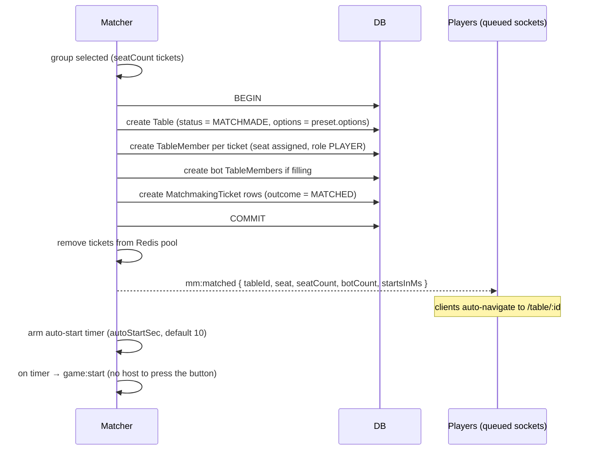
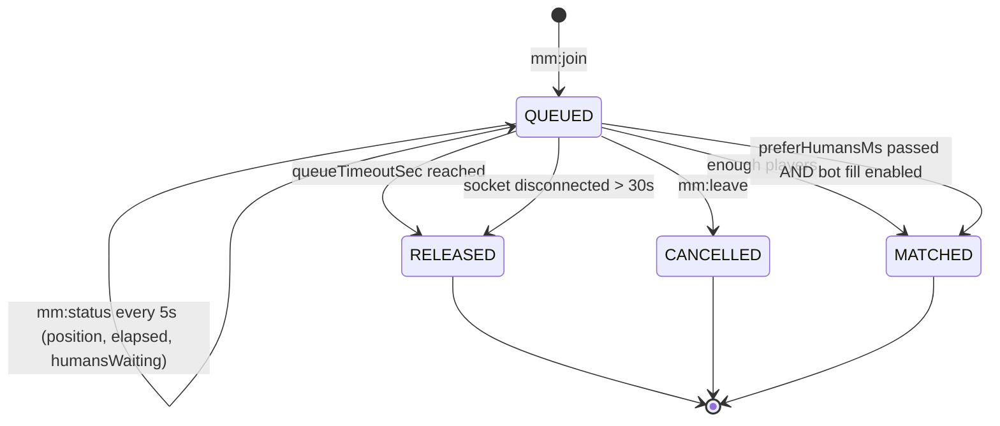

# Matchmaking

> **Status:** Draft · **Depends on:** [04-realtime-protocol.md](./04-realtime-protocol.md), [10-economy-and-rewards.md](./10-economy-and-rewards.md)

Players join a queue for a game; the server groups them into a table. If a full table cannot be
formed within a timeout, waiting players are **released from the queue** rather than left hanging.

---

## 0. What This Changes

Matchmaking makes a previously-stated non-goal obsolete. [01-business-prd.md](./01-business-prd.md)
§3 originally said *"no public matchmaking with strangers — the product is your friends."* That is
no longer true: queueing implies being matched with people you didn't invite.

Three consequences follow, and each is addressed below rather than discovered later:

| Consequence | Where handled |
|---|---|
| **Strangers now share a table**, so display names, chat, and avatars are visible to people you didn't choose | §7 — reporting, muting, name/avatar validation |
| **Coin rewards + stranger matching = a farming vector.** One person can queue several guest sessions and play themselves for coins | §7.2 and [07-security-and-anticheat.md](./07-security-and-anticheat.md) §11 |
| **A queue needs someone to be waiting.** With a handful of friends, most queues will time out | §5 — the release path is the *common* case, not the edge case, and its UX matters more than the match path |

---

## 1. Concepts

| Term | Meaning |
|---|---|
| **Ticket** | One player's (or party's) request to be matched: game, options bucket, enqueue time |
| **Pool** | The set of tickets competing to be matched together: one pool per `(gameSlug, optionsBucket)` |
| **Options bucket** | A coarse grouping of table options. **Critical:** if every option combination were its own pool, nobody would ever match |
| **Party** | 2+ players who queue together and must land at the same table |
| **Release** | Removing a ticket from the queue after `queueTimeoutSec` without a match |
| **Backfill** | Offering a seat vacated mid-game (usually by ejection) to the queue instead of a bot |

---

## 2. Options Bucketing

The single most important design decision here. A Shelem table has ~15 options
([games/shelem.md](./games/shelem.md) §7); if the pool key included all of them, two players who
picked different `bidTimeoutSec` values would never meet.

**Each game declares a small set of matchmaking presets**, and only presets are queueable.
Custom options remain available — for **private tables via invite link**, which is unchanged.

```ts
// added to GameMeta in 05-game-engine-spec.md
interface GameMeta {
  // ...
  matchmaking: {
    enabled: boolean
    /** Queueable presets. The bucket key is the preset id. */
    presets: {
      id: string                  // 'shelem-standard-1000'
      nameKey: string             // i18n
      seatCount: number           // exact seats this preset forms
      options: unknown            // validated against optionsSchema
      /** Wait this long for a full human table before accepting bots. */
      preferHumansMs: number
    }[]
  }
}
```

| Game | Presets |
|---|---|
| Sudoku | `sudoku-race-2` (easy/medium/hard as three presets) |
| Blackjack | `blackjack-standard-3`, `blackjack-standard-5` |
| Shelem | `shelem-standard-1000` (the default rule set only) |
| Poker | `poker-6max-blinds-5-10`, `poker-heads-up-5-10` |
| Chess | `chess-blitz-5-3`, `chess-rapid-10-5`, `chess-bullet-1-0` |

> **Rule:** a preset's `options` must be a **fixed literal**, not user-adjustable. That is what
> makes the pool key meaningful. House-rule experiments belong on private tables.

---

## 3. Queue Storage

The live queue is **Redis**, because it needs sub-second reads and is inherently ephemeral.

```
mm:pool:{gameSlug}:{presetId}        ZSET  member = ticketId, score = enqueuedAt (ms)
mm:ticket:{ticketId}                 HASH  holderKind, holderId, partyId?, rating, socketId, presetId
mm:holder:{holderKey}                STR   ticketId          — enforces one ticket per identity
mm:party:{partyId}                   SET   ticketIds
```

A lightweight `MatchmakingTicket` row is also persisted for metrics and abuse analysis
([03-data-model.md](./03-data-model.md) §3.8) — **not** as the live queue. Persisting the queue
itself would be slower and would need reconciliation on restart for no benefit; a ticket is cheap
to recreate because the client simply re-queues.

**On API restart:** all tickets are dropped and every queued socket receives
`mm:released { reason: 'SERVER_RESTART' }`. Silently losing a queued player is worse than telling
them to press the button again.

---

## 4. The Matcher

A single interval task, every `tickMs` (default **1000 ms**), per pool.

```ts
async function tick(pool: PoolKey) {
  const preset = registry.get(pool.gameSlug).meta.matchmaking.presets.find(p => p.id === pool.presetId)!
  const tickets = await redis.zrange(poolKey(pool), 0, -1, 'WITHSCORES')   // oldest first

  // 1. Release expired tickets BEFORE trying to match, so a stale ticket
  //    never gets pulled into a table its player has stopped waiting for.
  const expired = tickets.filter(t => now() - t.enqueuedAt > queueTimeoutMs)
  for (const t of expired) await release(t, 'TIMEOUT')

  const waiting = tickets.filter(t => !expired.includes(t))

  // 2. Enough for a full table? Form it, oldest-first (queue fairness).
  if (countPlayers(waiting) >= preset.seatCount) {
    const group = takeOldest(waiting, preset.seatCount)     // parties kept intact
    if (violatesFarmingGuard(group)) return                 // §7.2
    return formTable(group, preset)
  }

  // 3. Not enough humans. Has the oldest ticket waited past preferHumansMs?
  const oldest = waiting[0]
  if (oldest && now() - oldest.enqueuedAt > preset.preferHumansMs && botFillEnabled(oldest)) {
    return formTable(waiting, preset, { fillWithBots: preset.seatCount - countPlayers(waiting) })
  }
}
```

### 4.1 Matching rules

| Rule | Detail |
|---|---|
| **Fairness** | Oldest tickets match first. No skill-based reordering that could starve a player |
| **Parties are atomic** | A party of 3 either all get in or none do. A party larger than `seatCount` is rejected at enqueue |
| **Exact seat count** | Presets form exactly `seatCount` seats. No partially-filled human tables sitting idle |
| **Bot fill is opt-in** | Only after `preferHumansMs`, and only if the player enabled "fill with bots" on their ticket. Never a surprise |
| **Rating bands** (optional) | When `ratingBandsEnabled`, start at ±100 ELO and widen by ±50 every 15 s, uncapped at `queueTimeoutSec`. Off by default — with a small player base, bands mean nobody matches |
| **Anti-rematch** (optional) | Avoid re-pairing the same identities within 5 minutes, unless it's the only option |

### 4.2 Forming a table



Two details that matter:

- **The table is created in one transaction with all its members.** A half-formed table with two
  seats claimed and two tickets already consumed would leave players stranded.
- **Matchmade tables auto-start.** There is no host to press "Start", so a countdown
  (`autoStartSec`, default 10 s) gives people time to land on the page. Any player who hasn't
  connected by then is replaced by a bot — the same mechanism as
  [04-realtime-protocol.md](./04-realtime-protocol.md) §6.

### 4.3 No ready-check in v1

A standard matchmaking design asks each matched player to confirm before the table forms. It is
deliberately omitted:

- It adds a mandatory 10-second friction step to *every* match.
- Its purpose is to catch players who queued and walked away — and the **turn-timer ejection
  system** ([04](./04-realtime-protocol.md) §6) already handles that, with an economic penalty
  attached ([10](./10-economy-and-rewards.md) §5).
- With a small player base, a declined ready-check dissolves the table and everyone re-queues,
  which is worse than starting with one bot.

> **Open question:** revisit if "matched with someone who never moved" becomes a common complaint.
> The `startsInMs` field in `mm:matched` already gives the client somewhere to put a ready-check
> later without a protocol change.

---

## 5. Release — the common path

> **You asked for:** *wait ~2 minutes; if a table can't be filled, release the player from the
> waiting list.* Default `queueTimeoutSec = 120`.

With a handful of friends, **release will happen more often than matching**. So this path gets the
better UX, not the afterthought.



### On release, the server sends the player somewhere useful

```ts
// mm:released payload
{
  reason: 'TIMEOUT' | 'CANCELLED' | 'DISCONNECTED' | 'SERVER_RESTART' | 'BLOCKED',
  waitedMs: number,
  presetId: string,
  /** Concrete next steps, not a dead end. */
  suggestions: {
    playWithBots: { available: boolean; botCount: number }
    requeue:      { available: boolean }
    createPrivate:{ available: boolean }      // invite-link table — the original flow
    otherPresets: { presetId: string; humansWaiting: number }[]
  }
}
```

The release screen leads with the option most likely to result in actually playing:

```
┌──────────────────────────────────────────────┐
│  No one else is looking for Shelem right now │
│  You waited 2:00                             │
│                                              │
│  ┌────────────────────────────────────────┐  │
│  │  ▶  Play with 3 bots                   │  │  ← primary
│  └────────────────────────────────────────┘  │
│  ┌────────────────────────────────────────┐  │
│  │  🔗 Create a table and invite friends  │  │  ← the original product flow
│  └────────────────────────────────────────┘  │
│  Keep waiting  ·  Blackjack (2 waiting)      │
└──────────────────────────────────────────────┘
```

> **Design note:** the release screen is the natural place to steer someone back toward the
> invite-link flow, which is what actually works when the player base is six friends. Matchmaking
> is the *addition*; invites remain the backbone.

### Other release triggers

| Trigger | Behaviour |
|---|---|
| `mm:leave` | Immediate, no penalty |
| Socket disconnect | 30 s grace (a page refresh shouldn't drop the ticket), then release |
| Second ticket from the same identity | The first is released with `reason: 'CANCELLED'`. One ticket per identity, always |
| Queue cooldown active | Enqueue **refused** with `BLOCKED` + `cooldownEndsAt` — see §7.1 |
| Server restart | Released with `SERVER_RESTART` |

---

## 6. Backfill

When a seat empties mid-game — almost always via turn-timeout ejection
([04](./04-realtime-protocol.md) §6) — the default is a **bot**, immediately, so play never stalls.

**Backfill from the queue is deliberately deferred.** It sounds appealing and is a trap:

| Problem | Detail |
|---|---|
| Mid-game entry is unfair | Joining a Shelem hand at trick 8, or a poker seat with a bot's committed chips, disadvantages the newcomer through no fault of their own |
| Reward attribution breaks | Who earns the coins for a seat played 60% by an ejected human, 20% by a bot, 20% by a newcomer? ([10](./10-economy-and-rewards.md) §4) |
| It rewards the ejected player's disruption | A vacated seat becoming a fresh opportunity softens the AFK penalty that §7.1 exists to impose |

**v1 behaviour:** bot takeover only. The ejected player may reclaim their seat until the match
ends *if* the ejection was a disconnect rather than a timeout — see
[04](./04-realtime-protocol.md) §6.4.

> **Later:** backfill at a clean boundary only (between hands in Shelem/Blackjack/Poker, never
> mid-game in Chess), with the newcomer's reward prorated to the portion they played.

---

## 7. Abuse Control

Matchmaking plus a coin economy is the highest-risk combination in the entire product. These are
its defenses; the threat model lives in [07-security-and-anticheat.md](./07-security-and-anticheat.md) §11.

### 7.1 Queue cooldown — the anti-AFK penalty

Ejection for turn timeout carries a **matchmaking cooldown**, escalating within a rolling 24 h
window:

| Ejections in 24 h | Cooldown |
|---|---|
| 1 | none (everyone's phone rings) |
| 2 | 5 min |
| 3 | 30 min |
| 4 | 2 h |
| 5+ | 24 h |

Rationale: matchmaking asks strangers to commit 30–45 minutes to a Shelem match. One player
walking away ruins it for three others. Coin forfeiture ([10](./10-economy-and-rewards.md) §5)
removes the *incentive* to idle; the cooldown removes the *opportunity* to keep doing it.

Cooldowns apply to **matchmaking only** — never to private invite tables. Being unreliable with
strangers shouldn't stop you playing with your friends.

### 7.2 Self-farming guard

The attack: one person opens several browser sessions (guest sessions need no account), queues
them all, gets matched against themselves, and plays a deliberately fast loss to farm completion
rewards.

`violatesFarmingGuard(group)` refuses to form a table when:

| Signal | Rule |
|---|---|
| Same IP | > 2 tickets from one IP in a group → refuse and re-pool |
| Same device fingerprint | > 1 ticket → refuse |
| All-guest group | A group with **zero** signed-in users is refused for reward-eligible presets. They may still play — but the match is flagged `rewardEligible: false` |
| Repeat pairing | The same identity set matched > 3 times in 30 min → reward multiplier decays |

Refusal is silent to the client (the tickets simply keep waiting) so the guard's thresholds aren't
probeable.

The deeper mitigation is economic, not detective: **guest earnings are provisional and only vest
on signup**, and vesting is capped ([10](./10-economy-and-rewards.md) §3.4). Farming a wallet that
can't be withdrawn from, capped per session, and needs a real account to survive is not worth
anyone's afternoon.

> **Honest limitation:** IP and fingerprint signals are heuristics. A determined person with a
> phone hotspot and two browsers defeats them. The economic caps are the real defense, and they
> hold regardless.

### 7.3 Stranger-facing safety

Now that matchmaking exposes you to people you didn't invite:

| Control | Detail |
|---|---|
| Display-name validation | Length, no impersonation of `Dealer`/`System`/`Bot`, profanity filter — applied to guests too |
| Avatar restriction | Matchmade tables show **preset avatars only** for accounts under 24 h old. Uploads are for people you invited |
| Chat rate limits | Already in [04](./04-realtime-protocol.md) §7; unchanged |
| Mute | Per-table, client-side, instant, no confirmation |
| Report | `POST /reports` writes a `SecurityEvent` with the last 50 chat lines and the `gameId` for context |
| Block | Blocked identities are never matched together again (a `Block` row, checked in the farming guard) |
| Bots labelled | Always visibly marked. A bot must never be mistakable for a human |

---

## 8. Protocol

Socket events, added to the catalog in [04-realtime-protocol.md](./04-realtime-protocol.md) §3.

### Client → Server

| Event | Payload | Ack |
|---|---|---|
| `mm:join` | `{ presetId, allowBotFill, partyId? }` | `{ ok, ticketId, position, humansWaiting, timeoutAt }` / `BLOCKED` + `cooldownEndsAt` |
| `mm:leave` | `{ ticketId }` | `{ ok }` |
| `mm:status` | `{ ticketId }` | `{ ok, position, elapsedMs, humansWaiting, timeoutAt }` |
| `mm:createParty` | `{ presetId }` | `{ ok, partyId, inviteCode }` |
| `mm:joinParty` | `{ inviteCode }` | `{ ok, partyId, members }` |

### Server → Client

| Event | Payload |
|---|---|
| `mm:queued` | `{ ticketId, position, humansWaiting, timeoutAt }` |
| `mm:status` | `{ position, elapsedMs, humansWaiting, timeoutAt }` — pushed every 5 s |
| `mm:matched` | `{ tableId, seat, seatCount, botCount, startsInMs }` |
| `mm:released` | `{ reason, waitedMs, presetId, suggestions }` — see §5 |
| `mm:partyUpdated` | `{ partyId, members }` |

### REST

| Method | Path | Auth | Purpose |
|---|---|---|---|
| GET | `/matchmaking/presets` | P | All queueable presets + live `humansWaiting` per pool. Powers the queue picker and the welcome page's "N playing now" |
| GET | `/matchmaking/status` | G | My active ticket, if any (survives a page reload) |
| POST | `/reports` | G | Report a player from a matchmade table |
| POST | `/blocks` / DELETE | U | Manage blocked identities |

---

## 9. Data Model Additions

Detailed in [03-data-model.md](./03-data-model.md) §3.8. Summary:

| Model | Purpose |
|---|---|
| `MatchmakingTicket` | Persisted record of each ticket and its outcome (`MATCHED`/`TIMEOUT`/`CANCELLED`/`BLOCKED`) — metrics and abuse analysis, not the live queue |
| `MatchmakingCooldown` | Active cooldowns per identity with the ejection count that caused them |
| `Block` | Identity pairs never to be matched together |
| `Table.origin` | `'PRIVATE'` (invite link) or `'MATCHMADE'` — drives auto-start, avatar restrictions, and reward eligibility |
| `Table.rewardEligible` | Set at formation by the farming guard |

---

## 10. UI

### Queue picker (welcome page)
Each game preview card gains a live `N waiting` badge and two actions: **Quick play** (queue) and
**Create table** (invite link). With nobody waiting, "Create table" is visually primary — honest
about what will actually work.

### Queue overlay
Non-blocking, dismissible to a corner pill so the player can browse while queued. Shows elapsed
time, humans waiting, a countdown to the timeout, an "also allow bots" toggle (changeable
in-queue), and Cancel.

### Release screen
Per §5 — leads with the action most likely to result in playing.

### Match found
Full-screen for `startsInMs`: game name, seat count, bot count if any, and a countdown. Then
auto-navigate. A player who lands late joins mid-countdown and, if they miss it entirely, finds a
bot in their seat.

### Accessibility & RTL
Queue state announced via `aria-live`; the countdown is not the only cue (text and progress bar
too). Overlay and release screen mirror under RTL; numerals respect the Persian preference.

---

## 11. Configuration

```ts
const matchmakingConfig = z.object({
  tickMs: z.number().int().min(250).max(5000).default(1000),
  queueTimeoutSec: z.number().int().min(30).max(600).default(120),   // ← your 2 minutes
  autoStartSec: z.number().int().min(3).max(60).default(10),
  disconnectGraceSec: z.number().int().min(0).max(120).default(30),
  statusPushSec: z.number().int().min(1).max(30).default(5),
  ratingBandsEnabled: z.boolean().default(false),
  ratingBandInitial: z.number().int().default(100),
  ratingBandWidenPer15s: z.number().int().default(50),
  antiRematchWindowSec: z.number().int().default(300),
  maxTicketsPerIp: z.number().int().min(1).max(10).default(2),
  partyMaxSize: z.number().int().min(1).max(8).default(4),
})
```

---

## 12. Test Cases

| # | Case | Expect |
|---|---|---|
| 1 | `seatCount` players queue the same preset | Table formed, all seated, oldest-first |
| 2 | `seatCount − 1` queue, wait `queueTimeoutSec` | **All released with `TIMEOUT`**, no table formed |
| 3 | `seatCount − 1` queue with bot fill, `preferHumansMs` passes | Table formed with one bot |
| 4 | `seatCount − 1` queue **without** bot fill | Released at timeout, never bot-filled |
| 5 | Ticket expires in the same tick it would have matched | **Released, not matched** (expiry runs first) |
| 6 | Party of 2 + 2 solo, seatCount 4 | One table; party seated together |
| 7 | Party larger than `seatCount` | Rejected at `mm:join` |
| 8 | Second `mm:join` from one identity | First ticket cancelled; exactly one live ticket |
| 9 | Socket disconnects, reconnects within 30 s | Ticket survives; position preserved |
| 10 | Socket disconnects > 30 s | Released with `DISCONNECTED` |
| 11 | API restart while queued | All tickets released with `SERVER_RESTART`; no ghost tickets |
| 12 | Matched table creation fails mid-transaction | Full rollback; tickets returned to the pool, not consumed |
| 13 | Player never connects after `mm:matched` | Bot replaces them at `autoStartSec` |
| 14 | 3 tickets from one IP | Group refused; tickets remain pooled |
| 15 | All-guest group, reward-eligible preset | Table formed with `rewardEligible: false` |
| 16 | Enqueue during an active cooldown | `BLOCKED` with `cooldownEndsAt` |
| 17 | 3 timeout-ejections in 24 h | 30 min cooldown applied |
| 18 | Cooldown active, private invite table | **Join allowed** — cooldowns never touch private play |
| 19 | Blocked identities in one candidate group | Group refused |
| 20 | Rating bands on, widening | Band widens as specified; matches by `queueTimeoutSec` |
| 21 | Concurrent ticks | No ticket in two tables (Redis atomic removal) |
| 22 | 200 simultaneous tickets across pools | Matcher tick stays under 50 ms |

---

## Related Documents

- [04-realtime-protocol.md](./04-realtime-protocol.md) §6 — turn enforcement and ejection
- [10-economy-and-rewards.md](./10-economy-and-rewards.md) §5 — reward forfeiture on ejection
- [07-security-and-anticheat.md](./07-security-and-anticheat.md) §11 — economy and farming threats
- [03-data-model.md](./03-data-model.md) §3.8 — matchmaking models
- [01-business-prd.md](./01-business-prd.md) §3 — the revised non-goals
