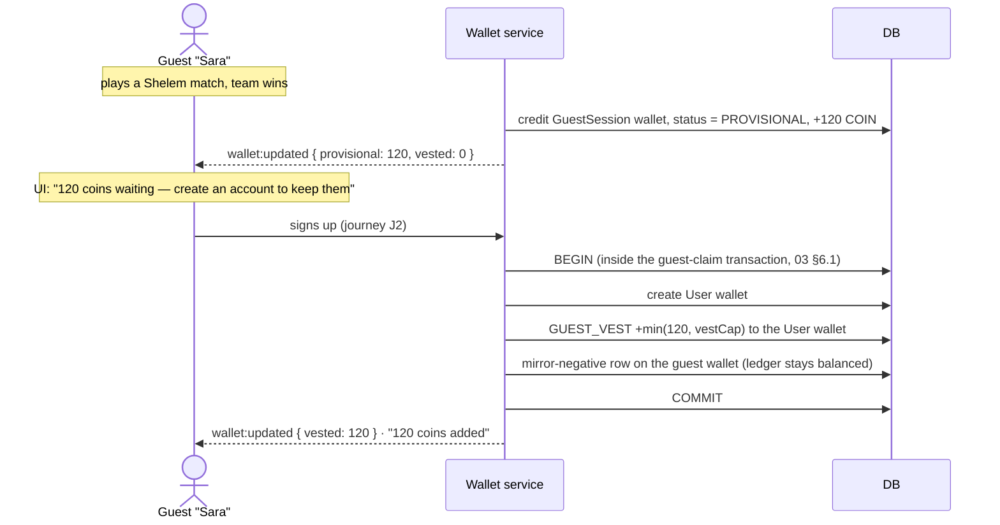

# Economy, Rewards & Premium

> **Status:** Draft · **Depends on:** [03-data-model.md](./03-data-model.md), [09-matchmaking.md](./09-matchmaking.md)

Players **earn coins and assets by playing**, hold them in a wallet — **guests included** — and
spend them on in-game items. A **premium plan** exists as the real-money product. Players **ejected
from a match earn nothing, even if their team wins.**

This is the project's commercial core, not a side feature. It also carries the highest design and
legal risk in the product, so the boundaries are drawn explicitly.

---

## 0. What This Changes

[01-business-prd.md](./01-business-prd.md) §3 previously listed as non-goals: *"no real money /
purchases / cash-out"*, *"cosmetics free and unlockable-by-play, never purchased"*, and framed the
whole thing as *"a personal project, not a startup"*. **Those statements are withdrawn.** The
revised position:

| Previously stated | Now |
|---|---|
| No monetization of any kind | **Premium subscription** is the real-money product (§6) |
| Cosmetics free, unlock-by-play only | Cosmetics are **bought with earned coins** (§4); some remain free unlocks |
| No wallets, no currency | **Multi-asset wallet with an append-only ledger** (§2) |
| Guests are throwaway identities | Guests **accrue provisional earnings** that vest on signup (§3.4) — this is now the primary signup incentive |
| Crypto/NFT: not mentioned | **Explicitly a possible future**, not built. §8 documents the seam kept open for it |

---

## 1. Principles

These constrain every decision below. P-numbers are referenced throughout.

| # | Principle | Consequence |
|---|---|---|
| **E1** | **The ledger is the truth.** A balance is the sum of its transactions, never an independently mutated number | Any balance discrepancy is detectable and repairable. No "the number just went wrong" |
| **E2** | **Every credit is idempotent.** One match, one reward, enforced by a unique key in the database | A socket retry, a restarted worker, or a replayed event cannot double-pay |
| **E3** | **Premium never confers gameplay advantage.** Cosmetics, convenience, and earn *rate* only — never information, never rules, never matchmaking priority | The moment premium buys a better hand or a longer turn timer, the game is broken and worthless |
| **E4** | **Coins are not money and never convert back.** No cash-out, no peer-to-peer transfer, no secondary market in v1 | Keeps the product clear of money-transmission and gambling regulation (§7) |
| **E5** | **Table chips ≠ wallet coins.** Poker/Blackjack chips are ephemeral per-match scoring tokens with no wallet relationship | Without this, poker becomes real-stakes gambling with a currency. This is the single most important boundary in the document (§4.4) |
| **E6** | **Effort earns, presence does not.** Rewards require actually playing to a legitimate conclusion | Idling in matches to farm is the most obvious exploit; forfeiture (§5) is the answer, and it is what you asked for |
| **E7** | **Earning is capped and decaying, not linear.** Per-day and per-hour caps, decay on repeated identical matchups | A grinder and a farmer are distinguished by *rate*, not intent, and rate is measurable |

---

## 2. Wallet & Ledger

### 2.1 Multi-asset from day one

Even though v1 ships one currency, the wallet is asset-keyed. Retrofitting a second asset onto a
single-balance schema is a migration nobody enjoys, and §8's crypto seam depends on it.

```ts
type AssetCode =
  | 'COIN'      // v1 soft currency, earned by playing
  | 'GEM'       // reserved: premium currency, not issued in v1
  | 'TICKET'    // reserved: event/tournament entry, not issued in v1
```

### 2.2 Holders

A wallet belongs to **either** a `User` **or** a `GuestSession` — never both, never neither.

| Holder | Balance status | Lifetime |
|---|---|---|
| `User` | **Vested** — spendable | Permanent |
| `GuestSession` | **Provisional** — accrues, cannot be spent | Vests on signup; expires with the guest session (§3.4) |

### 2.3 The ledger

```
balance(holder, asset) == Σ WalletTransaction.amount WHERE holder AND asset
```

`Wallet.balance` exists as a **cached** column for fast reads, written only inside the same
transaction that appends the ledger row. A nightly reconciliation job recomputes every balance
from its transactions and raises an `ALERT` `SecurityEvent` on any mismatch (E1).

```ts
type TransactionKind =
  | 'MATCH_REWARD'        // + earned by completing a match
  | 'DAILY_BONUS'         // + first win of the day
  | 'ACHIEVEMENT'         // + milestone
  | 'PREMIUM_GRANT'       // + subscription periodic grant
  | 'PURCHASE'            // − spent in the store
  | 'REFUND'              // + reversal of a PURCHASE
  | 'GUEST_VEST'          // + provisional balance vesting into a new account
  | 'GUEST_FORFEIT'       // − provisional balance expiring unvested
  | 'ADMIN_ADJUST'        // ± manual correction (you); always reason-tagged
  | 'CAP_REJECTED'        // 0 audit row: a reward that was earned but capped away
```

`CAP_REJECTED` is a zero-amount row on purpose. A reward silently not granted is indistinguishable
from a bug; a zero row with a reason makes "why didn't I get coins?" answerable from the ledger.

### 2.4 Credit path

```ts
async function credit(input: CreditInput): Promise<WalletTransaction> {
  return uow.run(async (repos) => {
    // E2: (holderKey, idempotencyKey) is UNIQUE. A duplicate insert throws and we
    // return the original row — the DATABASE enforces once-only, not a cache.
    const existing = await repos.wallet.findByIdempotencyKey(input.holderKey, input.idempotencyKey)
    if (existing) return existing

    const capped = await applyCaps(repos, input)          // E7
    if (capped.amount === 0) {
      return repos.wallet.append({ ...input, kind: 'CAP_REJECTED', amount: 0,
                                   reason: capped.reason })
    }
    const tx = await repos.wallet.append({ ...input, amount: capped.amount })
    await repos.wallet.bumpCachedBalance(input.holderKey, input.asset, capped.amount)
    return tx
  })
}
```

Idempotency keys are **derived, never random**:

| Credit | Key |
|---|---|
| Match reward | `match:{matchResultId}:{seat}` |
| Daily bonus | `daily:{holderKey}:{YYYY-MM-DD}` |
| Achievement | `achv:{achievementId}:{holderKey}` |
| Premium grant | `premium:{subscriptionId}:{periodIndex}` |
| Guest vesting | `vest:{guestSessionId}` |

A derived key means replaying the same event produces the same key and therefore no second credit.
A random key would defeat the entire mechanism.

### 2.5 Debit path

Spending is the same transaction with a negative amount, plus a balance check:

```ts
async function purchase(holderKey: HolderKey, itemId: string) {
  return uow.run(async (repos) => {
    const item = await repos.store.findById(itemId)
    assertPurchasable(item, holderKey)                     // active, not owned, premium gate ok
    const balance = await repos.wallet.balanceForUpdate(holderKey, item.asset)  // row-locked
    if (balance < item.priceAmount) throw new InsufficientFundsError(...)

    await repos.wallet.append({ holderKey, asset: item.asset, amount: -item.priceAmount,
                                kind: 'PURCHASE', idempotencyKey: `buy:{...}`, refId: item.id })
    await repos.wallet.bumpCachedBalance(holderKey, item.asset, -item.priceAmount)
    return repos.cosmetics.grant(holderKey, item.cosmeticId)
  })
}
```

`balanceForUpdate` takes a row lock (`SELECT … FOR UPDATE` on Postgres; SQLite serializes writes
anyway). Two simultaneous purchases with one item's worth of coins must not both succeed —
a read-then-write without the lock is a real double-spend.

> **Guests cannot spend** (§2.2). `assertPurchasable` rejects guest holders outright, which
> removes an entire class of attack: there is no way to convert farmed provisional coins into
> anything before signing up.

---

## 3. Earning

### 3.1 Match reward formula

```
reward = round(
    base(gameSlug)
  × placement(rank, seatCount)
  × premiumMultiplier
  × integrityFactor          ← 0 for ejected/forfeited players (§5)
  × repeatDecay              ← §3.5
  × durationFactor           ← §3.6
)
```

Every factor is data, not code — tunable without a deploy.

### 3.2 Base rates

| Game | Base | Rationale |
|---|---|---|
| Sudoku (solo) | 10 | Short, no opponent commitment |
| Sudoku (race) | 20 | Competitive |
| Blackjack | 25 | ~10 min |
| Chess (blitz) | 30 | ~10 min, high attention |
| Chess (rapid) | 50 | ~20 min |
| Poker | 60 | 20–60 min |
| **Shelem** | **80** | Longest and most demanding; deliberately the best rate |

Shelem paying most is intentional product design: it's the flagship, it asks for 45 minutes and
three other people, and the economy should reward showing up for it.

### 3.3 Placement multipliers

| Rank | 2 seats | 4 seats | 6 seats |
|---|---|---|---|
| 1st | 1.5 | 1.5 | 1.5 |
| 2nd | 0.6 | 1.0 | 1.1 |
| 3rd | — | 0.7 | 0.9 |
| 4th | — | 0.5 | 0.7 |
| 5th+ | — | — | 0.5 |
| **Draw** | 1.0 | 1.0 | 1.0 |

**Losing still pays** (0.5–0.7×). A game where losing pays nothing teaches players to quit when
behind — which is exactly the behaviour ejection penalties exist to discourage. Paying losers less
but never nothing keeps them at the table.

**Partnership games (Shelem, Hokm):** both partners receive the team's placement multiplier. A
partner who was ejected still gets zero (§5) — the multiplier is applied per seat, and
`integrityFactor` zeroes it individually.

### 3.4 Guest earning & vesting

> **You asked for:** *coins deposit to player wallets even if they are guests, and when they sign
> up the assets deposit to their wallets.*



| Rule | Value | Why |
|---|---|---|
| Guests accrue | Yes, `PROVISIONAL` | Your requirement, and the strongest possible signup incentive |
| Guests spend | **No** | Removes the payoff from guest-session farming (§2.5) |
| Vesting cap | **500 COIN** per claimed guest session | Bounds a farming run's value |
| Provisional TTL | Guest session lifetime (12 h) | Unvested balance expires as `GUEST_FORFEIT` |
| Reward-ineligible matches | Credit **0** with a `CAP_REJECTED` row | All-guest matchmade groups (§[09](./09-matchmaking.md) §7.2) |
| One vest per guest session | `vest:{guestSessionId}` idempotency key | Cannot vest the same session into two accounts |

> **This is the mechanism that turns your economy into the signup funnel.** A guest who has
> earned 340 coins in an evening has a concrete, personal reason to create an account — far
> stronger than "save your stats". It is also the reason the vesting cap exists: the incentive
> must be real without making guest sessions a coin faucet.

### 3.5 Repeat decay (E7)

Matching the same set of identities repeatedly decays the reward:

| Same matchup within 30 min | Multiplier |
|---|---|
| 1st–2nd | 1.0 |
| 3rd | 0.6 |
| 4th | 0.3 |
| 5th+ | 0.1 |

Applies to **private tables too**, not just matchmade. Four friends playing Shelem all evening are
not farming — but four friends playing 90-second "matches" repeatedly are, and the decay can't
tell intent, only rate. Real Shelem matches take 30–45 minutes, so honest play never hits the
lower tiers.

### 3.6 Duration factor

A match that ends implausibly fast pays proportionally:

```
durationFactor = clamp(actualDurationMs / expectedMinMs, 0, 1)
```

`expectedMinMs` is per game (Shelem 8 min, Poker 3 min, Chess 60 s, Blackjack 60 s). This is the
main defense against the "deliberately lose in 30 seconds, repeat" farm — the reward shrinks
in direct proportion to the shortcut.

Games ending fast for legitimate reasons are exempted: chess resignation-in-a-lost-position and
poker all-fold hands set `durationFactor = 1`.

### 3.7 Caps (E7)

| Cap | Value | On exceed |
|---|---|---|
| Per hour | 400 COIN | `CAP_REJECTED` rows for the remainder |
| Per day | 2 000 COIN | as above |
| Per day, guest | 500 COIN | as above |
| Matches counted per day | 30 | Rewards stop; play continues normally |

Caps are per **holder**, evaluated inside the credit transaction (E1/E2). Premium raises the
hourly and daily caps by its multiplier — never removes them.

### 3.8 Other earning

| Source | Amount | Key |
|---|---|---|
| First win of the day | +50 COIN | `daily:{holder}:{date}` |
| Achievements | 25–500 COIN | `achv:{id}:{holder}` |
| Premium periodic grant | +500 COIN/month | `premium:{subId}:{period}` |
| Completing the tutorial | +100 COIN | `achv:tutorial:{holder}` |

---

## 4. Spending

### 4.1 The store

Everything purchasable is cosmetic or convenience (E3):

| Category | Examples | Price band |
|---|---|---|
| **Card backs** | Persian tile, geometric, gold leaf, animated | 200–1 500 |
| **Card faces** | Classic French, Persian traditional, minimal, high-contrast | 400–1 200 |
| **Table felts** | Colors, patterns, wood, marble | 150–800 |
| **Avatars** | Preset packs, frames, animated frames | 100–1 000 |
| **Avatar frames / name colors** | Cosmetic identity | 200–600 |
| **Emote packs** | Themed reaction sets | 150–500 |
| **Table themes** | Coordinated felt + back + frame bundles | 1 000–2 500 |
| **Profile cosmetics** | Banners, badges, title tags | 100–800 |

Existing free unlocks (`DEFAULT`, `PLAY_COUNT`, `WIN_COUNT`, `ACHIEVEMENT`) **remain** —
[03-data-model.md](./03-data-model.md) §3.6 gains `PURCHASE` alongside them, not instead of them.
A store where nothing is free reads as a paywall; a store where everything is free has no economy.

### 4.2 Not purchasable, ever (E3)

| Never sold | Why |
|---|---|
| Any gameplay information | It's the anti-cheat guarantee ([07](./07-security-and-anticheat.md) §2) |
| Longer turn timers | Turn limits are a fairness mechanism, not a product |
| Better cards, dice, or seats | Obviously |
| Matchmaking priority | Queue fairness is oldest-first, full stop ([09](./09-matchmaking.md) §4.1) |
| Ejection immunity or cooldown removal | It's the anti-AFK penalty; selling relief from it sells the right to ruin others' matches |
| Removal of another player's cosmetics | — |

### 4.3 Coin sinks

An economy with earning and no spending inflates until coins are meaningless. Deliberate sinks:

- **Consumables:** table theme rentals (7-day), one-off emote bursts, profile boosts.
- **Rotating store:** a weekly featured selection at a premium price, encouraging spend now.
- **Re-roll costs:** changing a display name (after the first, free change), re-rolling a
  generated avatar.
- **Cosmetic tiers:** high-end items priced at multiple days of capped earning, so there is always
  something to save toward.

> **Open question:** exact price/earn balance. The numbers above are a starting point, not a
> tuned economy. They should be revisited once real play data exists — which is why every rate,
> price, and multiplier is a database row rather than a constant.

### 4.4 Table chips are NOT coins (E5)

**The most important boundary in this document.**

| | Table chips (Poker, Blackjack) | Wallet coins |
|---|---|---|
| Scope | One match | Account, permanent |
| Origin | Issued at match start (`startingStack`) | Earned by completing matches |
| On match end | **Destroyed** | Persist |
| Buy-in from the wallet | **Never** | — |
| Convert to coins | **Never** | — |
| Purpose | Scoring within the game's rules | Buying cosmetics |

The reward for a poker match is computed from **final placement**, exactly like Shelem or Chess.
A player who wins 4 000 chips receives the 1st-place coin reward, not 4 000 coins.

Why this line is drawn hard: if wallet coins could buy chips and chips could be converted back,
the product becomes **real-stakes gambling with a currency** — the moment a premium subscription
is in the picture, that is a regulated activity in most jurisdictions, and it is a very different
product from the one described in [01-business-prd.md](./01-business-prd.md). Keeping chips
ephemeral and non-convertible keeps poker a card game.

Implementation guards:
- No code path connects `PokerState.seats[].stack` to `Wallet`. Enforced by an ESLint
  `no-restricted-imports` rule barring wallet imports from `domain/games/**`.
- A test asserts no `WalletTransaction` is ever created with `refId` pointing at a chip amount.

---

## 5. Ejection & Forfeiture

> **You asked for:** *if players are fired from the game (for any reason like the time's-up rule)
> and their team wins, those who were fired don't get anything.*

This is implemented as `integrityFactor = 0` in §3.1 — a per-seat multiplier, so it zeroes one
player's reward without touching their teammates'.

### 5.1 Outcome states per seat

| `SeatOutcome` | Cause | `integrityFactor` | Counts for stats/ELO |
|---|---|---|---|
| `COMPLETED` | Played to the end | **1.0** | Yes |
| `EJECTED_TIMEOUT` | Turn timer expired → removed, bot substituted ([04](./04-realtime-protocol.md) §6) | **0** | Yes, as a loss |
| `EJECTED_ABANDON` | Disconnected past grace, never returned | **0** | Yes, as a loss |
| `RESIGNED` | Deliberately resigned/left | **0.25** | Yes, as a loss |
| `REPLACED_RETURNED` | Ejected, then reclaimed the seat and finished | **0.5** | Yes |
| `BOT` | Bot-occupied seat | **0** (bots have no wallet) | No |
| `KICKED` | Removed by the host (private tables) | **0** | No |

### 5.2 The rules that follow

1. **A winning team's ejected player earns nothing.** Their partner earns the full winning
   reward. Exactly the rule you specified.
2. **Resigning pays a little (0.25×), being ejected pays nothing.** Conceding a lost position
   promptly is *courteous*; vanishing mid-hand and forcing a bot substitution is not. The
   difference in reward is the difference in how much it costs everyone else.
3. **Returning after ejection recovers half.** If the seat is reclaimable (§[04](./04-realtime-protocol.md) §6.4)
   and the player comes back and finishes, they get 0.5× — enough to make coming back worthwhile,
   less than never leaving.
4. **Bots never earn.** Bot-played portions of a seat produce no credit for anyone.
5. **Ejection stacks with the matchmaking cooldown** ([09](./09-matchmaking.md) §7.1). Forfeiture
   removes the incentive to idle; the cooldown removes the opportunity to repeat it.
6. **Forfeiture is recorded, not silent.** A `CAP_REJECTED` ledger row with
   `reason: 'EJECTED_TIMEOUT'` and a clear post-match message: *"You were removed for inactivity —
   no coins earned for this match."* A player who doesn't understand why they earned nothing will
   assume a bug.

### 5.3 Where it's computed

`GameEngine.result()` returns per-seat `SeatOutcome` ([05-game-engine-spec.md](./05-game-engine-spec.md) §1.1).
The engine reports facts; the `RewardService` applies policy. Keeping the multipliers out of the
engines preserves invariant I1 (engines stay pure and have no idea coins exist).

---

## 6. Premium Plan

The real-money product. **Subscription only in v1.**

### 6.1 Tiers

| | Free | **Premium** |
|---|---|---|
| All games | ✅ | ✅ |
| Matchmaking | ✅ | ✅ |
| Private tables + invites | ✅ | ✅ |
| Coin earn rate | 1.0× | **1.5×** |
| Monthly coin grant | — | **500** |
| Daily/hourly earn caps | standard | **1.5× standard** |
| Exclusive cosmetics | — | ✅ rotating premium-only set |
| Custom avatar upload | ✅ (24 h account age) | ✅ immediate |
| Match history depth | 30 days | **unlimited** |
| Replay export (PGN/log) | last 10 | **unlimited** |
| Concurrent private tables | 2 | **10** |
| Profile customization slots | 1 | **5** |
| Supporter badge | — | ✅ |
| **Gameplay advantage** | **none** | **none** (E3) |

### 6.2 What premium deliberately does not include

Restating E3, because subscription products drift toward pay-to-win by a thousand small
decisions: no extra time to think, no additional information, no queue priority, no ejection
immunity, no cosmetics that obscure or mislead other players, no rule variations, no bot
difficulty adjustment in the subscriber's favour.

The pitch is *"earn faster, look better, keep more history, support the project"* — never *"win
more"*.

### 6.3 Mechanics

| Aspect | Decision |
|---|---|
| Billing | Monthly and annual (annual ~2 months free) |
| Provider | Deferred — Stripe assumed. **No payment code before M7** |
| Grace period | 3 days after a failed payment before perks lapse |
| On lapse | Perks stop. **Earned coins and purchased cosmetics are kept forever.** Never take back what someone earned |
| Premium-only cosmetics after lapse | Retained if purchased with coins; rotating *grants* deactivate |
| Refunds | Manual, at your discretion; a `REFUND` ledger row reverses any coin grant |
| Gifting | Deferred |
| Free trial | Deferred; the guest-vesting incentive is the acquisition mechanism |

### 6.4 Data

`Subscription` model in [03-data-model.md](./03-data-model.md) §3.9: provider ids, tier, status,
period bounds, cancellation, and a `SubscriptionEvent` audit log. **No card data ever touches this
database** — the provider holds it, we store a customer id and a subscription id.

### 6.5 Open question — should coins be purchasable for money?

> **The one economy decision still open, and the biggest.** Documented default: **no.**

Coins are **earn-only**; real money buys the subscription. Reasons for that default:

| For earn-only (the default) | For selling coins |
|---|---|
| "Everything in the store is reachable by playing" — the economy stays honest | Direct revenue per player, not just per subscriber |
| No pay-to-win *perception* on cosmetics, which is nearly as damaging as the real thing | Players who want a specific item now can get it |
| Dramatically simpler compliance: no virtual-goods pricing tiers, regional pricing, or consumer-protection rules on top of the subscription | — |
| Premium's 1.5× multiplier already gives paying players a legitimate advantage in *earning* | — |

**Decide before M7.** The schema already supports it — a `PURCHASE_CREDIT` transaction kind slots
into §2.3 without a migration — so this is a product call, not an engineering one. If you say yes,
note that it strengthens the case for 2FA ([07](./07-security-and-anticheat.md) §7) and moves the
first row of §7 closer to the line.

---

## 7. Legal & Regulatory Boundaries

Not legal advice — a record of the design decisions that keep the product simple, and the lines
that would change its category if crossed.

| Boundary | Status | What crossing it would mean |
|---|---|---|
| Coins convertible to money | **Never (E4)** | Money transmission; licensing |
| Coins tradeable between players | **Never in v1** | Secondary markets, RMT, fraud handling |
| Wallet coins as poker stakes | **Never (E5)** | **Gambling.** The most consequential line here |
| Real money for a chance-based outcome | **Never** | Gambling, even without cash-out, in several jurisdictions |
| Loot boxes / randomized paid rewards | **Never** | Regulated or banned in several jurisdictions; also just unpleasant |
| Coins purchasable for money | Open question (§6.5) | Virtual-goods consumer protection, regional pricing |
| Subscription | **Yes, from M7** | Standard SaaS: terms, refunds, VAT/tax handling, cancellation UX |
| Minors | Age gate at signup; no purchases without it | Additional consent rules |

**Poker deserves the explicit statement:** because chips are issued at match start, destroyed at
match end, never bought with coins, and never converted to coins (E5, §4.4), poker in this app is
a card game with a scoring token — the same as tracking points in Shelem. That property must be
preserved by every future change to the economy.

---

## 8. Crypto / NFT Seam

You mentioned possibly turning assets into a cryptocurrency or NFTs later, but not now. **Nothing
crypto is built.** These choices keep the door open at near-zero present cost:

| Design choice | Why it helps later |
|---|---|
| Append-only ledger with idempotency keys (§2.3) | Already the shape of an on-chain transaction log; auditable and replayable |
| Asset-keyed wallet (§2.1) | A token is just another `AssetCode`; no schema change |
| `CosmeticItem.externalRef` (nullable) | A slot for a token id / contract address per item, unused in v1 |
| Stable, immutable item slugs | A tokenized item needs a permanent identifier; renaming later would break it |
| Per-item `transferable` flag (default `false`) | Transferability is the crypto prerequisite and the regulatory tripwire; having the flag makes the decision explicit and per-item |
| Ledger `reason` + `refId` on every row | Provenance for a future mint |

**What would actually be required**, recorded so the scope isn't underestimated: custody and key
management, chain selection and gas economics, wallet-linking UX, a mint/burn pipeline reconciled
with this ledger, and — the hard part — the regulatory shift the moment assets become
transferable or tradeable (E4 stops holding, and §7's first two rows change category). Treat it as
a separate product decision, not a feature.

---

## 9. Data Model Additions

Detailed in [03-data-model.md](./03-data-model.md) §3.9–3.10. Summary:

| Model | Purpose |
|---|---|
| `Wallet` | One per (holder, asset). Cached balance + status (`VESTED` / `PROVISIONAL`) |
| `WalletTransaction` | **Append-only ledger.** Unique `(holderKey, idempotencyKey)` — this is E2 |
| `StoreItem` | Purchasable item: asset, price, category, premium gate, active window, `externalRef` |
| `Purchase` | Purchase record linking transaction → item → granted cosmetic |
| `RewardRule` | Per-game base rates, placement tables, caps, decay curves — **data, not code** |
| `Subscription` + `SubscriptionEvent` | Premium state and its audit trail |
| `Achievement` + `UserAchievement` | Milestone definitions and grants |
| `MatchParticipant` | Extended with `outcome: SeatOutcome`, `coinsAwarded`, `rewardForfeited` |
| `CosmeticItem` | Extended with `PURCHASE` unlock kind, `priceAmount`, `transferable` |

---

## 10. Protocol & API

### Socket events

| Event | Direction | Payload |
|---|---|---|
| `wallet:updated` | S→C | `{ asset, vested, provisional, delta?, reason? }` — pushed on any change |
| `game:rewardPreview` | S→C | `{ estimatedCoins, integrityFactor, warnings[] }` — shown at match end, before settlement |
| `game:rewardSettled` | S→C | `{ coinsAwarded, forfeited, reason?, capped? }` |
| `game:ejectionWarning` | S→C | `{ seat, secondsRemaining, consequence: 'EJECTION_NO_REWARD' }` — see [04](./04-realtime-protocol.md) §6.2 |

### REST

| Method | Path | Auth | Purpose |
|---|---|---|---|
| GET | `/wallet` | G | Balances per asset + vesting status |
| GET | `/wallet/transactions` | U | Paginated ledger — the player's own statement |
| GET | `/store` | G | Catalog with owned/affordable/locked flags |
| POST | `/store/purchase` | U | Buy an item (guests rejected) |
| GET | `/rewards/rules` | P | Public reward rates — **transparency is deliberate** (§11) |
| GET | `/achievements` | G | Definitions + my progress |
| GET | `/premium/plans` | P | Tiers and pricing |
| POST | `/premium/subscribe` | U | Start checkout (provider redirect) |
| POST | `/premium/cancel` | U | Cancel at period end |
| POST | `/premium/webhook` | — | Provider webhook; **signature-verified**, idempotent by event id |

---

## 11. Transparency

`GET /rewards/rules` is public, and the client shows the full breakdown after every match:

```
Match reward
  Shelem base                    80
  1st place            × 1.5   120
  Premium              × 1.5   180
  Repeat matchup       × 1.0   180
  ─────────────────────────────────
  Earned                       180 coins
```

And when forfeited:

```
Match reward
  You were removed for inactivity.
  No coins earned for this match.
  Your partner earned their full reward.
```

An opaque economy invites accusations of rigging. Publishing the formula makes the caps and decay
curves defensible, makes forfeiture feel like a rule rather than a punishment, and makes support
questions answerable by pointing at a number.

---

## 12. Test Cases

| # | Case | Expect |
|---|---|---|
| 1 | Complete a match | Reward = formula; one `MATCH_REWARD` row |
| 2 | **Same reward credited twice** | Second call returns the original row; **balance unchanged** (E2) |
| 3 | Balance vs ledger sum | Equal for every wallet after 10 000 random operations (E1) |
| 4 | Reconciliation with a corrupted cached balance | Mismatch detected; `ALERT` raised |
| 5 | **Ejected player on the winning team** | `coinsAwarded = 0`; **partner gets full reward** |
| 6 | Ejected player on the losing team | 0 |
| 7 | Resigned player | 0.25× |
| 8 | Ejected then returned and finished | 0.5× |
| 9 | Bot seat | No wallet transaction of any kind |
| 10 | Guest completes a match | `PROVISIONAL` credit; `wallet:updated` sent |
| 11 | Guest attempts a purchase | Rejected — guests cannot spend |
| 12 | **Guest signs up** | Provisional balance vests, capped at 500, inside the claim transaction |
| 13 | Guest vests twice | Second vest is a no-op (`vest:{guestSessionId}`) |
| 14 | Guest session expires unvested | `GUEST_FORFEIT` row; ledger balanced |
| 15 | Hourly cap exceeded | `CAP_REJECTED` rows; balance stops rising |
| 16 | Same matchup 5× in 30 min | Decay applied per §3.5 |
| 17 | 30-second Shelem match | `durationFactor` scales the reward down proportionally |
| 18 | Chess resignation in a lost position | `durationFactor = 1` (exempt) |
| 19 | Purchase with sufficient balance | Debit + cosmetic granted, one transaction |
| 20 | Purchase with insufficient balance | `InsufficientFundsError`; **no partial debit** |
| 21 | **Two concurrent purchases, one item's worth of coins** | Exactly one succeeds (row lock) |
| 22 | Purchase an already-owned item | Rejected |
| 23 | Premium-gated item without premium | Rejected |
| 24 | Premium multiplier | Applied to rewards and caps, never to gameplay |
| 25 | Premium lapses | Perks stop; **coins and purchased cosmetics retained** |
| 26 | Premium webhook delivered twice | Idempotent by provider event id |
| 27 | Premium webhook with a bad signature | Rejected; `SecurityEvent` |
| 28 | Monthly grant, same period twice | Credited once (`premium:{subId}:{period}`) |
| 29 | **No path from table chips to the wallet** | Static check: `domain/games/**` cannot import wallet code (E5) |
| 30 | Poker winner with 4 000 chips | Receives the 1st-place **coin** reward, not 4 000 coins |
| 31 | All-guest matchmade group | `rewardEligible: false`; `CAP_REJECTED` rows for all |
| 32 | Reward for a match that never finished | None |
| 33 | Admin adjustment | `ADMIN_ADJUST` row with a reason; balance moves |
| 34 | Refund | `REFUND` row reverses the purchase; cosmetic revoked |
| 35 | Ledger after 100 k random ops | Σ transactions == Σ cached balances, per holder and asset |

---

## Related Documents

- [01-business-prd.md](./01-business-prd.md) §3 — the revised non-goals, §10 — the economy's product role
- [03-data-model.md](./03-data-model.md) §3.9–3.10 — wallet, store, subscription models
- [04-realtime-protocol.md](./04-realtime-protocol.md) §6 — turn enforcement and ejection, which drives forfeiture
- [09-matchmaking.md](./09-matchmaking.md) §7 — farming guards and queue cooldowns
- [07-security-and-anticheat.md](./07-security-and-anticheat.md) §11 — economy threat model
- [08-roadmap.md](./08-roadmap.md) M7 — when this ships
