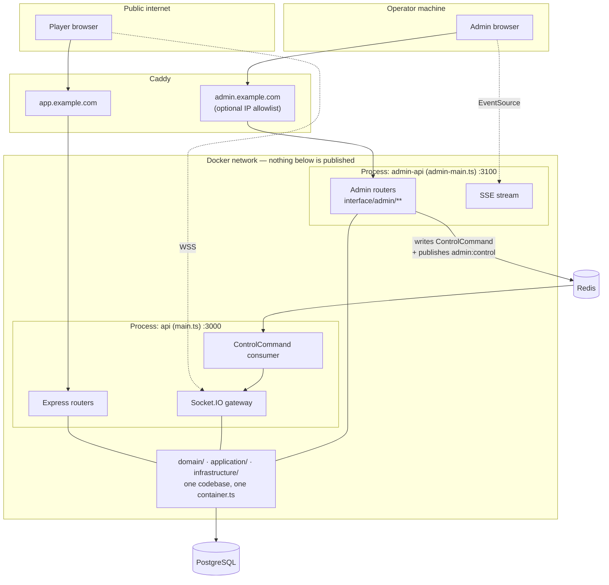
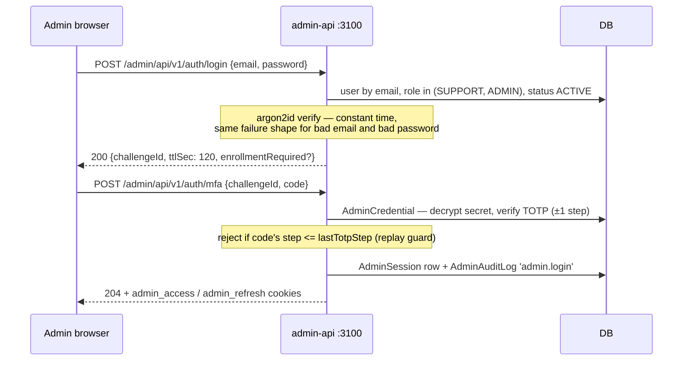
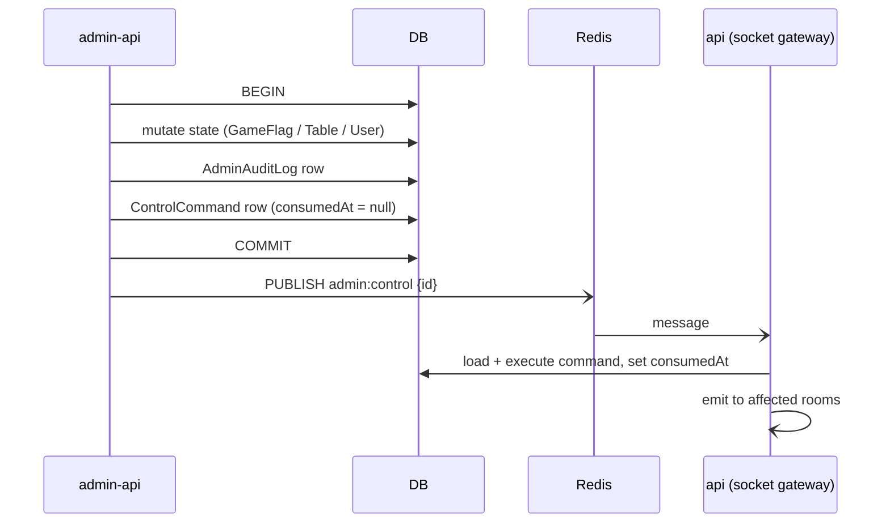

# Admin Console — Operations, Moderation & Oversight

The second application: a back-office for running the platform. Same repository, same domain
layer, **different process, different port, different network position, different credentials**.

This document specifies the admin backend entrypoint, the admin frontend project, the data model
additions, the live-control channel, and the security posture that lets one person operate the
platform without giving the public internet a path to the coin supply.

**Read [02-technical-prd.md](./02-technical-prd.md) first.** Everything here inherits its layering,
error taxonomy, portability rules, and Redis boundaries. Where this document and the technical PRD
disagree, the technical PRD wins.

---

## 0. What was missing

Before this document, the entire admin story in the PRD set was four fragments:

| Where | What existed |
|---|---|
| [03](./03-data-model.md) §3.1 | `User.role` — `'USER' \| 'ADMIN'`, used nowhere |
| [03](./03-data-model.md) §9 | A seeded admin from `SEED_ADMIN_EMAIL` / `SEED_ADMIN_PASSWORD` |
| [10](./10-economy-and-rewards.md) §2.3 | `ADMIN_ADJUST` as a ledger reason code |
| [11](./11-build-plan.md) S15 | `GET /metrics` and `GET /admin/security-events`, admin-gated, on the **public** port |

A role column, one ledger reason, and two JSON endpoints. No way to find a user, no way to disable
one, no way to see where coins went, no way to turn a broken game off without a deploy, and no UI
of any kind. [08](./08-roadmap.md) §"Deferred" even lists moderation as "probably never" — written
before matchmaking put strangers at the same table and before coins acquired value. That line is
now stale; this document supersedes it.

---

## 1. Guiding Principles

These are the admin-side equivalents of [02](./02-technical-prd.md) §1's P1–P10.

| # | Principle | Consequence |
|---|---|---|
| **A1** | **One domain, two front doors.** The admin app reuses `domain/` and `application/` verbatim | The rule `balance == Σ ledger` is enforced by one code path, not two that drift |
| **A2** | **The admin API is never reachable from the public internet.** Separate port, unpublished, separate hostname behind the proxy | A compromise of the player API does not reach `ADMIN_ADJUST` |
| **A3** | **No admin mutation without an audit row, written in the same transaction** | If the audit write fails, the action fails. Same discipline as the wallet ledger (P8) |
| **A4** | **The audit log is append-only.** No update path, no delete path, no admin UI to edit it | An admin cannot erase their own trail — including you |
| **A5** | **The admin console has no privileged view of a live game's hidden information** | An admin watching a live table sees the *spectator projection*, same as any spectator. Full state unlocks only after the match ends |
| **A6** | **The database is the truth; the control channel is a latency optimization** | Turning a game off works even with Redis down — it is just slower to take effect |
| **A7** | **Destructive actions require a fresh second factor and a written reason** | "Reason" is a `NOT NULL` column, not a UI placeholder |
| **A8** | **Platform-initiated interruption never costs a player anything** | Closing a table from the console does **not** forfeit rewards — unlike ejection ([10](./10-economy-and-rewards.md) §5). The player did nothing wrong |

> **A5 is the one that gets built wrong.** The natural "debug this table" screen dumps engine
> state to the admin — which is a live view of every player's cards, reachable by anyone who steals
> an admin session. The leak-test suite ([07](./07-security-and-anticheat.md) §4) is extended to
> cover the admin viewer as a subject, not just seats and spectators.

---

## 2. Deployment Topology

### 2.1 The shape



Two Node processes, one image, one codebase, one database. `:3100` never appears in the compose
file's `ports:` list — Caddy reaches it over the internal Docker network only.

### 2.2 Why not a fourth top-level project

A standalone `admin-backend/` was considered and rejected:

| Cost | Detail |
|---|---|
| The money rules fork | `balance == Σ ledger`, the derived idempotency keys, and forfeiture-on-ejection would exist in two codebases. Two implementations of a ledger is how ledgers break |
| Contract sync triples | [02](./02-technical-prd.md) §4.1's drift problem already costs a sync script. A second backend adds a second canonical source |
| Nothing is gained | The isolation the split was wanted for is *network* isolation, and a separate entrypoint on an unpublished port delivers exactly that |

The separate-entrypoint approach keeps every benefit and pays none of the cost. What it *does*
require is a structural guard that admin code cannot leak onto the public port — see §2.4.

### 2.3 File layout additions

```
backend/
├── src/
│   ├── admin-main.ts             # ★ admin entrypoint  :3100
│   ├── main.ts                   # public entrypoint   :3000  (was server.ts)
│   ├── admin-app.ts              # Express app for the admin process only
│   ├── contracts/
│   │   └── admin/                # ★ admin DTOs + Zod, mirrored to admin-frontend
│   ├── domain/
│   │   ├── entities/             # + AdminAuditEntry, GameFlag, PlatformFlag
│   │   └── repositories/         # + IAdminAuditRepository, IGameFlagRepository, ...
│   ├── application/
│   │   └── services/admin/       # ★ AdminAuthService, ModerationService,
│   │                             #   EconomyOpsService, PlatformControlService,
│   │                             #   ReportingService, AuditService
│   ├── infrastructure/
│   │   ├── admin/                # totp.ts, adminSession.ts, auditUow.ts
│   │   └── control/              # ControlCommand outbox publisher + consumer
│   └── interface/
│       ├── admin/                # ★ routers, controllers, middleware
│       │   ├── routes/
│       │   ├── controllers/
│       │   └── middleware/       # adminAuth, requireRole, requireStepUp, auditContext
│       ├── http/                 # public — MUST NOT import interface/admin/**
│       └── socket/
└── scripts/
    └── sync-contracts.ts         # extended: contracts → frontend AND contracts/admin → admin-frontend

admin-frontend/                   # ★ third independent project — see §8
```

### 2.4 The structural guard (the rule that keeps A2 true)

Three layers, because "remember not to mount it" is not a mechanism:

1. **ESLint `no-restricted-imports`** — `src/app.ts`, `src/main.ts`, `src/interface/http/**`, and
   `src/interface/socket/**` may not import `src/interface/admin/**`. This joins the two existing
   guards from [02](./02-technical-prd.md) §5.1.
2. **A startup assertion** in `app.ts`: after routers are mounted, walk the Express router stack
   and throw if any path matches `/admin`. Fail fast at boot, not in production traffic.
3. **An integration test**: `GET http://localhost:3000/admin/api/v1/users` → **404**, and the same
   path on `:3100` → 401. This test is in M0's suite and never gets deleted.

### 2.5 Environment

| Var | Example | Notes |
|---|---|---|
| `ADMIN_PORT` | `3100` | Zod-validated at startup like every other var |
| `ADMIN_BIND` | `0.0.0.0` in Docker, `127.0.0.1` bare-metal | Never published |
| `ADMIN_ORIGIN` | `https://admin.example.com` | The only allowed CORS origin for the admin app |
| `ADMIN_TOTP_ENC_KEY` | 32-byte base64 | AES-256-GCM key for TOTP secrets at rest. **Required — the admin process refuses to boot without it** |
| `ADMIN_SESSION_IDLE_MIN` | `30` | Idle timeout |
| `ADMIN_SESSION_ABSOLUTE_HOURS` | `8` | Hard cap regardless of activity |
| `ADMIN_STEPUP_WINDOW_MIN` | `5` | How long a fresh TOTP authorises destructive actions |
| `ADMIN_IP_ALLOWLIST` | optional CIDR list | Belt-and-braces on top of TOTP; empty = disabled |
| `CONTROL_TRANSPORT` | `redis` \| `poll` | `poll` for dev without Redis (§6.3) |

Dev runs both processes side by side:

```bash
cd backend && npm run dev            # public API  :3000
cd backend && npm run dev:admin      # admin API   :3100
cd admin-frontend && npm run dev     # Vite        :5273, proxies /admin/api to :3100
```

---

## 3. Admin Identity, Authentication & Authorization

### 3.1 Roles

`User.role` widens from two values to three. Per [02](./02-technical-prd.md) §6.2 it stays a
`String` with a TS union in `contracts/` — no Prisma enum.

| Role | Can | Cannot |
|---|---|---|
| `USER` | Play. Nothing admin | Reach `:3100` at all — login rejects non-admin roles |
| `SUPPORT` | Read everything. Disable/enable a user, force-logout, resolve reports | Touch the ledger, toggle games, edit flags, change roles |
| `ADMIN` | Everything, including `ADMIN_ADJUST`, game flags, maintenance mode, role changes | Edit or delete the audit log — no code path exists (A4) |

`SUPPORT` exists because the read/write split is worth having in the schema from day one; for a
solo operator, seeding a second account is optional.

> **Open question:** does a solo operator ever create a `SUPPORT` account? Documented default:
> ship the role and the RBAC matrix, seed only the `ADMIN`. Revisit if anyone else ever helps run
> the platform.

### 3.2 Sessions are separate from player sessions

An admin's player session and admin session are unrelated objects. Logging into the game does not
log you into the console, and vice versa.

| | Player | Admin |
|---|---|---|
| Cookies | `access`, `refresh` | `admin_access`, `admin_refresh` |
| Cookie scope | game host, `SameSite=Lax` | admin host, `Path=/admin`, `SameSite=Strict`, `Secure` |
| Store | `RefreshToken` | `AdminSession` |
| Lifetime | 15 min / 30 d rotating | 15 min / 8 h absolute, 30 min idle |
| Second factor | none | **TOTP required** |
| Bound to | user id | user id **+ IP** — a session presented from a new IP is revoked, not refreshed |

### 3.3 Login flow



Details that matter:

- **Two steps, not one field.** The password step and the code step get independent rate limits;
  brute-forcing a 6-digit code is the realistic attack and it needs its own counter.
- **TOTP** is RFC 6238, 30 s step, ±1 window tolerance. Secrets are stored **AES-256-GCM
  encrypted** under `ADMIN_TOTP_ENC_KEY`, never plaintext — a database dump alone does not yield
  a working second factor.
- **Replay guard:** `AdminCredential.lastTotpStep` is advanced on every success. The same code
  cannot be used twice, which closes the shoulder-surf / proxy-replay window.
- **Enrollment is mandatory.** A freshly seeded admin has `totpEnrolledAt = null`; login returns
  `enrollmentRequired` and the *only* route the resulting session can reach is
  `POST /auth/totp/enroll`. Ten single-use recovery codes are issued at enrollment, stored as
  SHA-256 hashes in a JSON-encoded `String` (§6.2 forbids `String[]`).
- **Lockout:** 5 failed code attempts → `lockedUntil = now + 15 min`, and a `SecurityEvent` row.
- **No self-service password reset, no email.** Recovery is a recovery code, or CLI + DB access.
  This is consistent with [07](./07-security-and-anticheat.md) §7's admin-assisted reset.

### 3.4 Step-up: fresh factor for destructive actions

Holding a valid session is not sufficient for anything irreversible or economically meaningful.
Routes marked ⚡ in §5 require a TOTP verification within `ADMIN_STEPUP_WINDOW_MIN` (default 5).

```ts
// interface/admin/middleware/requireStepUp.ts — shape only
export const requireStepUp: RequestHandler = (req, _res, next) => {
  const ageMs = Date.now() - req.adminSession.mfaAt.getTime()
  if (ageMs > env.ADMIN_STEPUP_WINDOW_MIN * 60_000) {
    throw new StepUpRequiredError()      // 401, code 'STEP_UP_REQUIRED'
  }
  next()
}
```

The client responds to `STEP_UP_REQUIRED` with a modal asking for a code, replays the request, and
the operator loses four seconds. That is the entire cost of making a stolen laptop session unable
to mint coins.

### 3.5 The audit spine

Every mutating admin service call goes through one wrapper. This is the mechanism behind A3.

```ts
// infrastructure/admin/auditUow.ts — shape only
async function withAudit<T>(
  ctx: AdminActionContext,               // actor, ip, userAgent, requestId, reason
  action: AdminAction,                   // 'user.disable' | 'wallet.adjust' | 'game.setFlag' | ...
  target: { type: string; id: string },
  fn: (tx: Tx) => Promise<{ result: T; before?: unknown; after?: unknown }>,
): Promise<T> {
  return uow.transaction(async (tx) => {
    const { result, before, after } = await fn(tx)
    await tx.adminAuditLog.create({ data: {
      actorUserId: ctx.actor.id, actorIp: ctx.ip, actorUserAgent: ctx.userAgent,
      requestId: ctx.requestId, action, targetType: target.type, targetId: target.id,
      reason: ctx.reason ?? null,
      beforeJson: before ? JSON.stringify(before) : null,
      afterJson: after ? JSON.stringify(after) : null,
      prevHash, hash,                     // tamper-evident chain — §9 T24
    }})
    return result
  })
}
```

Enforced by a **route-manifest test**: every admin route declared as mutating is exercised, and the
test asserts exactly one `AdminAuditLog` row appeared. A new mutating endpoint that forgets the
wrapper fails CI rather than shipping silently.

---

## 4. Data Model Additions

All additions obey [02](./02-technical-prd.md) §6.2 — no enums, no `String[]`, no JSON path
queries, no `Decimal`, no native types.

```prisma
// ─── extends existing model User ──────────────────────────────────────────
// role   String @default("USER")     // now 'USER' | 'SUPPORT' | 'ADMIN'
// + the following fields and relations:
//   status          String   @default("ACTIVE")   // 'ACTIVE' | 'DISABLED' | 'BANNED'
//   statusReason    String?
//   statusChangedAt DateTime?
//   statusChangedBy String?
//   adminCredential AdminCredential?
//   adminSessions   AdminSession[]
//   adminActions    AdminAuditLog[]  @relation("AdminActor")
//   @@index([status])

/** Second-factor material and lockout state. One row per admin. */
model AdminCredential {
  id                 String    @id @default(cuid())
  userId             String    @unique
  totpSecretEnc      String                          // AES-256-GCM(iv:tag:ct), never plaintext
  totpEnrolledAt     DateTime?
  lastTotpStep       Int?                            // replay guard — §3.3
  recoveryCodeHashes String    @default("[]")        // JSON array of sha256; String, not String[]
  failedAttempts     Int       @default(0)
  lockedUntil        DateTime?
  createdAt          DateTime  @default(now())
  updatedAt          DateTime  @updatedAt

  user User @relation(fields: [userId], references: [id], onDelete: Cascade)
}

/** Admin sessions live apart from player RefreshTokens — §3.2. */
model AdminSession {
  id         String    @id @default(cuid())
  userId     String
  tokenHash  String    @unique                       // sha256 of the refresh token
  ip         String
  userAgent  String
  mfaAt      DateTime                                // last successful TOTP — drives step-up
  createdAt  DateTime  @default(now())
  lastSeenAt DateTime  @default(now())
  expiresAt  DateTime                                // absolute cap
  revokedAt  DateTime?

  user User @relation(fields: [userId], references: [id], onDelete: Cascade)
  @@index([userId, revokedAt])
}

/** Append-only. No update path, no delete path, anywhere. A4. */
model AdminAuditLog {
  id            String   @id @default(cuid())
  actorUserId   String
  actorIp       String
  actorUserAgent String
  requestId     String
  action        String                               // 'user.disable' | 'wallet.adjust' | ...
  targetType    String                               // 'user' | 'table' | 'game' | 'flag' | 'wallet'
  targetId      String
  reason        String?                              // NOT NULL enforced per-action in the service
  beforeJson    String?                              // JSON snapshot; never queried into (§6.2)
  afterJson     String?
  prevHash      String?                              // tamper-evident chain — §9 T24
  hash          String                               // sha256(prevHash + canonical row)
  createdAt     DateTime @default(now())

  actor User @relation("AdminActor", fields: [actorUserId], references: [id])
  @@index([createdAt])
  @@index([actorUserId, createdAt])
  @@index([targetType, targetId, createdAt])
}

/** Per-game availability, overriding the code registry without a deploy. */
model GameFlag {
  slug            String   @id                       // matches domain/games/registry.ts
  state           String   @default("ENABLED")       // 'ENABLED' | 'HIDDEN' | 'DISABLED' — §7.3
  reason          String?
  updatedAt       DateTime @updatedAt
  updatedByUserId String?
}

/** Generic key/value flags: maintenance mode, feature toggles, operational limits. */
model PlatformFlag {
  key             String   @id                       // 'maintenance' | 'registrationOpen' | ...
  value           String                             // JSON-encoded scalar or object
  updatedAt       DateTime @updatedAt
  updatedByUserId String?
}

/** Durable outbox for admin→gameplay commands. The DB is the truth (A6); Redis is the fast path. */
model ControlCommand {
  id          String    @id @default(cuid())
  kind        String                                 // 'table.close' | 'user.forceLogout' | ...
  payloadJson String
  auditLogId  String                                 // which admin action produced it
  createdAt   DateTime  @default(now())
  consumedAt  DateTime?
  @@index([consumedAt, createdAt])
}

/** Nightly rollups. Reports never aggregate the live OLTP tables during play — §7.4. */
model DailyMetric {
  id        String   @id @default(cuid())
  day       String                                   // 'YYYY-MM-DD' — String, not DateTime math
  metric    String                                   // 'dau' | 'coinsMinted' | 'matches' | ...
  dimension String   @default("_all")                // game slug, preset, or '_all'
  value     Int
  computedAt DateTime @default(now())

  @@unique([day, metric, dimension])
  @@index([metric, day])
}
```

### 4.1 Seed additions

[03](./03-data-model.md) §9's seed gains:

- `GameFlag` rows for every registry slug, all `ENABLED`.
- `PlatformFlag` rows: `maintenance = {"on":false}`, `registrationOpen = true`.
- The seeded admin gets `role = 'ADMIN'` and an `AdminCredential` with `totpEnrolledAt = null`,
  forcing enrollment on first login. **The seed never writes a TOTP secret.**

---

## 5. Admin REST Surface

Base path `/admin/api/v1`, on `:3100` only. `Auth` column: **S**upport · **A**dmin.
⚡ = requires step-up (§3.4). 📝 = `reason` is mandatory.

### Auth

| Method | Path | Auth | Purpose |
|---|---|---|---|
| POST | `/auth/login` | — | Password step. Returns `{ challengeId }` |
| POST | `/auth/mfa` | — | TOTP step. Sets admin cookies |
| POST | `/auth/totp/enroll` | S | Returns provisioning URI + recovery codes. Once, at first login |
| POST | `/auth/stepup` | S | Fresh TOTP; advances `mfaAt` |
| POST | `/auth/refresh` | — | Rotates the admin refresh token; IP must match |
| POST | `/auth/logout` | S | Revokes this `AdminSession` |
| GET | `/auth/me` | S | `{ id, email, role, mfaAt, stepUpValidUntil }` |

### Users & moderation — §7.1

| Method | Path | Auth | Purpose |
|---|---|---|---|
| GET | `/users` | S | Cursor-paginated search: email, display name, id, status, role, `createdAt` range |
| GET | `/users/:id` | S | Profile + wallet balances + status history + recent matches + linked guest sessions |
| GET | `/users/:id/matches` | S | Paginated match history with `SeatOutcome` and reward per match |
| GET | `/users/:id/sessions` | S | Active refresh-token families and live sockets |
| POST | `/users/:id/disable` | S ⚡📝 | Status → `DISABLED`. Revokes tokens, closes sockets, releases seats |
| POST | `/users/:id/enable` | S 📝 | Status → `ACTIVE` |
| POST | `/users/:id/ban` | A ⚡📝 | Status → `BANNED`. Same as disable + blocks re-registration by email |
| POST | `/users/:id/force-logout` | S 📝 | Revokes all refresh families, disconnects sockets. Session-only, no status change |
| POST | `/users/:id/reset-display-name` | S 📝 | For impersonation or profanity. Sets a generated placeholder |
| POST | `/users/:id/password-reset` | A ⚡📝 | Issues a one-time token to hand over out-of-band ([07](./07-security-and-anticheat.md) §7) |
| PATCH | `/users/:id/role` | A ⚡📝 | Grant/revoke `SUPPORT`/`ADMIN`. **Cannot target self** |
| GET | `/reports` | S | Player reports from matchmade tables ([09](./09-matchmaking.md)) |
| POST | `/reports/:id/resolve` | S 📝 | Resolve with an outcome |

### Economy oversight — §7.2

| Method | Path | Auth | Purpose |
|---|---|---|---|
| GET | `/ledger` | S | Cursor-paginated `WalletTransaction` across all users. Filters: user, asset, reason, amount range, date range |
| GET | `/ledger/:id` | S | One entry with its idempotency key and originating match |
| GET | `/wallets/:userId` | S | Balances per asset, vesting state, cached-vs-derived comparison |
| POST | `/wallets/:userId/reconcile` | S | Recompute `Σ ledger` and report any drift from `Wallet.balance`. **Read-only — never writes a correction** |
| POST | `/wallets/:userId/adjust` | A ⚡📝 | `ADMIN_ADJUST` credit or debit. Reason is stored on the ledger row *and* the audit row |
| GET | `/economy/summary` | S | Supply: minted, sunk, in circulation, admin-minted share, per day |
| GET | `/reward-rules` | S | Current `RewardRule` rows |
| PATCH | `/reward-rules/:id` | A ⚡📝 | Rebalance rates, caps, multipliers. Diff recorded in `beforeJson`/`afterJson` |
| GET | `/store-items` | S | Catalog with sales counts |
| PATCH | `/store-items/:id` | A ⚡📝 | Price, availability, featured flag |
| GET | `/subscriptions` | S | Active, grace, lapsed; provider event history |

### Game & platform control — §7.3

| Method | Path | Auth | Purpose |
|---|---|---|---|
| GET | `/games` | S | Registry slugs joined with their `GameFlag` state and live table counts |
| PUT | `/games/:slug/state` | A ⚡📝 | `ENABLED` \| `HIDDEN` \| `DISABLED` |
| GET | `/tables` | S | Live tables: game, state, seats, occupancy, age, current turn deadline |
| GET | `/tables/:id` | S | **Spectator projection only while live** (A5). Full event log after `MatchResult` exists |
| POST | `/tables/:id/close` | A ⚡📝 | Ends the match with no reward forfeiture (A8) |
| POST | `/tables/:id/seats/:seat/kick` | A ⚡📝 | Removes a player; bot substitution per [04](./04-realtime-protocol.md) §6.4. **No forfeiture** |
| GET | `/flags` | S | All `PlatformFlag` rows |
| PUT | `/flags/:key` | A ⚡📝 | Set a flag. `maintenance` and `registrationOpen` are the two that exist in v1 |
| POST | `/broadcast` | A ⚡📝 | Push an `i18nKey` banner to all connected clients |
| GET | `/matchmaking/queues` | S | Live depth per pool, oldest ticket age, timeout-release rate |
| GET | `/matchmaking/cooldowns` | S | Active cooldowns and why |
| DELETE | `/matchmaking/cooldowns/:id` | S 📝 | Clear a cooldown applied in error |

### Reports, monitoring & audit — §7.4

| Method | Path | Auth | Purpose |
|---|---|---|---|
| GET | `/metrics/overview` | S | Today's tiles: DAU, live players, active tables, queue depth, matches today, coins today |
| GET | `/metrics/series` | S | `?metric=&dimension=&from=&to=` over `DailyMetric` |
| GET | `/security-events` | S | Paginated `SecurityEvent` — supersedes S32's ad-hoc endpoint |
| GET | `/audit` | S | Paginated `AdminAuditLog`. Filters: actor, action, target, date |
| GET | `/audit/verify` | A | Recomputes the hash chain and reports the first break, if any |
| GET | `/stream` | S | **SSE.** Live tiles + security-event feed. One-way, no new client library |
| GET | `/health` | — | Process health for compose. The only unauthenticated admin route |

Middleware order mirrors [02](./02-technical-prd.md) §7 with two insertions:
`requestId → pino-http → helmet → cors(ADMIN_ORIGIN) → cookieParser → ipAllowlist → rateLimit →
zodValidate → adminAuthenticate → requireRole → requireStepUp → auditContext → controller →
errorHandler`.

### 5.1 Error taxonomy additions

Extends [02](./02-technical-prd.md) §5.6. All carry `i18nKey` + `details`, never a rendered
sentence.

| Error | code | HTTP | When |
|---|---|---|---|
| `StepUpRequiredError` | `STEP_UP_REQUIRED` | 401 | Session valid, second factor stale |
| `MfaRequiredError` | `MFA_REQUIRED` | 401 | Password verified, code not yet supplied |
| `MfaEnrollmentRequiredError` | `MFA_ENROLLMENT_REQUIRED` | 403 | Admin has no TOTP secret yet |
| `AdminLockedError` | `ADMIN_LOCKED` | 423 | Too many failed code attempts |
| `ReasonRequiredError` | `REASON_REQUIRED` | 400 | A 📝 route called without `reason` |
| `SelfTargetError` | `SELF_TARGET_FORBIDDEN` | 409 | Role change or ban aimed at the acting admin |

---

## 6. The Control Channel

Admin actions that must affect a **live** game process — closing a table, kicking a seat, flipping
maintenance mode — cannot be a direct function call, because the gameplay sockets live in the other
process.

### 6.1 Outbox, then notify



The ordering is the whole point:

- The command row is written **inside** the same transaction as the state change and the audit row.
  Either all three exist or none do.
- The Redis publish happens **after commit**, and is best-effort. If it fails, or Redis is down, or
  the API process is restarting, the command is still in the table.
- The API process also **sweeps unconsumed commands every 2 s** and at startup. Redis makes the
  action feel instant; the sweep makes it *reliable*. This is A6.
- Commands are idempotent and `consumedAt` is set in the same transaction as the effect, so a
  duplicate delivery is a no-op.

### 6.2 Command catalog

```ts
// contracts/admin/control.ts — shape only
export type ControlCommand =
  | { kind: 'table.close';        tableId: string; reason: string }
  | { kind: 'table.kickSeat';     tableId: string; seat: SeatId; reason: string }
  | { kind: 'user.forceLogout';   userId: string }
  | { kind: 'user.disabled';      userId: string }          // drop sockets, release seats
  | { kind: 'game.stateChanged';  slug: string; state: GameFlagState }
  | { kind: 'platform.flagChanged'; key: string }
  | { kind: 'broadcast';          i18nKey: string; params?: Record<string, string> }
```

Every command carries its `auditLogId` on the row, so the gateway's structured log line for
"closed table X" points back at who ordered it and why.

### 6.3 Redis boundary compliance

[02](./02-technical-prd.md) §3.2 lists what Redis must never own. The control channel respects it:
Redis carries a **notification containing an id**, never the command's authority. The truth is the
`ControlCommand` row. With `CONTROL_TRANSPORT=poll` (dev, no Redis) the system is identical, just
with up to 2 s of latency — which is why dev without Redis stays a supported configuration.

---

## 7. Capability Specifications

### 7.1 Users & moderation

The user detail page is the workhorse. One screen answers "who is this, what have they done, and
what is wrong":

| Panel | Content |
|---|---|
| Identity | Email, display name, avatar, locale, role, status + reason + who set it, created, last seen |
| Wallet | Balance per asset, vesting state, **cached vs derived** with a mismatch badge |
| Activity | Last 20 matches: game, result, `SeatOutcome`, reward, duration, ejected? |
| Integrity | `SecurityEvent` rows for this user; strike/ejection counts; matchmaking cooldowns |
| Guest lineage | The `GuestSession` rows claimed by this account ([03](./03-data-model.md) §6.1) |
| Sessions | Active refresh families, live sockets, IPs |

**Status semantics** — three values, deliberately distinct:

| Status | Login | Live sessions | Existing matches | Coins |
|---|---|---|---|---|
| `ACTIVE` | yes | — | — | — |
| `DISABLED` | rejected | revoked immediately | seats released, **no forfeiture** (A8) | preserved, unspendable |
| `BANNED` | rejected | revoked immediately | seats released, no forfeiture | preserved, unspendable; email blocked from re-registration |

Disable is reversible and is the default tool. Ban is for the case where re-registration matters.
Neither destroys data — deletion is not an admin capability in v1, because a deleted user breaks
`MatchParticipant` history and the ledger's referential integrity.

> **Open question:** account deletion on request. Documented default: not built in v1. When it is,
> it must be an *anonymization* (scrub email, display name, avatar; keep the rows) rather than a
> `DELETE`, or the ledger stops reconciling.

**Chat visibility is deliberately narrow.** Free-text search across all `ChatMessage` rows is not
built. An admin can read a table's chat only when that table has an open `Report` against it, or
after the match has ended and is being investigated. The audit row records the read.

> **Open question:** is even report-scoped chat access acceptable, or should the reporter's
> submitted excerpt be the only thing an admin sees? Documented default: report-scoped, audited.

### 7.2 Economy oversight

Three screens, in order of how often they get used:

**Ledger browser.** Server-side, **cursor-paginated on `(createdAt, id)`** — never offset, because
the ledger is the table that grows without bound and page 400 of an offset query is a sequential
scan. Filters map to indexed columns only. Each row links to its user and its originating match.

**Reconciliation.** For one user or platform-wide: recompute `Σ WalletTransaction.amount` per
asset and compare against `Wallet.balance`. Reports drift; **never silently corrects it**. A drift
is a bug in the money path and wants a human looking at the ledger, not an auto-heal that hides it.
Runs as a nightly job too, emitting a `SecurityEvent` on any mismatch.

**Supply.** The chart that matters for a coin economy:

```
day │ minted (rewards + admin) │ sunk (purchases + fees) │ net │ circulating │ admin-minted %
```

If `circulating` climbs while `sunk` stays flat, the economy is inflating and the `RewardRule` rows
need tuning — which is a row update, not a deploy ([10](./10-economy-and-rewards.md) §3).
`admin-minted %` is on this chart specifically so a compromised or careless admin account shows up
as a line on a graph you already look at.

**`ADMIN_ADJUST` rules:**

- `ADMIN` role, step-up, mandatory reason — the reason lands on both the `WalletTransaction` row
  and the `AdminAuditLog` row.
- Idempotency key derived as `admin:{auditLogId}` — the same derived-key discipline as every other
  credit ([10](./10-economy-and-rewards.md) §2.4). A retried request cannot double-credit.
- A daily platform-wide ceiling on admin-minted coins, above which the endpoint refuses and raises
  a `SecurityEvent`. A stolen admin session should not be able to mint the supply in one night.

### 7.3 Game & platform control

Turning a game off is three states, not a boolean, because "off" has to answer "what about the
match that is in progress right now?"

| State | `GET /games` (public) | New tables | Matchmaking pool | Live matches |
|---|---|---|---|---|
| `ENABLED` | listed | allowed | open | run |
| `HIDDEN` | **absent** | rejected | drained, tickets released | **run to completion** |
| `DISABLED` | absent | rejected | drained, tickets released | **closed at the next hand boundary**, no forfeiture (A8) |

`HIDDEN` is the one you reach for: it stops the bleeding immediately without punishing the four
people who are 30 minutes into a Shelem match. `DISABLED` is for "this engine is producing wrong
results and must stop now".

Both take effect without a deploy because `GET /api/v1/games` reads the registry **joined with
`GameFlag`** — the registry stays the source of truth for what *exists*, the flag for what is
*available*. The gateway caches flags in memory and invalidates on `game.stateChanged`.

**Maintenance mode** (`PlatformFlag: maintenance`) rejects new logins, new tables, and queue joins
with a banner, while letting live matches finish. Admin login is exempt — locking yourself out of
the console during an incident is a bad day.

**Table control.** Closing a table or kicking a seat is rare and always logged. Both go through the
control channel, and both are explicitly **non-punitive**: `SeatOutcome` is recorded as neutral and
rewards for completed hands stand. An operator ending a stuck match must not cost a player their
evening's coins.

### 7.4 Reports & live monitoring

**Two data paths, deliberately separated:**

| | Source | Freshness | Cost |
|---|---|---|---|
| **Live tiles** | Redis presence, queue keys, in-memory table map, via SSE | seconds | trivial |
| **Trends** | `DailyMetric` rollups, computed by a nightly job | yesterday | zero at read time |

Reports **never** run aggregate queries against `GameEvent`, `WalletTransaction`, or `MatchResult`
during play. A "count all matches this month" query on the OLTP database is how an admin dashboard
takes the game down.

**The metric set for v1:**

| Group | Metrics |
|---|---|
| Audience | DAU, MAU, new registrations, returning rate, guest sessions started |
| Funnel | **Guest → user conversion rate** (the number [01](./01-business-prd.md) §7 targets at 45%), invite-link acceptance, time-to-signup |
| Play | Matches started / completed / abandoned per game, median duration, seats-per-table occupancy |
| Health | Ejections per 100 matches, strike rate, disconnect rate, queue timeout-release rate, bot-fill share |
| Economy | Coins minted, sunk, circulating, admin-minted share, purchases, ARPU, active subscriptions |
| Integrity | `SecurityEvent` counts by type, rejected moves, rate-limit trips |

The rollup job is a plain `node scripts/rollup.ts --day=YYYY-MM-DD`, idempotent by the
`@@unique([day, metric, dimension])` constraint, run from cron in the API container. Re-running a
day is safe, which matters the first time the job crashes halfway.

---

## 8. Admin Frontend

A **third independent project**, `admin-frontend/`, with its own `package.json`, lockfile,
tsconfig, and CI pipeline — same relationship `frontend/` has to `backend/`
([02](./02-technical-prd.md) §4).

### 8.1 What it deliberately is not

| Player app | Admin console | Why |
|---|---|---|
| English + Persian, full RTL | **English, LTR only** | An internal tool for one operator. RTL is correctness for players, not for a table of ledger rows |
| Themed, cosmetics, CSS custom properties | One flat neutral theme | The theming system exists to be sold. The console does not participate |
| Socket.IO, bidirectional | SSE, one-way | The console reads; it does not play |
| Optimistic-free game rendering | Ordinary CRUD forms | No game state, no projections, no engines |
| Code-split by game | Single bundle | Nobody is on a phone on 3G |

Same stack — Vite, React, TypeScript strict, Zustand, Axios — so there is no second set of idioms
to hold in your head.

### 8.2 Structure

```
admin-frontend/
├── src/
│   ├── contracts/          # ★ MIRROR of backend/src/contracts/admin — generated, do not edit
│   ├── api/                # axios instance (withCredentials, ADMIN base), one module per resource
│   ├── stream/             # EventSource manager, reconnect with backoff
│   ├── stores/             # adminAuthStore, usersStore, ledgerStore, gamesStore,
│   │                       #   tablesStore, metricsStore, auditStore, uiStore
│   ├── routes/
│   ├── features/
│   │   ├── auth/           # login, MFA, enrollment, step-up modal
│   │   ├── dashboard/      # live tiles + trend charts
│   │   ├── users/          # search, detail, moderation actions
│   │   ├── economy/        # ledger browser, reconciliation, supply, reward rules
│   │   ├── platform/       # game states, flags, maintenance, tables, matchmaking
│   │   └── audit/          # audit log, security events, chain verification
│   ├── components/         # DataTable (cursor paging), ReasonDialog, ConfirmDestructive, StatCard
│   └── main.tsx
├── tests/
└── e2e/                    # Playwright — login+MFA, disable a user, adjust a wallet
```

### 8.3 Cross-cutting client rules

- **`ReasonDialog` is the only way to call a 📝 route.** The reason field is required by the
  component, so an unreasoned mutation cannot be constructed in the UI at all.
- **Axios interceptor on `STEP_UP_REQUIRED`** opens the TOTP modal, then replays the original
  request once. Any second failure surfaces as an error rather than looping.
- **`DataTable` is cursor-only.** It has no page-number API, so no screen can accidentally
  offset-paginate the ledger.
- **Destructive confirmations name the target.** "Disable `ali@example.com`" typed back, not "are
  you sure?" — the failure mode being a mis-click on the wrong row of a table.
- **Contract sync** extends `sync-contracts.ts` to a second destination; `contracts:check` now runs
  in three CI pipelines and the pre-commit hook.

### 8.4 Proxy and hosting

Dev: Vite on `:5273` proxies `/admin/api` and `/admin/api/v1/stream` to `:3100`.
Prod: Caddy serves the static build on `admin.example.com` and reverse-proxies to `admin-api:3100`
over the internal network, optionally behind `ADMIN_IP_ALLOWLIST`. SSE needs
`flush_interval -1` in the Caddy proxy block or the stream buffers.

---

## 9. Security Additions

Extends [07](./07-security-and-anticheat.md)'s threat model. Its adversary model already shifted to
financially-motivated attackers when the economy landed; an admin console gives that adversary a
much more valuable target than a player account.

| # | Threat | Defense |
|---|---|---|
| **T21** | Stolen or hijacked admin session | TOTP at login; IP-pinned sessions; 30 min idle / 8 h absolute; step-up for every destructive route; `admin.login` audited with IP and user agent |
| **T22** | Malicious or compromised admin mints coins | Mandatory reason on `ADMIN_ADJUST`; daily platform ceiling on admin-minted coins with a `SecurityEvent` on refusal; admin-minted share plotted on the supply chart; derived idempotency key prevents replay |
| **T23** | Admin API exposed on the public port | Separate entrypoint; `:3100` unpublished; ESLint import ban; boot-time router-stack assertion; permanent integration test asserting 404 on `:3000/admin/*` |
| **T24** | Audit log tampering | Append-only by construction — no update/delete code path. Postgres `REVOKE UPDATE, DELETE ON "AdminAuditLog"` from the app role. Hash chain (`prevHash` → `hash`) makes deletion detectable via `GET /audit/verify` |
| **T25** | Admin console leaks live hidden information | A5: live tables render the **spectator projection**. Raw `GameEvent` access gated on `MatchResult != null`. The [07](./07-security-and-anticheat.md) §4 leak-test suite gains "admin viewer" as a subject |
| **T26** | Admin action used to grief players | Per-action rate limits; no bulk destructive endpoints in v1; disable is reversible; every action reversible-or-logged; A8 guarantees no economic harm from platform-initiated interruption |
| **T27** | TOTP secret recovered from a database dump | Secrets AES-256-GCM encrypted under `ADMIN_TOTP_ENC_KEY`, which lives in the environment, not the database. Recovery codes stored as SHA-256 hashes |

### 9.1 The 2FA deferral is now resolved

[07](./07-security-and-anticheat.md) §7 lists 2FA as deferred, conditional on "future feature
changes". An admin console with `ADMIN_ADJUST` powers is precisely that condition. **2FA is
mandatory for admin accounts and remains out of scope for player accounts** — the asymmetry is
deliberate and is the reason admin identity is a separate session object (§3.2) rather than a flag
on the player session.

### 9.2 Accepted risks

| Risk | Why accepted |
|---|---|
| A compromised `ADMIN_TOTP_ENC_KEY` **and** database dump defeats TOTP | An attacker with both already has the ledger. The key raises the bar from "one dump" to "dump + host compromise" |
| The operator's own laptop is the weakest link | Out of scope for application code. Step-up and short sessions bound the damage window |
| No alerting channel in v1 | Security events are visible in the console, not pushed. See §11 |

---

## 10. Testing

Adds to [02](./02-technical-prd.md) §10. These are the tests that would actually have caught the
mistakes this document is designed to prevent:

| # | Test | Asserts |
|---|---|---|
| 1 | **Public-port isolation** | `GET :3000/admin/api/v1/users` → 404; same path on `:3100` → 401 |
| 2 | **Audit-completeness, route-manifest driven** | Every route flagged `mutating` produces exactly one `AdminAuditLog` row. A new endpoint without the wrapper fails CI |
| 3 | **RBAC matrix** | `SUPPORT` × every `A`-marked route → 403. Table-driven over the manifest |
| 4 | **Step-up expiry** | A ⚡ route with `mfaAt` older than the window → `STEP_UP_REQUIRED`, and no state change |
| 5 | **TOTP replay** | The same code accepted once, rejected the second time |
| 6 | **Reason enforcement** | Every 📝 route with `reason` omitted or blank → `REASON_REQUIRED`, no row written |
| 7 | **Admin live-table leak test** | A live table fetched as admin contains no trace of any seat's hidden cards — the [07](./07-security-and-anticheat.md) §4 harness with a new subject |
| 8 | **Adjust idempotency** | The same `POST /wallets/:id/adjust` retried → one ledger row, one audit row |
| 9 | **Admin mint ceiling** | Adjustments past the daily cap → refused + `SecurityEvent` |
| 10 | **Game `DISABLED` mid-match** | Match closes at the hand boundary, `SeatOutcome` neutral, **rewards for completed hands intact and no forfeiture** (A8) |
| 11 | **Control channel durability** | With Redis stopped, a `table.close` still executes within one sweep interval |
| 12 | **Control command idempotency** | A command delivered twice produces one effect |
| 13 | **Audit chain verification** | A row deleted directly in SQL → `GET /audit/verify` reports the break at the right index |
| 14 | **Reconciliation detects drift** | A hand-corrupted `Wallet.balance` is reported and **not** auto-corrected |
| 15 | **Rollup idempotency** | The same day computed twice → identical `DailyMetric` rows, no duplicates |

---

## 11. Delivery Plan

Per the decision to grow a minimal operational surface alongside the platform and build the real
console once there is something to report on.

**MA sits between M7 and M8, and existing milestones are not renumbered** — every cross-reference
in [08](./08-roadmap.md), [11](./11-build-plan.md), and the game specs stays valid.

### 11.1 Incremental additions to existing milestones

| Milestone | Sessions | Scope | Why here |
|---|---|---|---|
| **M0** | +3 (S48–S50) | Schema additions; `admin-main.ts` + the three isolation guards; admin auth with TOTP + enrollment; the `withAudit` spine; `GET /users`, `GET /audit`, `GET /security-events`. **No UI** — verified with `backend/requests/admin.http` | The audit-in-transaction rule and the port isolation must exist *before* the first admin write. Retrofitting A3 after twenty admin endpoints exist means touching all twenty |
| **M2** | +1 | Ledger browser API, wallet detail, reconciliation endpoint + nightly job | The first milestone where coins move at volume across two games. You want to see the ledger before you need to |
| **M3** | +1 | `GameFlag` + `PlatformFlag`, `ControlCommand` outbox and consumer, maintenance mode, queue/cooldown visibility | Matchmaking is when "turn this game off" first has consequences — a broken engine in a queue pool affects strangers, not just friends |

**S15's `GET /admin/security-events` and `GET /metrics` are superseded.** As originally written they
sit on the public port behind a role check — exactly the arrangement §2.4 exists to prevent. S15 is
amended to record `SecurityEvent` rows and increment counters (unchanged), and to expose **neither**
over HTTP; S49 mounts both on the admin process instead.

### 11.2 MA — Admin Console (~3 weeks, after M7)

**Goal:** the operator stops using `psql` and `curl`.

| Area | Work |
|---|---|
| **Project** | `admin-frontend/` scaffold, CI pipeline, contract mirror, Caddy host, Playwright setup |
| **Auth UI** | Login, MFA, first-run enrollment with QR + recovery codes, step-up modal, session expiry handling |
| **Users** | Search, detail page, all moderation actions, report queue |
| **Economy** | Ledger browser, reconciliation, supply charts, `ADMIN_ADJUST` flow, reward-rule and store-item editing |
| **Platform** | Game state control, flags, maintenance, live table list, table close/kick, matchmaking panel |
| **Reports** | `DailyMetric` rollup job, dashboard tiles, trend charts, SSE live feed |
| **Audit** | Audit browser, chain verification, security-event feed |
| **Hardening** | The full §10 suite; a documented incident runbook |

**Exit criteria**

- [ ] `:3000/admin/*` returns 404 in a deployed environment; `:3100` is not in `docker ps` port output
- [ ] A fresh admin cannot do anything until TOTP is enrolled
- [ ] Every mutating action in the UI produces an audit row with actor, IP, reason, before/after
- [ ] `GET /audit/verify` detects a row deleted directly in SQL
- [ ] Disabling a live player releases their seat, substitutes a bot, and **forfeits nothing**
- [ ] Setting a game `HIDDEN` removes it from the welcome page within 2 s and lets a live match finish
- [ ] Setting a game `DISABLED` with Redis stopped still takes effect within one sweep interval
- [ ] `ADMIN_ADJUST` requires step-up and a reason; a retry produces exactly one ledger row
- [ ] The daily admin-mint ceiling refuses and logs
- [ ] Reconciliation reports a hand-injected drift and does not correct it
- [ ] A live table viewed as admin passes the leak test for every seat
- [ ] Rollup re-run for the same day produces no duplicate rows
- [ ] `SUPPORT` is 403 on every `A` route, verified by the matrix test

---

## 12. Open Questions

Collected for the Status table in [README.md](./README.md).

> **Open question:** does a `SUPPORT` account ever get created for a solo operator? Documented
> default: ship the role and the RBAC matrix, seed only `ADMIN`. §3.1

> **Open question:** chat visibility. Report-scoped and audited, or reporter-excerpt only?
> Documented default: report-scoped, audited. §7.1

> **Open question:** account deletion on request. Documented default: not built in v1; when built,
> anonymize rather than `DELETE`, or the ledger stops reconciling. §7.1

> **Open question:** audit-log retention. Documented default: indefinite — it is small, and the
> hash chain means pruning needs a checkpoint mechanism to stay verifiable. Revisit if it grows.

> **Open question:** alerting channel for `SecurityEvent` and reconciliation drift. Documented
> default: none in v1 — visible in the console only. Email is already deferred
> ([08](./08-roadmap.md)), so a webhook or Telegram bot is the likelier first push channel. §9.2

---

## Related Documents

- [02-technical-prd.md](./02-technical-prd.md) — layering, error taxonomy, Redis boundaries,
  portability rules that every addition here obeys
- [03-data-model.md](./03-data-model.md) — the schema these models extend
- [04-realtime-protocol.md](./04-realtime-protocol.md) §6 — ejection and bot substitution, reused
  by the kick command
- [07-security-and-anticheat.md](./07-security-and-anticheat.md) — the threat model T21–T27 extend,
  and the leak-test harness A5 reuses
- [08-roadmap.md](./08-roadmap.md) — where MA sits
- [09-matchmaking.md](./09-matchmaking.md) — queues, cooldowns, and reports surfaced in §7.3
- [10-economy-and-rewards.md](./10-economy-and-rewards.md) — the ledger, `ADMIN_ADJUST`, and the
  forfeiture rule A8 deliberately does not trigger
- [11-build-plan.md](./11-build-plan.md) — the session slices for §11.1
