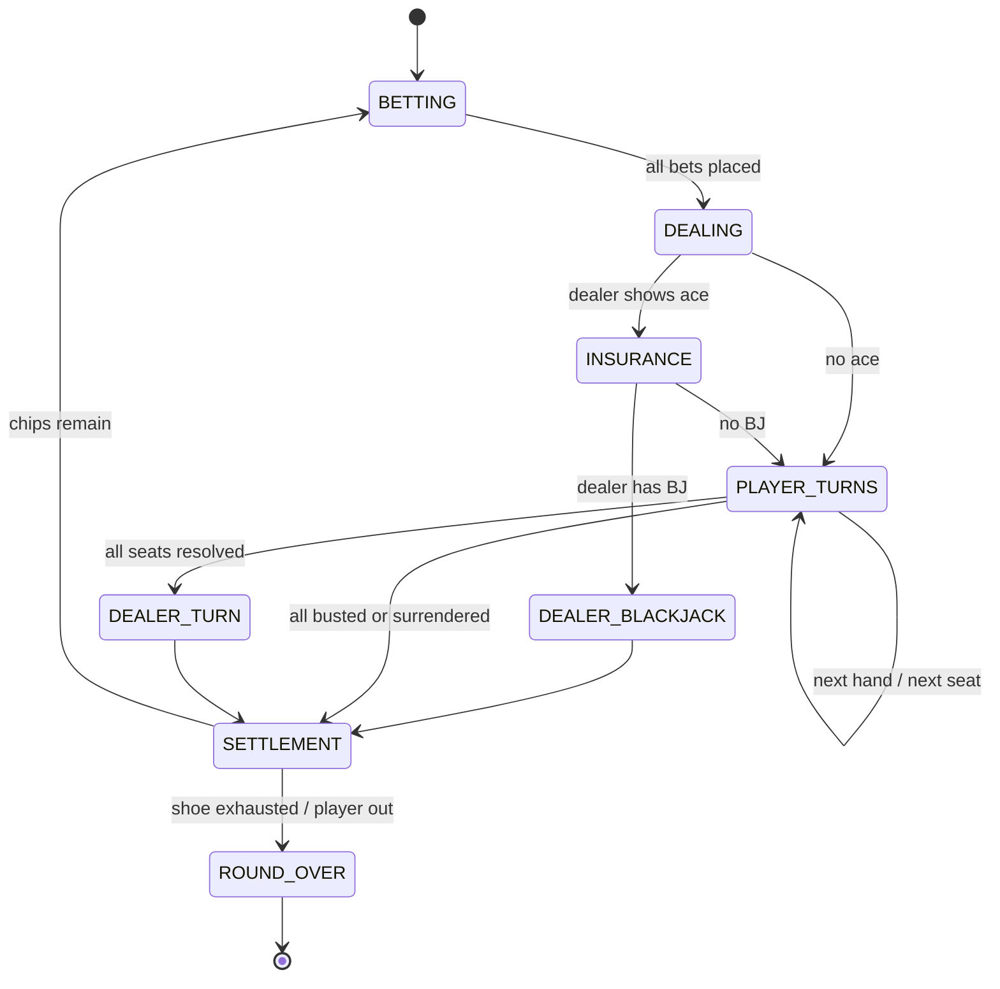

# Blackjack — Implementation Spec

> **Milestone:** M2 · **Players:** 1–5 vs dealer · **Duration:** 5–15 min · **Complexity:** Light
> **Implements:** [../05-game-engine-spec.md](../05-game-engine-spec.md)

Blackjack's job in this project is to introduce, at low rules risk, everything Shelem and Poker
will need: **shuffling a real deck, dealing, hidden state, a betting round, a bot-driven seat, and
the seed-commitment fairness protocol.**

**Virtual chips only.** No purchase, no cash-out, ever ([../01-business-prd.md](../01-business-prd.md) §3).

---

## 1. Rules (defaults)

| Rule | Default | Option |
|---|---|---|
| Decks in shoe | 6 | 1, 2, 4, 6, 8 |
| Shuffle point (penetration) | 75% | 50–90% |
| Dealer on soft 17 | **Stands** (S17) | H17 |
| Blackjack pays | 3:2 | 6:5 |
| Double | Any two cards | 9–11 only |
| Double after split | Allowed | — |
| Split | Up to 3 hands | 1, 2, 3 |
| Re-split aces | Not allowed | Allowed |
| Split aces | One card each, no BJ | — |
| Insurance | Offered on dealer ace, pays 2:1 | Off |
| Surrender | Late surrender allowed | Off |
| Dealer peek | Peeks for blackjack on A or 10 | Off (ENHC) |

Hand values: 2–9 face value · 10/J/Q/K = 10 · A = 11 or 1 (whichever is better).
A hand is **soft** if an ace is counted as 11.

---

## 2. Phase Machine



---

## 3. State

```ts
interface BlackjackState {
  phase: 'BETTING' | 'DEALING' | 'INSURANCE' | 'DEALER_BLACKJACK'
       | 'PLAYER_TURNS' | 'DEALER_TURN' | 'SETTLEMENT' | 'ROUND_OVER'
  options: BlackjackOptions

  /** ★ SERVER ONLY. Never projected — see §5. */
  shoe: Card[]
  shoeInitialSize: number
  cardsDealt: number
  needsShuffle: boolean

  dealer: {
    /** [upcard, holeCard]. holeCard is projected only when revealed. */
    cards: Card[]
    holeRevealed: boolean
    total: number | null            // computed only when revealed
    busted: boolean
    blackjack: boolean
  }

  seats: Record<SeatId, {
    chips: number
    /** Split creates additional hands. Index 0 is the original. */
    hands: {
      cards: Card[]
      bet: number
      doubled: boolean
      surrendered: boolean
      stood: boolean
      busted: boolean
      blackjack: boolean
      fromSplit: boolean
      splitAces: boolean
      settled: number | null        // net chip delta, set at SETTLEMENT
    }[]
    insuranceBet: number
    activeHand: number | null       // which hand is acting
    lastAction: string | null
  }>

  toAct: SeatId | null
  roundNumber: number
  seedCommit: string                // published pre-deal
}
```

**I5 note:** `shoe` is a `Card[]` of 2-char strings; no `Set`/`Map`/`Date` anywhere.

---

## 4. Moves

```ts
type BlackjackMove =
  | { type: 'BET'; amount: number }
  | { type: 'HIT' }
  | { type: 'STAND' }
  | { type: 'DOUBLE' }
  | { type: 'SPLIT' }
  | { type: 'SURRENDER' }
  | { type: 'INSURANCE'; take: boolean }
```

### Legality

| Move | Legal when |
|---|---|
| `BET` | `phase = BETTING`, no bet yet, `min ≤ amount ≤ min(max, chips)` |
| `HIT` | `phase = PLAYER_TURNS`, my active hand, not stood/busted/doubled/surrendered, not `splitAces` |
| `STAND` | `phase = PLAYER_TURNS`, my active hand |
| `DOUBLE` | `phase = PLAYER_TURNS`, hand has exactly 2 cards, `chips ≥ bet`, allowed by `doubleRule`, `doubleAfterSplit` if `fromSplit` |
| `SPLIT` | 2 cards of equal **rank value**, `hands.length < maxSplits + 1`, `chips ≥ bet`, and if the pair is aces then `resplitAces` or not already from a split |
| `SURRENDER` | `phase = PLAYER_TURNS`, hand has exactly 2 cards, not `fromSplit`, `lateSurrender` on |
| `INSURANCE` | `phase = INSURANCE`, dealer upcard is an ace, no insurance yet, `chips ≥ bet/2` |

> **Split rank rule:** default is *equal rank value* — so `KH` + `TD` (both 10) may be split.
> Some houses require *identical rank*. Exposed as the `splitOn` option (`'value'` | `'rank'`).

### Resolution details worth getting right

- **Blackjack** = 2 cards totalling 21 on the **initial** deal only. A 21 after a split is **not**
  a blackjack and pays 1:1.
- **Dealer peek:** with peek on, if the dealer has blackjack the round settles immediately —
  players lose only their original bet (not doubles/splits, which never happened).
- **Split aces:** one card each, then automatically stood. No hit, no double.
- **Bust** is immediate: the hand is settled as a loss even if the dealer later busts.
- **Push** on equal totals returns the bet.

### Payouts

| Outcome | Return |
|---|---|
| Blackjack | bet × (1 + 3/2) |
| Win | bet × 2 |
| Push | bet × 1 |
| Loss / bust | 0 |
| Surrender | bet × 0.5 (**rounded down** — chips are `Int`) |
| Insurance win | insurance × 3 |
| Insurance loss | 0 |

> Chips are integers ([../03-data-model.md](../03-data-model.md) §1). Blackjack at 3:2 on an odd
> bet, and surrender on an odd bet, both produce halves — **always round down, in the house's
> favour, deterministically.** A float here would produce chip-conservation test failures that are
> maddening to debug. The minimum bet is constrained to be even by default to make this rare.

---

## 5. Projection — the shoe is the trap

```ts
projectState(state, viewer) {
  const dealer = {
    upcard: state.dealer.cards[0] ?? null,
    // ★ hole card is ABSENT until revealed — not sent with a faceDown flag
    holeCard: state.dealer.holeRevealed ? state.dealer.cards[1] : undefined,
    cards: state.dealer.holeRevealed ? state.dealer.cards : state.dealer.cards.slice(0, 1),
    total: state.dealer.holeRevealed ? state.dealer.total : null,
    holeRevealed: state.dealer.holeRevealed,
    busted: state.dealer.busted,
    blackjack: state.dealer.holeRevealed ? state.dealer.blackjack : false,
  }

  const base = {
    phase: state.phase, options: state.options, dealer,
    // ★ shoe REPLACED by counts. The array is never sent.
    shoeRemaining: state.shoe.length,
    penetration: state.cardsDealt / state.shoeInitialSize,
    toAct: state.toAct, roundNumber: state.roundNumber, seedCommit: state.seedCommit,
    // all player hands are FACE UP in blackjack — public by the rules of the game
    seats: mapValues(state.seats, publicSeat),
  }
  return base    // identical for seats and spectators; only `you` differs
}
```

| Trap | Why tempting | Correct |
|---|---|---|
| **`shoe: Card[]`** in the projection | It's in the state; spreading is one line | `shoeRemaining: number`. Sending the shoe hands over **every future card** — strictly worse than leaking one hand |
| Hole card with `faceDown: true` | "The client just won't render it" | Omit the field. A flag is a request, not a boundary |
| `dealer.total` before reveal | Convenient for the UI | `null` until reveal — the total *is* the hole card |
| Card-counting via `penetration` | — | **Fine and intentional.** Penetration is visible at a real table; counting is legitimate skill, not cheating |

> Blackjack is the game where the deck leak is most tempting, because dealing genuinely needs the
> shoe. It is therefore the game where the leak test earns its keep.

---

## 6. Dealer Automation

The dealer is not a seat — it's driven entirely by `advance()`:

```ts
advance(state, rng) {
  switch (state.phase) {
    case 'DEALING':      return dealInitialCards(state, rng)     // 2 per seat, 2 to dealer
    case 'PLAYER_TURNS':
      if (allSeatsResolved(state)) return { ...toPhase('DEALER_TURN'), revealHole: true }
      return advanceToNextHand(state)
    case 'DEALER_TURN': {
      const t = handTotal(state.dealer.cards)
      const mustHit = t.value < 17 || (t.value === 17 && t.soft && state.options.dealerHitsSoft17)
      return mustHit ? dealToDealer(state, rng) : toPhase('SETTLEMENT')
    }
    case 'SETTLEMENT':   return settleAllHands(state)
    default:             return null
  }
}
```

`advance()` is called in a loop by `GameSessionService` until it returns `null`, so a single
player `STAND` cascades into hole-card reveal → dealer draws → settlement → next betting round,
each step producing its own `GameEvent` and its own broadcast. The client sees the dealer draw
card by card, which is what makes it feel like a table.

---

## 7. Shoe & Shuffle

```ts
function buildShoe(decks: number, rng: Rng): Card[] {
  const cards = Array.from({ length: decks }, buildStandardDeck).flat()
  return shuffle(cards, rng)          // CSPRNG Fisher-Yates
}
```

- Reshuffle when `cardsDealt / shoeInitialSize ≥ penetration`, at the **start of a round**, never
  mid-hand.
- Reshuffling **starts a new seed commitment**: a fresh `seed`, a fresh `sha256(seed + gameId + shoeNumber)`
  broadcast before the next deal. Otherwise a single commitment would cover cards dealt after the
  reveal of an earlier one.
- If the shoe runs dry mid-hand (only possible with pathological options), deal from a freshly
  shuffled shoe and log a `SYSTEM` event.

---

## 8. Bot — basic strategy

Blackjack has a mathematically optimal strategy, so the bot can be genuinely good with a lookup
table rather than a search.

```ts
const blackjackBot: BotStrategy<BlackjackState, BlackjackMove> = {
  difficulty: 'hard',
  chooseMove(state, seat, legal, rng) {
    const hand = activeHand(state, seat)
    if (state.phase === 'BETTING') return { type: 'BET', amount: flatBet(state, seat) }
    if (state.phase === 'INSURANCE') return { type: 'INSURANCE', take: false }  // always -EV
    const action = BASIC_STRATEGY[keyOf(hand, state.dealer.cards[0]!)]
    return firstLegal([action, 'HIT', 'STAND'], legal)   // fall back if the ideal isn't legal
  },
}
```

- `BASIC_STRATEGY` is a table keyed by `(hard/soft/pair total, dealer upcard)`, correct for the
  configured S17/H17 and DAS rules.
- The bot **never takes insurance** — it is always negative expectation without counting.
- `firstLegal` is important: basic strategy says "double" in spots where doubling may be illegal
  (three cards, after split with DAS off). Falling through to the next-best legal action keeps
  invariant I3 intact.
- Easy/medium tiers use a deliberately degraded table (mimic-the-dealer, never-bust) so a beginner
  isn't outclassed.

---

## 9. Options

```ts
const blackjackOptions = z.object({
  decks: z.union([z.literal(1), z.literal(2), z.literal(4), z.literal(6), z.literal(8)]).default(6),
  penetration: z.number().min(0.5).max(0.9).default(0.75),
  dealerHitsSoft17: z.boolean().default(false),
  blackjackPays: z.enum(['3:2', '6:5']).default('3:2'),
  doubleRule: z.enum(['any2', '9to11']).default('any2'),
  doubleAfterSplit: z.boolean().default(true),
  maxSplits: z.number().int().min(0).max(3).default(3),
  splitOn: z.enum(['value', 'rank']).default('value'),
  resplitAces: z.boolean().default(false),
  insurance: z.boolean().default(true),
  lateSurrender: z.boolean().default(true),
  dealerPeek: z.boolean().default(true),
  minBet: z.number().int().min(2).default(10),
  maxBet: z.number().int().default(500),
  startingChips: z.number().int().default(1000),
  betTimeoutSec: z.number().int().min(10).max(120).default(30),
  actionTimeoutSec: z.number().int().min(10).max(120).default(30),
})
```

---

## 10. Timers & Disconnects

Canonical mechanism: [../04-realtime-protocol.md](../04-realtime-protocol.md) §6.

| Setting | Value |
|---|---|
| Turn limit — betting | **30 s** |
| Turn limit — player action | **30 s** |
| Warning before ejection | 10 s |
| Strikes before ejection | **2**, reset by any action |
| Disconnect grace | 45 s |
| Reclaim window | 120 s, at the **next round boundary** (avoids a jarring mid-hand handover) |

**Default action on a non-final strike:**

| Phase | Action | Never |
|---|---|---|
| `BETTING` | Seat sits out the round (no bet placed) | **Never auto-bet** — spending someone's chips without consent is worse than skipping them |
| `PLAYER_TURNS` | **Stand** | Never hit — it could bust a 20 |
| `INSURANCE` | Decline | — |

**On ejection:** bot takes the seat if `supportsBots`, else the seat sits out subsequent rounds;
**reward is zero** ([../10-economy-and-rewards.md](../10-economy-and-rewards.md) §5); escalating
matchmaking cooldown. Returning within the window resumes at a round boundary for 0.5× reward.

> **Chips are not coins.** Blackjack chips are issued at match start and destroyed at the end; the
> coin reward comes from final **placement**, never from the chip count
> ([../10-economy-and-rewards.md](../10-economy-and-rewards.md) E5).

---

## 11. Result

```ts
result(state) {
  const seats = Object.entries(state.seats)
    .map(([s, v]) => ({ seat: +s, chips: v.chips, net: v.chips - state.options.startingChips }))
  return {
    standings: sortBy(seats, (s) => -s.net).map((s, i) => ({ seat: s.seat, rank: i + 1, score: s.net })),
    reason: 'NORMAL',
    summary: { rounds: state.roundNumber, perSeat: seats,
               shoes: Math.ceil(state.cardsDealt / state.shoeInitialSize) },
  }
}
```

Blackjack is **not rated** (no ELO) — it's a player-vs-house game, so a rating against other
players would be meaningless. `PlayerStats` tracks rounds played, net chips, blackjacks hit, and
basic-strategy deviation if you ever want it.

---

## 12. UI Notes

- Dealer at the top, seats arced along the bottom; each seat shows chips, bet, and hand total.
- Hole card is a `<CardBack />` with **no** `card` prop — the component literally has no face data
  ([../06-frontend-architecture.md](../06-frontend-architecture.md) §5.2).
- Deal animation: card flies from a shoe graphic to the seat, ~180 ms stagger. `--anim-card-deal`
  respects the animation-speed preference and `prefers-reduced-motion`.
- Action buttons show only server-supplied `legalMoves` — a disabled Double is disabled because
  the server didn't offer it, not because the client evaluated the rules.
- Chip stacks visualize denominations; the bet slider snaps to chip values.
- Shoe indicator shows `shoeRemaining` and a penetration bar.
- "✓ Deal verified" badge after each shoe's reveal, with commit/seed details on tap.
- RTL: the seat arc and panels mirror; card faces and pip layout do not.

---

## 13. Test Cases

| # | Case | Expect |
|---|---|---|
| 1 | `A` + `K` initial | Blackjack, pays 3:2 |
| 2 | `A` + `K` after split | 21, **not** blackjack, pays 1:1 |
| 3 | Soft 17 (`A6`), S17 | Dealer stands |
| 4 | Soft 17 (`A6`), H17 | Dealer hits |
| 5 | `A` + `A` + `9` | Total 21 (one ace demoted) |
| 6 | `A` + `A` + `A` + `8` | Total 21 |
| 7 | Split aces | One card each, auto-stand, `HIT` illegal |
| 8 | Split to 4 hands with `maxSplits = 3` | Legal; 5th split illegal |
| 9 | `KH` + `TD`, `splitOn: 'value'` | Split legal |
| 10 | `KH` + `TD`, `splitOn: 'rank'` | Split illegal |
| 11 | Double with 3 cards | `IllegalMoveError` |
| 12 | Double after split, DAS off | `IllegalMoveError` |
| 13 | Insurance, dealer has BJ | Insurance pays 2:1; main bet loses |
| 14 | Insurance, dealer no BJ | Insurance lost; hand continues |
| 15 | Late surrender | Half bet returned, **rounded down** |
| 16 | Player busts, dealer busts | Player still loses (bust is immediate) |
| 17 | Push | Bet returned exactly |
| 18 | Dealer peek finds BJ | Only original bets lost; no splits/doubles occurred |
| 19 | **Chip conservation** | Σ(chips) + Σ(bets) constant across 10 000 random rounds |
| 20 | **Leak: `shoe` in any projection** | Absent — only `shoeRemaining` |
| 21 | **Leak: hole card before reveal** | Field absent from every seat and spectator projection |
| 22 | **Leak: `dealer.total` before reveal** | `null` |
| 23 | Shoe reshuffle at penetration | New shoe, **new seed commitment** |
| 24 | Seed verification | `sha256(seed + gameId + shoeNumber)` matches the broadcast commit |
| 25 | Same `(seed, moves)` twice | Byte-identical state (I1) |
| 26 | JSON round-trip | Deep-equal (I5) |
| 27 | Bot over 1000 seeded rounds | Never chooses an illegal move |
| 28 | Bot never takes insurance | Verified |
| 29 | Action timeout | Auto-stand, never auto-hit |
| 30 | Bet timeout | Seat sits out; chips untouched |

---

## 14. Open Questions

> **Q1:** Should a player who busts out (chips = 0) be able to re-buy? Default assumption: **yes,
> unlimited re-buy to `startingChips`** — these are play chips among friends and a friend sitting
> out for an hour isn't fun. Worth confirming.
>
> **Q2:** Multiple hands per seat (playing two boxes)? Default assumption: **no** — it complicates
> the seat model for little gain in a social game.

---

**Related:** [../05-game-engine-spec.md](../05-game-engine-spec.md) · [../07-security-and-anticheat.md](../07-security-and-anticheat.md) §4 · [poker-holdem.md](./poker-holdem.md) (shares the betting core) · [../08-roadmap.md](../08-roadmap.md) M2
