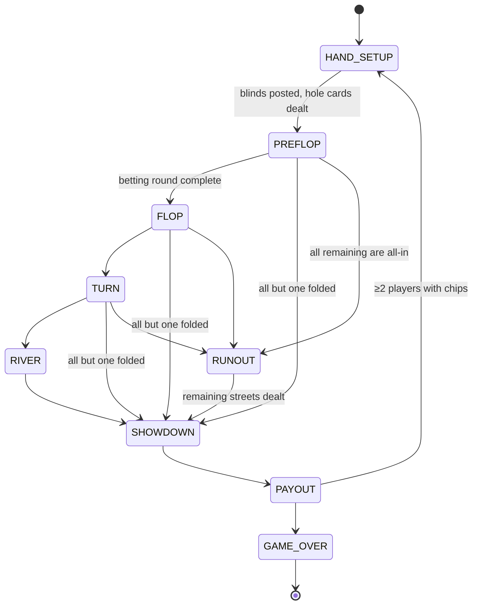

# Poker — No-Limit Texas Hold'em — Implementation Spec

> **Milestone:** M5 · **Players:** 2–6 · **Duration:** 20–60 min · **Complexity:** Heavy
> **Implements:** [../05-game-engine-spec.md](../05-game-engine-spec.md)

**Virtual chips only.** No purchase, no cash-out, no real money, ever — this is a hard product
boundary ([../01-business-prd.md](../01-business-prd.md) §3), and it keeps the app entirely outside
gambling regulation.

Poker contains the hardest logic in the project: **side-pot construction with multiple all-ins at
different stack depths.** That algorithm is specified and unit-tested *before* any UI work begins.

---

## 1. Rules

No-Limit Texas Hold'em, cash-game style (fixed blinds, re-buy allowed between hands).

| Rule | Default |
|---|---|
| Hole cards | 2 per player |
| Board | 5 community cards: flop (3), turn (1), river (1) |
| Blinds | Small 5 / Big 10 |
| Starting stack | 1000 (100 BB) |
| Betting | No-limit; min-raise = size of the previous bet or raise |
| Min bet | Big blind |
| Burn cards | Not used (no physical shuffle to protect) |
| Rake | **None** |
| Ante | None |
| Straddle | Not supported |
| Run it twice | Not supported |

### Hand rankings (best first)

1. Straight flush 2. Four of a kind 3. Full house 4. Flush 5. Straight
6. Three of a kind 7. Two pair 8. One pair 9. High card

Aces are high, and low only in the `A-2-3-4-5` "wheel" straight. Kickers break ties within a
category. Suits **never** break ties — equal hands split the pot.

---

## 2. Phase Machine



`RUNOUT` exists as a distinct phase because when everyone is all-in there is no more betting: the
remaining streets are dealt without action, and the UI wants to show them dramatically one at a
time rather than jumping to the result.

---

## 3. State

```ts
interface PokerState {
  phase: 'HAND_SETUP' | 'PREFLOP' | 'FLOP' | 'TURN' | 'RIVER'
       | 'RUNOUT' | 'SHOWDOWN' | 'PAYOUT' | 'GAME_OVER'
  options: PokerOptions

  /** ★ SERVER ONLY — projected as a count. */
  deck: Card[]
  /** Community cards. Only the cards for streets already dealt exist here. */
  board: Card[]

  buttonSeat: SeatId
  handNumber: number

  seats: Record<SeatId, {
    /** ★ SERVER ONLY — projected only to the owning seat, or at showdown. */
    holeCards: Card[]
    stack: number
    /** Chips committed on the CURRENT street. */
    streetBet: number
    /** Chips committed across the whole hand. Drives side pots. */
    handCommitted: number
    status: 'ACTIVE' | 'FOLDED' | 'ALL_IN' | 'SITTING_OUT' | 'BUSTED'
    hasActedThisStreet: boolean
    lastAction: PokerAction | null
    /** Set at showdown for players whose cards are shown. */
    revealedHand: { cards: Card[]; rank: HandRank } | null
  }>

  /** Chips already collected from previous streets. */
  pot: number
  /** Built at PAYOUT; see §5. */
  sidePots: { amount: number; eligibleSeats: SeatId[] }[]

  toAct: SeatId | null
  /** Largest total street bet a player must match. */
  currentBet: number
  /** Minimum legal raise INCREMENT for the current street. */
  minRaise: number
  lastAggressor: SeatId | null
  /** Seat the street's action closes on. */
  actionClosesAt: SeatId | null

  seedCommit: string
  lastHandSummary: HandSummary | null
}
```

**I5 note:** `deck`, `board`, `holeCards` are `Card[]` (2-char strings). `sidePots[].eligibleSeats`
is an array, not a `Set`.

---

## 4. Moves

```ts
type PokerMove =
  | { type: 'FOLD' }
  | { type: 'CHECK' }
  | { type: 'CALL' }
  | { type: 'BET';   amount: number }    // total street bet, when currentBet === 0
  | { type: 'RAISE'; amount: number }    // TOTAL street bet, not the increment
  | { type: 'ALL_IN' }
  | { type: 'SIT_OUT' } | { type: 'SIT_IN' }
  | { type: 'REBUY'; amount: number }    // between hands only
```

> **`RAISE.amount` is the total street bet**, not the increment. This is the convention that
> matches how poker UIs display bets ("raise to 60"), and it removes an entire class of
> off-by-one-blind bug. It is stated here because the opposite convention is equally common and
> mixing them silently is disastrous.

### Legality

| Move | Legal when |
|---|---|
| `FOLD` | My turn, `status = ACTIVE` |
| `CHECK` | My turn, `streetBet === currentBet` |
| `CALL` | My turn, `streetBet < currentBet`, `stack > 0`. Caps at the stack (a short call is an all-in) |
| `BET` | My turn, `currentBet === 0`, `minBet ≤ amount ≤ streetBet + stack` |
| `RAISE` | My turn, `currentBet > 0`, `amount ≥ currentBet + minRaise`, `amount ≤ streetBet + stack`. **Exception:** `amount === streetBet + stack` (all-in) is always legal even below the min-raise |
| `ALL_IN` | My turn, `stack > 0` |
| `SIT_OUT` / `SIT_IN` | Between hands |
| `REBUY` | Between hands, `stack < startingStack`, `amount` brings the stack to at most `startingStack` |

### Street completion

A betting round ends when **either**:
- all `ACTIVE` players have `hasActedThisStreet` **and** all `streetBet` values are equal, **or**
- only one non-folded player remains, **or**
- all remaining players are `ALL_IN`.

**The short all-in does not reopen betting.** If a player all-ins for *less* than a full raise,
players who already acted are not given a fresh right to raise. This is a genuine rule that is
easy to get wrong, and it has a dedicated test.

### Blinds & button

| Players | Button | Small blind | Big blind | First to act preflop |
|---|---|---|---|---|
| 3+ | dealer | button + 1 | button + 2 | button + 3 (UTG) |
| **2 (heads-up)** | dealer **is** the small blind | button | other player | **button (SB)** preflop; **BB** on all later streets |

The heads-up exception is the second-most-common poker implementation bug after side pots.
Dedicated tests.

---

## 5. Side Pots — the hard part

### The algorithm

```ts
function buildSidePots(seats: Record<SeatId, SeatState>): SidePot[] {
  // Every seat that put chips in, folded or not — folded chips still fund the pots.
  const contributors = entries(seats).filter(([, s]) => s.handCommitted > 0)

  // Distinct commitment levels, ascending.
  const levels = uniq(contributors.map(([, s]) => s.handCommitted)).sort((a, b) => a - b)

  const pots: SidePot[] = []
  let previous = 0

  for (const level of levels) {
    const layer = level - previous
    // Everyone who reached this level contributes `layer` to this pot.
    const amount = contributors
      .filter(([, s]) => s.handCommitted >= level)
      .length * layer
    // ...but only NON-FOLDED players can win it.
    const eligible = contributors
      .filter(([, s]) => s.handCommitted >= level && s.status !== 'FOLDED')
      .map(([seat]) => +seat)

    if (amount > 0 && eligible.length > 0) pots.push({ amount, eligibleSeats: eligible })
    else if (amount > 0) pots[pots.length - 1]!.amount += amount   // no eligible → merge down
    previous = level
  }
  return pots
}
```

### The two rules that make it correct

1. **Folded players' chips fund pots they cannot win.** A player who bets 100 and folds has
   contributed 100 to the layered pots; they are excluded from `eligibleSeats` but their chips are
   in `amount`. Omitting them makes chips vanish and breaks conservation.
2. **A layer with no eligible winner merges into the previous pot.** Rare (everyone at that level
   folded) but it must not silently drop chips.

### Worked example

| Seat | Committed | Status |
|---|---|---|
| 0 | 100 | ALL_IN |
| 1 | 300 | ALL_IN |
| 2 | 500 | ACTIVE |
| 3 | 500 | ACTIVE |
| 4 | 50 | FOLDED |

Levels: 50, 100, 300, 500.

| Pot | Layer | Contributors at level | Amount | Eligible |
|---|---|---|---|---|
| 1 | 50 − 0 = 50 | 5 (all) | 250 | 0, 1, 2, 3 (**not 4** — folded) |
| 2 | 100 − 50 = 50 | 4 (0,1,2,3) | 200 | 0, 1, 2, 3 |
| 3 | 300 − 100 = 200 | 3 (1,2,3) | 600 | 1, 2, 3 |
| 4 | 500 − 300 = 200 | 2 (2,3) | 400 | 2, 3 |

Total = 250 + 200 + 600 + 400 = **1450** = 100 + 300 + 500 + 500 + 50 ✓

### Payout

Award pots **from the last (highest) to the first**, so the "main pot last" convention is visible
in the UI. For each pot: rank the eligible seats' 7-card hands, split evenly among the best, and
award odd chips **starting from the first seat clockwise of the button** (the standard rule) so
distribution is deterministic and never fractional.

```ts
function awardPot(pot: SidePot, ranks: Record<SeatId, HandRank>, button: SeatId) {
  const best = maxRank(pot.eligibleSeats.map((s) => ranks[s]!))
  const winners = pot.eligibleSeats.filter((s) => rankEquals(ranks[s]!, best))
  const share = Math.floor(pot.amount / winners.length)
  const odd = pot.amount - share * winners.length          // 0..winners-1 chips
  const ordered = clockwiseFrom(button + 1, winners)
  return ordered.map((s, i) => ({ seat: s, amount: share + (i < odd ? 1 : 0) }))
}
```

> **Chip conservation is a property test, not a hope:** `Σ stacks + Σ pots` must be invariant
> across 10 000 randomly generated hands. Any float, any rounding shortcut, any dropped layer
> shows up immediately.

---

## 6. Hand Evaluator

7-card best-5 evaluation. Called at showdown and by the bot.

```ts
interface HandRank {
  category: 1..9                  // 9 = straight flush
  /** Tiebreak ranks, most significant first. e.g. two pair → [highPair, lowPair, kicker] */
  tiebreak: number[]
  bestFive: Card[]                // for UI highlighting
}
```

Approach: **generate all 21 five-card combinations and score each**, then take the max. This is
~2 µs in JS — vastly fast enough for a friendly game, and it is *obviously correct*, which matters
more here than a bitmask lookup table that is fast and subtly wrong.

Edge cases with dedicated tests:

| Case | Correct |
|---|---|
| `A-2-3-4-5` | Straight, **five-high** (the wheel). Ace plays low |
| `A-K-Q-J-T` | Straight, ace-high (broadway) |
| Wheel **flush** | Straight flush, five-high |
| Flush vs flush | Compare all five ranks in order |
| Two pair vs two pair | High pair, then low pair, then kicker |
| Full house vs full house | Trips rank first, then pair rank |
| Quads vs quads (board quads) | Kicker decides |
| Trips on board, both play kickers | Both kickers compared |
| Identical hands, different suits | **Split.** Suits never break ties |
| Best five uses only board cards | Legal — the whole table splits |

Validation: cross-check against a reference implementation across **≥ 100 000 random 7-card
hands** (a roadmap exit criterion).

---

## 7. Projection

```ts
projectState(state, viewer) {
  const showdown = state.phase === 'SHOWDOWN' || state.phase === 'PAYOUT'

  const publicSeat = (s: SeatState, seat: SeatId) => ({
    seat, stack: s.stack, streetBet: s.streetBet, handCommitted: s.handCommitted,
    status: s.status, lastAction: s.lastAction,
    // ★ hole cards: only at showdown, only for players who actually show
    holeCards: showdown && s.revealedHand ? s.revealedHand.cards : undefined,
    holeCardCount: s.holeCards.length,      // 0 or 2 — needed to render card backs
    revealedHand: showdown ? s.revealedHand : null,
  })

  const base = {
    phase: state.phase, options: state.options,
    board: state.board,                     // only dealt streets exist in state
    pot: state.pot,
    sidePots: state.sidePots.map((p) => ({ amount: p.amount, eligibleSeats: p.eligibleSeats })),
    buttonSeat: state.buttonSeat, handNumber: state.handNumber,
    currentBet: state.currentBet, minRaise: state.minRaise, toAct: state.toAct,
    // ★ deck REPLACED by a count
    deckRemaining: state.deck.length,
    seedCommit: state.seedCommit,
    lastHandSummary: state.lastHandSummary,
    seats: mapEntries(state.seats, publicSeat),
  }

  if (viewer.kind === 'seat') {
    return { ...base, you: { seat: viewer.seat, holeCards: state.seats[viewer.seat]?.holeCards ?? [] } }
  }
  if (viewer.kind === 'spectator') return base    // no hole cards at all until showdown
  return state
}
```

### Leak checklist

| Item | Rule |
|---|---|
| Own hole cards | Only to the owning seat |
| Others' hole cards | **Never** until showdown, and then only for players who show |
| **Folded players' cards** | **Never revealed.** Mucked is mucked — revealing them would leak strategic information into future hands |
| `deck` | **Never.** `deckRemaining` only. Leaking the deck reveals the entire runout |
| Undealt board cards | Not in `state.board` at all until their street is dealt — so they cannot leak |
| Spectator view | No hole cards before showdown. Spectators must not become an information channel to a seated player |
| Stacks, bets, pots, board, actions | Fully public |

> **The spectator channel is the poker-specific risk.** If spectators saw hole cards, any player
> could open a second browser as a spectator and see the whole table. Hence spectators get strictly
> less information than any seat, and there is a dedicated test for it.

---

## 8. Options

```ts
const pokerOptions = z.object({
  smallBlind: z.number().int().min(1).default(5),
  bigBlind: z.number().int().min(2).default(10),
  startingStack: z.number().int().min(20).default(1000),
  maxSeats: z.number().int().min(2).max(6).default(6),
  allowRebuy: z.boolean().default(true),
  actionTimeoutSec: z.number().int().min(10).max(120).default(30),
  /** Extra one-shot time a player can spend on a hard decision. */
  timeBankSec: z.number().int().min(0).max(120).default(30),
  showdownRevealMuck: z.boolean().default(false),   // must losers show? default no
  runoutDelayMs: z.number().int().min(0).max(5000).default(1200),
  graceSec: z.number().int().min(15).max(120).default(45),
})
```

Blind escalation (tournament mode) is deliberately out of scope — cash-game structure only.

---

## 9. Timers & Disconnects

Canonical mechanism: [../04-realtime-protocol.md](../04-realtime-protocol.md) §6.

| Setting | Value |
|---|---|
| Turn limit | **30 s** |
| Time bank | 30 s one-shot per hand, consumed automatically **before** the strike fires |
| Warning before ejection | 10 s |
| Strikes before ejection | **2**, reset by any action |
| Disconnect grace | 45 s |
| Reclaim window | 120 s, at the **next hand boundary** — joining mid-hand with a bot's committed chips is unfair in both directions |

**Default action on a non-final strike:** **fold**, or check if checking is free.

> **Never auto-call.** Auto-calling spends a player's chips without consent and would bleed a
> disconnected friend's stack to nothing. Folding costs them only the current hand. This is the
> single most important line in this section.

**On ejection:** bot takes the seat (or the seat sits out from the next hand); **reward is zero**
([../10-economy-and-rewards.md](../10-economy-and-rewards.md) §5); escalating matchmaking cooldown;
counted as a loss. Returning within the window resumes at a hand boundary for 0.5× reward.

**Sitting out** (voluntary, between hands) is different from ejection: blinds are not posted, the
player is skipped, no penalty, no cooldown — but also **no reward**, since they didn't play.

---

## 10. Bot

**Tier 1 — legal & tight (M5)**
- Preflop: play a fixed range by position (premium pairs and big aces from anywhere, wider on the
  button). Fold everything else.
- Postflop: bet ~60% pot with two pair or better; check/call one bet with a made pair; fold to
  aggression otherwise.
- Never bluffs. Predictable, but a legal opponent that lets a 4-handed game start with 2 humans.

**Tier 2 — heuristic (M8, only if needed)**
- Monte-Carlo equity vs a random opponent range (2 000 samples — cheap enough server-side).
- Pot-odds-based calling, position awareness, occasional seeded bluffing.

The bot receives its **seat projection**, not the raw state (§7) — so a bot cannot see hole cards
it shouldn't, even by accident. This is enforced by the `BotStrategy` signature.

---

## 11. UI Notes

- Oval table, seats around the rim, community cards centered, pot chips between board and seats.
- Hole cards: yours face-up and enlarged; others as `<CardBack />` with **no** `card` prop.
- Action bar: Fold / Check-Call / Bet-Raise with a slider plus quick buttons (½ pot, ¾, pot,
  all-in). Slider bounds come from server `legalMoves` — the client never computes the min-raise.
- **Side pots displayed as separate stacks** with eligibility on hover. When a hand has three side
  pots, showing one number is confusing and looks like a bug.
- All-in: distinct visual treatment; runout deals streets with `runoutDelayMs` between them.
- Showdown: winning five cards highlighted within the seven; hand name shown from an i18n key.
- Timer ring on the acting seat; time bank shown as a separate segment.
- Chip counts respect the Persian numeral preference.
- RTL: seat ring, action bar, and panels mirror. Card faces and board order do not.
- **Nowhere in the UI is there any reference to money, purchase, or value.** Chips are points.

### 11.1 Chips are not coins

**Poker's most important non-rule.** The chips in `PokerState.seats[].stack` are issued at match
start, destroyed at match end, and have **no relationship to the player's wallet**:

| | Table chips | Wallet coins |
|---|---|---|
| Bought with coins | **Never** | — |
| Converted to coins | **Never** | — |
| Survive the match | No | Yes |
| Reward basis | — | **Final placement**, exactly as in Shelem or Chess |

A player who wins 4 000 chips receives the **1st-place coin reward** (~90 coins), not 4 000 coins.

Why this appears in a rules document: if wallet coins could buy chips and chips could be cashed
back, poker becomes **real-stakes gambling with a currency** — a completely different, regulated
product ([../10-economy-and-rewards.md](../10-economy-and-rewards.md) E5, §7). The boundary is
enforced by a lint rule (`domain/games/**` cannot import wallet code) and a test, not by
intention — precisely because the realistic threat here is a future well-meaning commit, not an
attacker ([../07-security-and-anticheat.md](../07-security-and-anticheat.md) §11.6).

---

## 12. Test Cases

| # | Case | Expect |
|---|---|---|
| 1 | Hand evaluator vs reference, 100k random 7-card hands | 100% agreement |
| 2 | `A-2-3-4-5` | Five-high straight |
| 3 | Wheel flush | Five-high straight flush |
| 4 | Identical hands, different suits | Split, no suit tiebreak |
| 5 | Board quads + kickers | Kicker decides |
| 6 | Best five entirely on board | All remaining players split |
| 7 | Heads-up blinds | Button = SB, acts first preflop, **last** postflop |
| 8 | 3+ players | UTG = button + 3 |
| 9 | Min-raise | `≥ currentBet + minRaise` enforced |
| 10 | All-in below min-raise | **Legal** |
| 11 | Short all-in | Does **not** reopen betting for players who already acted |
| 12 | Check when `streetBet < currentBet` | `IllegalMoveError` |
| 13 | Raise above stack | `IllegalMoveError` |
| 14 | Call with insufficient chips | Becomes an all-in for the stack |
| 15 | **Side pots: §5 worked example** | Exactly the four pots in the table |
| 16 | Side pots: folded contributor | Chips included, seat excluded from eligibility |
| 17 | Side pots: layer with no eligible winner | Merged into the previous pot, no chips lost |
| 18 | Three simultaneous all-ins at distinct depths | Correct three-way pot split |
| 19 | Odd chip in a split pot | Awarded clockwise from the button, deterministically |
| 20 | **Chip conservation over 10 000 random hands** | `Σ stacks + Σ pots` invariant |
| 21 | All fold to the big blind | BB wins uncontested; no showdown; cards not revealed |
| 22 | All remaining all-in preflop | `RUNOUT` deals flop, turn, river; then showdown |
| 23 | **Leak: another seat's hole cards pre-showdown** | Absent |
| 24 | **Leak: folded player's cards at showdown** | Absent |
| 25 | **Leak: `deck` in any projection** | Absent — `deckRemaining` only |
| 26 | **Leak: spectator sees hole cards pre-showdown** | Absent |
| 27 | Same `(seed, moves)` twice | Byte-identical (I1) |
| 28 | JSON round-trip | Deep-equal (I5) |
| 29 | Frozen input | No mutation (I2) |
| 30 | Bot over 1000 seeded hands | Never illegal; never exceeds its stack |
| 31 | Action timeout | Auto-fold (or auto-check if free) — **never** auto-call |
| 32 | Disconnect mid-hand | Grace, then bot or sit-out; stack intact |
| 33 | Seed verification | `sha256(seed + gameId + handNumber)` matches the pre-deal commit |
| 34 | Re-buy | Only between hands; capped at `startingStack` |

---

## 13. Open Questions

> **Q1:** Should losing players be forced to show at showdown? Default assumption: **no** — the
> winner shows, others may muck (`showdownRevealMuck: false`). Showing all hands is friendlier for
> a social game though; easy to flip.
>
> **Q2:** Should a player be able to see their own mucked cards afterwards in the hand history?
> Default assumption: **yes** — their own cards, their own history. Never anyone else's.

---

**Related:** [../05-game-engine-spec.md](../05-game-engine-spec.md) (betting core) · [blackjack.md](./blackjack.md) (shares `shared/betting.ts`) · [../07-security-and-anticheat.md](../07-security-and-anticheat.md) · [../08-roadmap.md](../08-roadmap.md) M5
