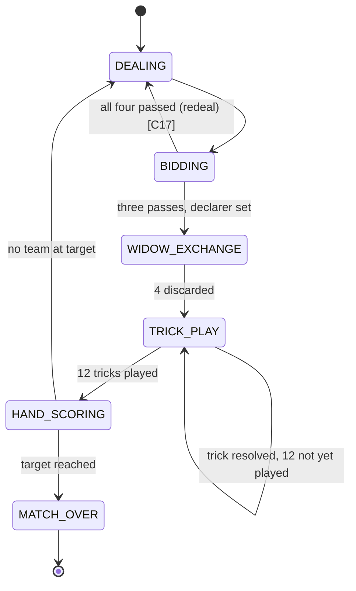

# Shelem (شلم) — Implementation Spec

> **Milestone:** M4 ⭐ · **Players:** 4 (2 partnerships) · **Duration:** 30–45 min · **Complexity:** Heavy
> **Implements:** [../05-game-engine-spec.md](../05-game-engine-spec.md)
> **Primary source:** [Wikipedia — Shelem](https://en.wikipedia.org/wiki/Shelem)

Shelem is the flagship game — the reason this project exists. The rules below now follow a
sourced reference rather than my reconstruction; **§0 records what changed and what is still
open.**

---

## 0. Rules Status

### 0.1 ✅ Now confirmed from the source

| # | Parameter | Confirmed value |
|---|---|---|
| C1 | **Card point values** | **A = 10 · Q = 10 · 10 = 5 · K, J, 9–2 = 0** — plus **5 points per trick** |
| C2 | **Total points per hand** | **165** (100 in card points + 65 in trick points) |
| C3 | **Minimum bid** | **100** |
| C4 | **Bid increment** | Multiples of **5** |
| C5 | Widow size | **4** cards |
| C6 | Tricks per hand | **12** played (dealt 12 each in batches of 4) |
| C7 | **Contract made** | Declaring team scores **the points they actually collected** — *not* the bid |
| C8 | **Contract set** | Declaring team **loses the bid**, **doubled** if they collected less than their opponents |
| C9 | Defenders' score | **Always** the points they collected, whether the contract is made or set |
| C10 | **Shelem (slam)** | Winning **all** tricks scores **330** |
| C14 | Rank order | A K Q J 10 9 8 7 6 5 4 3 2 (high to low) |
| C16 | Bidding order | Starts with **eldest hand** (left of dealer); a pass is final for the round |

### 0.2 ⚠️ Corrections to earlier drafts

Four defaults in the previous version of this document were **wrong**. They are corrected
throughout, but called out here because they change code:

| Was | Now | Impact |
|---|---|---|
| Points: 5 = 5, 10 = 10, A = 10; total **100** | **A = 10, Q = 10, 10 = 5, + 5/trick; total 165** | `cardPoints()` rewritten. **Fives are worth nothing; queens are worth 10.** Trick-count now feeds scoring |
| Minimum bid **55** | **100** | Bid validation, bidding UI stepper bounds |
| Contract made ⇒ score **the bid** | Score **points collected** | Scoring function rewritten. Overtricks now matter, so bidding conservatively is punished less |
| Declarer **announces** trump in its own phase | **Trump is the suit of the declarer's opening lead** | `TRUMP_SELECTION` phase and the `SELECT_TRUMP` move are **deleted** — see §3 |

### 0.3 🔍 One inference worth checking

The source states card values (A/Q = 10, 10 = 5 → **100**), "5 points for every trick", and a
total of **165**. Twelve tricks at 5 gives 60, which totals 160 — five short. It also states the
declarer's 4 discards *"become the declarer's team's first trick (including any points)"*.

**Reading: the discard pile is a 13th scoring trick.** 13 × 5 = 65, and 100 + 65 = **165** exactly.

> **This has a real strategic consequence:** the declarer can **bank point cards** by discarding
> aces, queens, and tens into the pile, where they are safe for their team. That is a strong
> move — which is precisely why some house rules forbid discarding point cards (C15). Exposed as
> the `allowPointCardsInDiscard` option, default **true** per the source.
>
> **Alternative reading:** 12 tricks × 5 = 60 plus a **5-point last-trick bonus** also sums to
> 165. Both are consistent with the arithmetic. I've implemented the discard-as-trick reading
> because the source says so explicitly, and left `lastTrickBonus` as an option (default 0). If
> your group plays a last-trick bonus instead, set `discardCountsAsTrick: false` and
> `lastTrickBonus: 5`.

### 0.4 ❓ Still open — the source doesn't say

| # | Parameter | My default | Note |
|---|---|---|---|
| C11 | Higher declaration above Shelem ("Sar") | **Off** (`sarShelemEnabled: false`) | Not in the source. Was speculative; now disabled by default rather than invented |
| C12 | Last-trick bonus | **0** | See §0.3 |
| C13 | **Match target score** | **1165** | Not in the source. With ~165/hand this is ~7–10 hands. `1000` and "best of N hands" are also options |
| C15 | May the declarer discard point cards? | **Yes** | Source implies yes ("including any points"); many houses forbid it |
| C17 | All four players pass | **Redeal**, same dealer | Not addressed by the source. `forcedDealerBid` is the alternative |
| — | Aces worth 15 (total 185) | **Off** | The source mentions this variant explicitly; available as `pointValues: 'aces15'` |
| — | Set penalty doubling threshold | **Less than opponents** | Source gives this as primary, "less than half the bid" as a variant |
| — | Shelem alternative scoring | **330 flat** | Source gives "bid × 2" as a variant |

**Every one of these is a table option** (§7), so a disagreement at your table is a settings
change, not a code change.

---

## 1. Overview

A **bidding, trick-taking, partnership** game. Two teams of two, partners opposite. One team
commits to a point target; the other tries to stop them.

```
        Seat 2  (Team A)
             |
Seat 1 ------+------ Seat 3       Team A = seats 0, 2
(Team B)     |     (Team B)       Team B = seats 1, 3
        Seat 0  (Team A)
```

> **Seating convention:** `team = seat % 2`. Seats 0 and 2 are partners; 1 and 3 are partners.
> Used throughout the codebase (`TableMember.team`, [../03-data-model.md](../03-data-model.md)
> §3.2) and it generalizes to Hokm unchanged.

---

## 2. Structure of a Hand

| Step | What happens |
|---|---|
| 1. **Deal** | 52 cards: **12 to each player in batches of 4**, and **4 face-down to the widow** (گل / *gol*) |
| 2. **Bidding** | Starting with **eldest hand** (left of dealer), each player bids or passes. Bids are point targets, **minimum 100**, in **multiples of 5**. A pass is **final for the round** — a player who passes cannot bid again. Bidding ends when three players have passed |
| 3. **Declarer** | The highest bidder becomes **declarer** (حاکم). Their team is the declaring team |
| 4. **Widow** | Declarer alone takes up the widow (now 16 cards) and **discards any 4 face down**, returning to 12. **Those 4 cards become the declaring team's first trick, including any card points they contain** |
| 5. **Trump** | **Declarer leads to the first trick, and the suit of that card is the trump suit.** There is no separate announcement |
| 6. **Trick play** | 12 tricks. Follow suit if able; otherwise play anything. Highest trump wins, else highest card of the led suit. Trick winner leads the next |
| 7. **Scoring** | Total each team's card points **plus 5 per trick won**; compare the declaring team's total against the bid |
| 8. **Next hand** | Deal rotates. Repeat until a team reaches the match target |

### 2.1 Card points

| Rank | Points | Count | Total |
|---|---|---|---|
| **Ace** | **10** | 4 | 40 |
| **Queen** | **10** | 4 | 40 |
| **10** | **5** | 4 | 20 |
| K, J, 9, 8, 7, 6, 5, 4, 3, 2 | 0 | 40 | 0 |
| | | **52** | **100** |

Plus **5 points per trick** × 13 tricks (12 played + the declarer's discard pile, §0.3) = **65**.

> **Total per hand = 165.** Note two things that trip up anyone coming from other point-trick
> games: **fives are worthless** here, and **queens are worth as much as aces**. Kings and jacks
> are worth nothing despite being high cards — so a king is a strong *trick-winner* and a zero
> *point-card*, which is the game's central tension.

### 2.2 Scoring

Let `bid` be the contract, and for each team:

```
teamPoints = cardPoints(tricks won by the team)
           + 5 × (number of tricks won by the team)
// the declaring team's discard pile counts as one of their tricks
// declaringPoints + defendingPoints === 165, always
```

| Case | Declaring team | Defending team |
|---|---|---|
| **Made** — `declaringPoints ≥ bid` | `+ declaringPoints` | `+ defendingPoints` |
| **Set** — `declaringPoints < bid` | `− bid` | `+ defendingPoints` |
| **Set, and `declaringPoints < defendingPoints`** | `− 2 × bid` | `+ defendingPoints` |
| **Shelem** — declaring team wins **all 12** tricks | `+ 330` | `0` |

First team to the match target (C13, default 1165) wins. If both cross in the same hand, the
higher total wins; if tied, play another hand.

> **Scoring collected points rather than the bid changes strategy considerably.** Bidding 100 and
> collecting 140 scores 140, so there is no penalty for underbidding a strong hand — the bid is a
> *floor you must clear*, not the payout. That in turn makes the auction less aggressive than the
> alternative rule, and it makes the doubled set penalty the main deterrent against overbidding.

---

## 3. Phase Machine



> **There is no `TRUMP_SELECTION` phase.** Trump is established as a *side effect* of the
> declarer's first `PLAY_CARD` in `TRICK_PLAY`. This is the structural difference from Hokm
> (where the Hakem announces trump after seeing 5 cards) and it is easy to get wrong if you build
> Hokm first and assume Shelem works the same way.
>
> Implementation consequence: `applyMove` for the opening lead must set `state.trump` **before**
> evaluating trick legality — and `legalMoves` for that single move is the declarer's whole hand,
> since there is no led suit and no trump yet.

---

## 4. State

```ts
interface ShelemState {
  phase: 'DEALING' | 'BIDDING' | 'WIDOW_EXCHANGE' | 'TRICK_PLAY'
       | 'HAND_SCORING' | 'MATCH_OVER'
  options: ShelemOptions

  dealer: SeatId
  handNumber: number

  /** ★ SERVER ONLY — projected only as counts. */
  hands: Record<SeatId, Card[]>
  /** ★ SERVER ONLY — projected only to the declarer, only during WIDOW_EXCHANGE. */
  widow: Card[]
  /** ★ Declarer's 4 discards. Count as the declaring team's first trick (§0.3). */
  discards: Card[]

  bidding: {
    current: number | null                 // highest bid so far
    highBidder: SeatId | null
    passed: SeatId[]                       // array, not a Set (I5)
    toBid: SeatId | null
    history: { seat: SeatId; action: 'BID' | 'PASS' | 'SHELEM'; value?: number }[]
  }

  declarer: SeatId | null
  declaringTeam: 0 | 1 | null
  contract: { kind: 'POINTS' | 'SHELEM'; value: number } | null
  /** null until the declarer's opening lead establishes it. */
  trump: Suit | null

  trick: {
    leader: SeatId
    plays: { seat: SeatId; card: Card }[]
    number: number                         // 1..12
  }
  /** Completed tricks. `cards` retained for replay and dispute resolution. */
  tricks: { winner: SeatId; cards: { seat: SeatId; card: Card }[]; cardPoints: number }[]

  /** Team → { cardPoints, trickCount, total }. total = cardPoints + 5 × trickCount. */
  handScore: Record<0 | 1, { cardPoints: number; trickCount: number; total: number }>
  matchScore: Record<0 | 1, number>
  toAct: SeatId | null
  lastHandSummary: HandSummary | null
}
```

**I5 note:** `passed` is an array. `handScore` / `matchScore` are plain objects. All cards are
2-char strings. JSON round-trip safe.

---

## 5. Moves

```ts
type ShelemMove =
  | { type: 'BID'; value: number }
  | { type: 'PASS' }
  | { type: 'DECLARE_SHELEM' }
  | { type: 'DISCARD'; cards: [Card, Card, Card, Card] }
  | { type: 'PLAY_CARD'; card: Card }
  // NOTE: no SELECT_TRUMP — trump comes from the opening lead (§3)
```

### Legality

| Move | Legal when |
|---|---|
| `BID` | `phase = BIDDING`, `toBid = me`, not passed, `value ≥ 100`, `value > bidding.current`, `value % 5 === 0`, `value ≤ 165` |
| `PASS` | `phase = BIDDING`, `toBid = me`, not already passed |
| `DECLARE_SHELEM` | `phase = BIDDING`, `toBid = me`, beats any current bid |
| `DISCARD` | `phase = WIDOW_EXCHANGE`, `me = declarer`, exactly 4 distinct cards, **all present in my 16-card hand**, and (if `allowPointCardsInDiscard = false`) none of them a point card |
| `PLAY_CARD` | `phase = TRICK_PLAY`, `toAct = me`, card in my hand, **and follow-suit satisfied** (below) |

### Follow-suit rule

```ts
function legalPlays(hand: Card[], trick: TrickState): Card[] {
  if (trick.plays.length === 0) return hand              // leader may play anything
  const led = suitOf(trick.plays[0]!.card)
  const inSuit = hand.filter((c) => suitOf(c) === led)
  return inSuit.length > 0 ? inSuit : hand               // must follow if able
}
```

The declarer's **opening lead** is the `trick.plays.length === 0` case with `trump === null`:
the whole hand is legal, and whichever card they choose sets trump.

No "must trump" obligation by default; `mustTrumpIfVoid` is available for houses that require it.

### Trick resolution

```ts
function resolveTrick(trick, trump): { winner: SeatId; cardPoints: number } {
  const led = suitOf(trick.plays[0]!.card)
  const trumps = trick.plays.filter((p) => suitOf(p.card) === trump)
  const contenders = trumps.length > 0
    ? trumps
    : trick.plays.filter((p) => suitOf(p.card) === led)
  const winner = maxBy(contenders, (p) => RANK_ORDER.indexOf(rankOf(p.card)))!.seat
  return { winner, cardPoints: sum(trick.plays.map((p) => cardPoints(p.card))) }
}
```

`RANK_ORDER` ascending: `2 3 4 5 6 7 8 9 T J Q K A`.

```ts
// The corrected point table (§2.1)
const CARD_POINTS: Record<Rank, number> = {
  A: 10, K: 0, Q: 10, J: 0, T: 5,
  '9': 0, '8': 0, '7': 0, '6': 0, '5': 0, '4': 0, '3': 0, '2': 0,
}
```

---

## 6. Projection

```ts
projectState(state, viewer) {
  const publicPart = {
    phase: state.phase, options: state.options,
    dealer: state.dealer, handNumber: state.handNumber,
    bidding: state.bidding,                      // fully public — bids are announced
    declarer: state.declarer, declaringTeam: state.declaringTeam,
    contract: state.contract,
    trump: state.trump,                          // null until the opening lead
    trick: state.trick,                          // played cards are face up
    tricks: state.tricks.map((t) => ({ winner: t.winner, cardPoints: t.cardPoints, cards: t.cards })),
    handScore: state.handScore, matchScore: state.matchScore,
    toAct: state.toAct, lastHandSummary: state.lastHandSummary,
    // ★ hand SIZES only — public at a real table, and the UI needs them
    handCounts: mapValues(state.hands, (h) => h.length),
    widowSize: state.widow.length,
    discardCount: state.discards.length,
  }

  if (viewer.kind === 'seat') {
    const isDeclarer = state.declarer === viewer.seat
    return {
      ...publicPart,
      you: {
        seat: viewer.seat,
        team: viewer.seat % 2,
        hand: state.hands[viewer.seat] ?? [],
        // ★ widow ONLY to the declarer, ONLY during the exchange
        widow: isDeclarer && state.phase === 'WIDOW_EXCHANGE' ? state.widow : undefined,
        // ★ discards to the declarer only, until HAND_SCORING reveals them
        discards: isDeclarer || state.phase === 'HAND_SCORING' ? state.discards : undefined,
      },
    }
  }

  if (viewer.kind === 'spectator') return publicPart   // no hand, no widow, no discards
  return state                                          // omniscient
}
```

### Leak checklist

| Item | Rule |
|---|---|
| Other players' hands | **Never.** Counts only |
| Widow before the exchange | **Never** — not even to the declarer until they win the bid |
| Widow after the exchange | **Never** to anyone; it has merged into the declarer's hand |
| **Declarer's discards** | **Declarer only** until `HAND_SCORING`. They contain points and are now a scoring trick, so hiding them until scoring is what stops defenders from counting the remaining points exactly |
| Undealt cards | **There are none** — all 52 are dealt. The one card game here with no deck to leak |
| **Partner's hand** | **Never.** Partnership does not mean shared vision — the most important leak to test, because "they're on my team" is exactly the rationalization that would justify it |
| Trump before the opening lead | `null` for everyone, including the declarer's own view. It genuinely isn't decided yet |
| Bids, trick history, scores | Fully public |

> **The partner leak is the Shelem-specific trap.** It would be easy to reason "partners
> cooperate, so show the partner's hand." That would destroy the game. Partners communicate only
> through their bids and their plays, exactly as at a physical table.

---

## 7. Options

```ts
const shelemOptions = z.object({
  // ── scoring (all sourced values are the defaults) ──
  pointValues: z.enum(['standard', 'aces15']).default('standard'),      // C1 · 165 or 185 total
  minBid: z.number().int().min(50).max(165).default(100),               // C3 ✅
  bidIncrement: z.number().int().min(5).max(10).default(5),             // C4 ✅
  contractMadeScoring: z.enum(['collected', 'bid']).default('collected'),// C7 ✅
  setPenaltyDoubleWhen: z.enum(['lessThanOpponents', 'lessThanHalfBid', 'never'])
    .default('lessThanOpponents'),                                      // C8 ✅
  shelemScoring: z.enum(['flat330', 'doubleBid']).default('flat330'),   // C10 ✅
  trickPoints: z.number().int().min(0).max(10).default(5),              // C1 ✅
  discardCountsAsTrick: z.boolean().default(true),                      // §0.3
  lastTrickBonus: z.number().int().min(0).max(25).default(0),           // C12
  sarShelemEnabled: z.boolean().default(false),                         // C11 — unsourced
  sarShelemValue: z.number().int().default(660),                        // C11
  matchTarget: z.number().int().min(200).max(3000).default(1165),       // C13 — unsourced

  // ── play variants ──
  mustTrumpIfVoid: z.boolean().default(false),
  allowPointCardsInDiscard: z.boolean().default(true),                  // C15
  allPassBehaviour: z.enum(['redeal', 'forcedDealerBid']).default('redeal'), // C17

  // ── timing ──
  bidTimeoutSec: z.number().int().min(15).max(120).default(45),
  playTimeoutSec: z.number().int().min(15).max(120).default(30),
  graceSec: z.number().int().min(30).max(300).default(90),
})
```

> Options carrying a ✅ are **sourced defaults** — change them only if your table genuinely plays
> differently. The unsourced ones (`matchTarget`, `sarShelemEnabled`, `lastTrickBonus`) are
> best guesses and the first things to adjust after a real match.

---

## 8. Timers, Ejection & Reward

Canonical mechanism: [../04-realtime-protocol.md](../04-realtime-protocol.md) §6.

| Setting | Value |
|---|---|
| Turn limit — card play | **30 s** |
| Turn limit — bidding | **45 s** (bidding genuinely needs thought) |
| Warning before ejection | 10 s |
| Strikes before ejection | **2** (`ejectAfterStrikes`), reset by any action |
| Disconnect grace | **90 s** — generous, because a 4-player partnership match is ruined by a forfeit |
| Reclaim window | 120 s, **mid-trick** (a Shelem hand is long; waiting for a boundary could bench someone for five minutes) |

**Default action on a non-final strike** — never spends anything unauthorized:

| Phase | Action |
|---|---|
| Bidding | Auto-`PASS`. **Never bid on someone's behalf** |
| Widow discard | Auto-discard the 4 lowest-value non-trump-suit cards. **Point cards are kept** — banking them is a deliberate choice, not a default |
| Trick play | Auto-play the lowest-value **legal** card |

> Note the discard default. Since discarded point cards are *banked* for the declaring team
> (§0.3), an auto-discard that dumped aces would silently make a strong strategic play on the
> player's behalf. Auto-discarding the lowest cards is the neutral action.

**On ejection** (strike limit reached, or grace expired):

| Consequence | Detail |
|---|---|
| Seat | Bot takes over; the hand continues uninterrupted |
| Reward | **Zero, even if their team wins.** Their partner earns in full ([../10-economy-and-rewards.md](../10-economy-and-rewards.md) §5) |
| Return within the window | Bot detaches, human resumes mid-trick, reward 0.5× |
| Stats | Counted as a loss |
| Matchmaking | Escalating cooldown; **private tables unaffected** ([../09-matchmaking.md](../09-matchmaking.md) §7.1) |
| Two seats ejected | Hand pauses; host chooses to continue with bots or abandon the match |

> Shelem is the game where ejection hurts most and matters most. A 45-minute match with three
> other people is exactly what an absent player ruins — and exactly what a player with a doorbell
> shouldn't lose their evening's coins over. Hence the two-strike default and the generous
> mid-trick reclaim rather than a single-strike rule.

---

## 9. Bot

The hardest AI problem in this project. Ship the weak one first
([../01-business-prd.md](../01-business-prd.md) §7).

**Tier 1 — legal (ships with M4)**
- Bidding: bid `minBid` (100) only if the hand holds ≥ 3 point cards (aces/queens/tens), else pass.
  Never declares Shelem.
- Discard: 4 lowest non-point cards.
- Opening lead (which sets trump): longest suit, lowest card of it.
- Play: random from `legalMoves`.

**Tier 2 — heuristic (M8, if the weak bot becomes annoying)**
- Bid from an estimate: `Σ(point-card value × capture likelihood) + long-suit bonus + 5 × expected tricks`.
  The trick-points component matters — 65 of the 165 available points come from trick count alone,
  so a hand full of kings is worth bidding on even with no point cards.
- **Discard evaluation:** weigh banking a point card against losing a potential trick-winner.
- Lead: draw trumps early when declaring; lead through the declarer when defending.
- Follow: win the trick if it holds points and the partner hasn't already won it; otherwise
  discard the lowest-value card.
- **Void tracking** from observed failures to follow suit. Cheap and effective.

> **Bots receive the same seat projection a human would**, enforced by the `BotStrategy`
> signature taking the projected view rather than raw state. A bot that read its partner's hand
> would be the §6 leak, and it would show up in play as uncannily good partnership.

---

## 10. UI Notes

- Four seats; **partner opposite is visually paired** (matching team colour ring).
- **Bidding panel:** current high bid, a stepper constrained to legal values from server
  `legalMoves` (100, 105, 110 …), Pass, and Shelem behind a confirmation. Bid history strip so
  late bidders can see the auction.
- **Widow exchange:** a 16-card hand with the 4 widow cards visually marked as new. Point cards
  are badged with their value, because the decision to bank or keep them is the interesting one.
  Select 4 → confirm.
- **No trump picker.** Instead, the declarer's opening-lead prompt says explicitly:
  *"Your lead sets the trump suit."* This is the single most confusing rule for a new player and
  the UI must not let it be a surprise.
- **Scoreboard** shows card points **and** trick count separately per team, then the total — the
  two-component score is otherwise hard to follow.
- Trick area: four slots by seat; winning card highlighted before the trick sweeps to the winner.
- Between hands: contract, collected, made/set (with the doubling flagged), score delta, and a
  "next hand" gate.
- **Persian card face set**, default for the `fa` locale.
- Persian terminology in the `fa` namespace: شلم, حکم, حاکم, گل, دست, پاس. Keep Shelem / Hokm /
  gol untranslated in `en` too — they're the actual names of things.
- RTL: seat ring, hand fan, and panels mirror. Trick direction stays clockwise.

---

## 11. Test Cases

| # | Case | Expect |
|---|---|---|
| 1 | Deal | 12/12/12/12 + 4 widow; all 52 cards present exactly once; dealt in batches of 4 |
| 2 | **Card point total** | Σ `CARD_POINTS` over 52 cards = **100** |
| 3 | **Full hand point total** | `declaringPoints + defendingPoints` = **165** for any completed hand |
| 4 | Fives are worth 0 | `cardPoints('5H') === 0` |
| 5 | Queens are worth 10 | `cardPoints('QH') === 10` |
| 6 | Kings are worth 0 | `cardPoints('KH') === 0` |
| 7 | Bid below 100 | `IllegalMoveError` |
| 8 | Bid not a multiple of 5 | `IllegalMoveError` |
| 9 | Bid ≤ current high bid | `IllegalMoveError` |
| 10 | Bid after passing | `IllegalMoveError` |
| 11 | Bid above 165 | `IllegalMoveError` |
| 12 | Three passes | Bidding closes; high bidder is declarer; eldest hand bid first |
| 13 | All four pass | Redeal, same dealer |
| 14 | Non-declarer attempts `DISCARD` | `IllegalMoveError` |
| 15 | Discard a card not in hand | `IllegalMoveError` |
| 16 | Discard 3 or 5 cards | Schema rejection |
| 17 | Declarer hand after exchange | Exactly 12 cards |
| 18 | **`SELECT_TRUMP` move does not exist** | Type-level; no such move accepted |
| 19 | **Opening lead sets trump** | `state.trump === suitOf(firstCard)` after the declarer's first play |
| 20 | **`legalMoves` for the opening lead** | The declarer's entire 12-card hand |
| 21 | `trump` before the opening lead | `null` in every projection, declarer's included |
| 22 | Play out of turn | `NotYourTurnError` |
| 23 | Play off-suit while holding the led suit | `IllegalMoveError` |
| 24 | Play any card when void in the led suit | Legal |
| 25 | Trick with no trump played | Highest card of the led suit wins |
| 26 | Trick with trump played | Highest trump wins |
| 27 | **Discard pile scores as a trick** | Declaring team's `trickCount` includes it; its card points credited to them |
| 28 | **Banked point cards** | Declarer discards `AS QH` → those 20 points count for the declaring team |
| 29 | `allowPointCardsInDiscard: false` | Discarding `AS` is an `IllegalMoveError` |
| 30 | **Contract made** | Declaring team `+ declaringPoints` (**not** the bid); defenders `+ defendingPoints` |
| 31 | **Contract made with overtricks** | Bid 100, collected 140 → **+140** |
| 32 | **Contract set** | Declaring team `− bid`; defenders `+ defendingPoints` |
| 33 | **Set with fewer points than opponents** | Declaring team `− 2 × bid` |
| 34 | Set but still ahead of opponents | Declaring team `− bid` (not doubled) |
| 35 | `setPenaltyDoubleWhen: 'lessThanHalfBid'` | Doubling triggers on that condition instead |
| 36 | **Shelem: all 12 tricks** | Declaring team **+330**; defenders 0 |
| 37 | `shelemScoring: 'doubleBid'` | Declaring team `+ 2 × bid` |
| 38 | Shelem declared but 11 tricks taken | Contract set; standard set penalty applies |
| 39 | `pointValues: 'aces15'` | Card total 120; hand total **185** |
| 40 | Team reaches `matchTarget` | `phase = MATCH_OVER`; correct winner |
| 41 | Dealer rotation | Rotates across hands |
| 42 | **Leak: any seat sees another's hand** | Absent — counts only |
| 43 | **Leak: partner's hand** | Absent (the Shelem-specific trap) |
| 44 | **Leak: widow before the exchange** | Absent for all seats, declarer included |
| 45 | **Leak: widow after the exchange** | Absent for everyone |
| 46 | **Leak: discards before scoring** | Declarer only |
| 47 | **Leak: spectator projection** | No hand, no widow, no discards |
| 48 | Same `(seed, moves)` twice | Byte-identical state (I1) |
| 49 | Frozen input to `applyMove` | No mutation (I2) |
| 50 | JSON round-trip | Deep-equal (I5) |
| 51 | Bot over 1000 seeded hands | Never plays an illegal card; never discards illegally |
| 52 | Play timeout | Lowest-value **legal** card auto-played |
| 53 | Discard timeout | Lowest non-point cards discarded — **point cards retained** |
| 54 | Bot takes over mid-hand, human returns | Control restored mid-trick, state consistent |
| 55 | **Three full-match fixtures** | Replay byte-identically; scoring matches hand-verified expectations |

Test 3 is the strongest single invariant: **every completed hand must total exactly 165.** It
catches point-table errors, trick-point miscounts, and a forgotten discard pile in one assertion.

Test 55 remains the acceptance gate — three complete matches, hand-scored on paper, replayed
through the engine.

---

## 12. Milestone Exit Criteria

From [../08-roadmap.md](../08-roadmap.md) M4. The one that still matters most:

> **You play a full match with your regular group and everyone agrees the scoring is right.**

The rules now have a source, so this is verification rather than discovery — but the source
doesn't cover the match target, the all-pass rule, or whether your table forbids discarding point
cards, and those are exactly the things an actual game will surface.

---

**Related:** [../05-game-engine-spec.md](../05-game-engine-spec.md) (trick-taking core) · [backlog-games.md](./backlog-games.md) (Hokm reuses ~70% of this — but **not** the trump mechanic) · [../08-roadmap.md](../08-roadmap.md) M4
